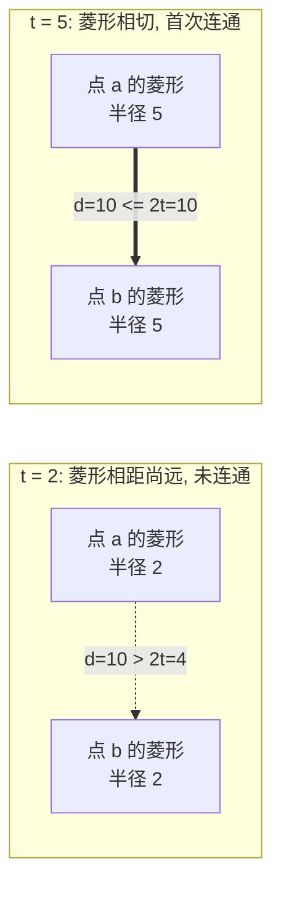
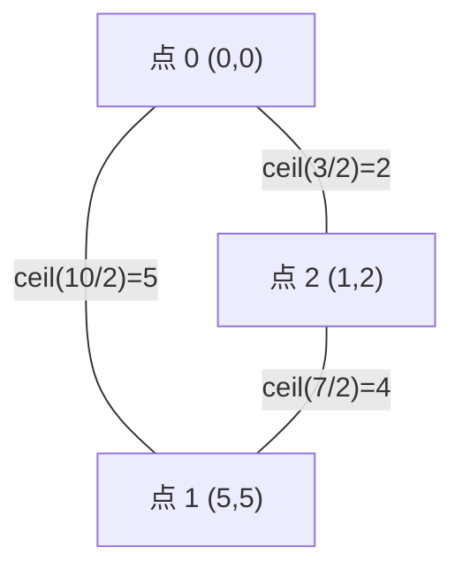

[[TOC]]

## 形式化题目

平面上给定 $n$ 个点（$1 \leqslant n \leqslant 50$，坐标为 $1 \sim 10^9$ 的整数）。每个点从时刻 $0$ 起向四个方向扩散，时刻 $t$ 时覆盖所有到该点**曼哈顿距离** $\leqslant t$ 的格子（一个菱形）。若点 $a$、$b$ 的扩散区域在时刻 $t$ 有公共格子，则它们在时刻 $t$ 连通。求最早的时刻 $T$，使所有点在时刻 $T$ 构成一个连通块。

## 正解

### 思路

**第一步：两点何时连通？**

时刻 $t$，点 $a$ 的扩散区域是所有满足 $|x-a_x|+|y-a_y| \leqslant t$ 的格子（一个对角线方向的菱形）。两个菱形有公共格子，等价于存在点 $(x,y)$ 同时满足两个不等式，两式相加得

$$|x-a_x|+|y-a_y|+|x-b_x|+|y-b_y| \leqslant 2t,$$

左边由三角不等式放缩到下界 $|a_x-b_x|+|a_y-b_y|$，即两点曼哈顿距离 $d(a,b)$；并且当 $(x,y)$ 取在 $a$、$b$ 连线（折线）上时该下界可以取到。所以

$$a,b \text{ 在时刻 } t \text{ 连通} \iff d(a,b) \leqslant 2t \iff t \geqslant \left\lceil \frac{d(a,b)}{2} \right\rceil.$$

**第二步：连通的时刻转化为图。**

把每个点看作图上的一个顶点，给每对点连一条无向边，边权为 $w(a,b)=\lceil d(a,b)/2 \rceil$，表示这条边「被接通」的最早时刻。

在时刻 $T$，原图中所有 $w \leqslant T$ 的边都已接通，所有点形成连通块当且仅当这些边构成连通图，即 $T$ 至少要覆盖一棵生成树的所有边。为了让 $T$ 最小，应选**边权最大值最小**的生成树——最小生成树（MST）。

$$\text{答案} = \text{MST 的最大边权}.$$

样例验证：两点 $(0,0)$ 与 $(5,5)$，$d=10$，答案 $\lceil 10/2\rceil = 5$，与样例一致。

**实现：** $n \leqslant 50$，是完全图上的稠密图，用 Prim 即可，每轮选离生成树最近的点并入，过程中维护已选边权的最大值，最后输出。

### 代码

@include-code(./main.py, python)

### 复杂度

- 建边隐式在距离计算中：Prim 共 $n$ 轮，每轮 $O(n)$ 更新距离，总时间 $O(n^2)$（完全图边数本身 $O(n^2)$，与 Kruskal 排序的 $O(n^2\log n)$ 同阶或更优）。
- 空间 $O(n)$（只存每个点到生成树的最短距离，不需要显式存边）。

## 总结

- 扩散区域是曼哈顿距离意义下的菱形，两菱形相交 $\iff$ 两点曼哈顿距离 $\leqslant 2t$。
- 「所有点连通的最小时刻」= 完全图（边权 $\lceil d/2\rceil$）上最小生成树的最大边权，这是经典的「瓶颈生成树」转化。
- 稠密图 Prim $O(n^2)$ 恰好匹配 $n \leqslant 50$ 的规模。

## 图示解析

两个时刻 $t$ 各自扩散出的菱形（曼哈顿距离 $\leqslant t$），当二者接触/相交时即连通：

多点情形下，每个点向其余点连边权为 $\lceil d/2 \rceil$ 的边，取最小生成树，其最大边权（瓶颈边）即为答案：

上图中 MST 取边 $A\!-\!C(2)$ 与 $C\!-\!B(4)$，最大边权 $4$，即所有点连通的最早时刻为 $4$。
