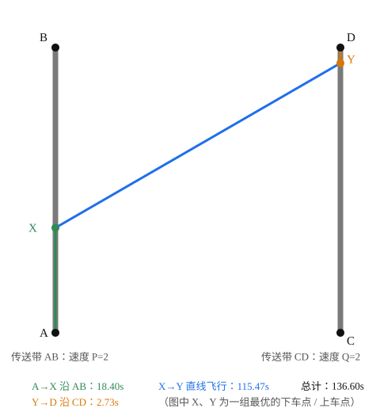

[[TOC]]

## 形式化题目

平面上有两条线段 $AB$ 与 $CD$，各看成一条传送带。在 $AB$ 上移动的速度为 $P$，在 $CD$ 上移动的速度为 $Q$，在平面其余位置移动的速度为 $R$。人从 $A$ 出发要走到 $D$，每一步走哪条路线都由自己决定，求最短总时间。

样例（$A=(0,0)$，$B=(0,100)$，$C=(100,0)$，$D=(100,100)$，$P=Q=2$，$R=1$）的最优路线如下图：绿色是沿 AB 的 $A\to X$ 段，蓝色是直线飞行的 $X\to Y$ 段，橙色是沿 CD 的 $Y\to D$ 段。

先看路线形状：人只在两条竖直传送带附近活动，中间一大段是斜穿平面的直线飞行。整条路线恰好由"沿 AB 走一段 + 直线飞行 + 沿 CD 走一段"组成，其中下车点 $X$、上车点 $Y$ 的位置是仅有的两个自由决策。对照数字：完全不踩传送带直飞要 $141.42$ 秒，而这条三段式路线只要 $136.60$ 秒——传送带把两头"顺路"的距离提速了。

## 正解

### 思路

**第一步：最优路线一定可以写成三段。** 在 $AB$ 上走到某个点 $X$ 下车，直线飞到 $CD$ 上的某个点 $Y$，再沿 $CD$ 走到 $D$：

$$A \xrightarrow{\text{速度 } P} X \xrightarrow{\text{速度 } R} Y \xrightarrow{\text{速度 } Q} D$$

三点理由：

- 中间一段以恒定速度 $R$ 移动，两点之间显然直线最短；
- 不会"离开传送带又回来"：若某走法离开 $AB$ 兜一圈再回到 $AB$，由三角不等式，把兜圈的那部分换成"直接沿 $AB$ 走"或"直接飞过缺口"（两者取快）不会更慢，逐段替换后每条传送带至多用一整段；
- 传送带若比飞行还慢（比如 $P<R$），最优解干脆整条不用——这正好对应 $X=A$ 或 $Y=D$ 的端点取值，不需要特判。

于是决策只剩两个连续参数。令 $X(t)=A+t(B-A)$，$Y(s)=C+s(D-C)$，$t,s\in[0,1]$，总时间为

$$T(t,s)=\frac{|AX(t)|}{P}+\frac{|X(t)Y(s)|}{R}+\frac{|Y(s)D|}{Q}$$

"不用传送带直飞"也在这族路线里：取 $t=0$、$s=1$ 即可。把 $t,s$ 各离散成 $n$ 个点做 $O(n^2)$ 枚举既慢又不满足精度，连续决策点应当用连续优化的手段——三分搜索。

**第二步：固定下车点，上车点可以三分。** 固定 $t$，把 $s$ 看成自变量。"沿一条直线匀速移动的点到一个定点的距离"是参数的凸函数——单调段加 V 形转弯，是标准的单峰形态；而两个凸函数相加仍是凸函数，所以

$$g(s)=\frac{|X(t)Y(s)|}{R}+\frac{|Y(s)D|}{Q}$$

关于 $s$ 凸，可以先对 $s$ 实数三分，求出固定 $t$ 时的最短时间。

**第三步：整体再对下车点三分。** 外层想三分的函数是

$$F(t)=\min_{s\in[0,1]} T(t,s)$$

一般的"凸函数取 $\min$"**并不**保凸，这里能用三分的关键是：$T(t,s)$ 的三项都是"仿射映射与范数的复合"，例如 $X(t)-Y(s)=(A-C)+t(B-A)-s(D-C)$ 是 $(t,s)$ 的仿射映射，另外两项各自只含一个变量。三者相加，$T$ 关于 $(t,s)$ 是**联合凸**的；而联合凸函数对一个变量取最小（部分最小化）后仍然是凸函数，所以 $F(t)$ 凸，可以对 $t$ 再做三分。

两步合起来就是**嵌套三分**：外层三分下车点 $t$，每到一个 $t$ 就内层三分上车点 $s$。三分模板每次取

$$m_1=lo+\frac{hi-lo}{3},\qquad m_2=hi-\frac{hi-lo}{3}$$

若 $f(m_1)<f(m_2)$ 则最小值不在 $(m_2,hi]$（凸性保证），令 $hi=m_2$，否则令 $lo=m_1$，区间每轮缩成原来的 $\tfrac{2}{3}$。

下表展示样例中固定 $t=t^\ast=0.368$ 后，内层对上车点参数 $s$ 三分的前 5 轮（$f$ 即固定 $t$ 的总时间）：

| 轮次 | $lo$ | $hi$ | $m_1$ | $f(m_1)$ | $m_2$ | $f(m_2)$ | 收缩 |
| --- | --- | --- | --- | --- | --- | --- | --- |
| 1 | 0.0000 | 1.0000 | 0.3333 | 151.7950 | 0.6667 | 139.4321 | $lo=m_1$ |
| 2 | 0.3333 | 1.0000 | 0.5556 | 142.3668 | 0.7778 | 137.5817 | $lo=m_1$ |
| 3 | 0.5556 | 1.0000 | 0.7037 | 138.6998 | 0.8519 | 136.8982 | $lo=m_1$ |
| 4 | 0.7037 | 1.0000 | 0.8025 | 137.3073 | 0.9012 | 136.6670 | $lo=m_1$ |
| 5 | 0.8025 | 1.0000 | 0.8683 | 136.8019 | 0.9342 | 136.6067 | $lo=m_1$ |

每一轮都是右边的试探点更优，于是左端不断右移，最小值被夹在 $[lo,hi]$ 里：5 轮后区间宽从 $1$ 缩到约 $0.13$，60 轮后 $(2/3)^{60}\approx 4\times 10^{-11}$。代码里固定跑 100 轮（$(2/3)^{100}\approx 2.5\times 10^{-18}$），随后直接取中点求值，远高于保留两位小数所需的 $0.005$ 精度，也不会死循环。

顺带一提，样例里外层 $F(t)$ 在 $t\in[0,0.37]$ 上是一段**平台**：AB、CD 是两条平行的竖直传送带时，存在一整族等价的最优上下车组合。三分遇到平台时 $f(m_1)=f(m_2)$，走 $lo=m_1$ 分支继续收缩，最终落在平台内任意点，返回的最小值不受影响。

### 代码

Python 版：

@include-code(./main.py, python)

C++ 版（同一算法）：

@include-code(./main.cpp, cpp)

### 复杂度

- 时间复杂度：内层 100 轮、每轮 2 次求值，外层再套 100 轮，总共约 $100\times 201\approx 2\times 10^4$ 次 $T(t,s)$ 求值，即 $O(\log^2(1/\varepsilon))$（$\varepsilon$ 为目标精度），与坐标大小无关。Python 实测每组数据约 $0.03$ 秒。
- 空间复杂度：$O(1)$，只保存 8 个坐标、3 个速度和三分的区间端点。

## 总结

- 建模核心是把自由走法压缩成**三段式路线** $A\to X\to Y\to D$：直线段由"恒速走直线最短"保证，"反复上下传送带不更优"由三角不等式保证，"传送带没用"则被端点 $t=0$、$s=1$ 自然吸收。
- 两个连续决策点各配一层三分；外层能三分的依据必须说准——$T(t,s)$ 联合凸，**部分最小化保凸**，而不是含糊的"取 min 后还是凸的"。
- 实数三分模板：每轮比较 $f(m_1),f(m_2)$ 缩区间到 $2/3$，固定迭代次数后取中点求值；相等时单侧收缩，天然兼容函数平台。
- 样例对照：直飞 $141.42$s，只用 AB 的最优 $136.62$s，两段都用 $136.60$s，可见"两头搭传送带"的收益是逐段累加的。
