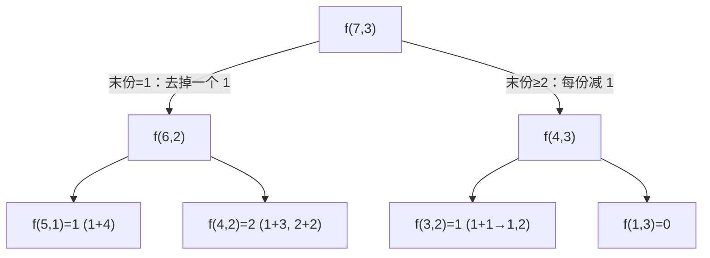

[[TOC]]

## 形式化题目

给定两个整数 $n, k$，把 $n$ 拆成恰好 $k$ 份，每份是不小于 $1$ 的正整数，且两份不计顺序（即把 $k$ 个数从小到大排好后再比较），求不同的拆法数。样例 $n=7, k=3$ 答案为 $4$：$1{,}1{,}5$、$1{,}2{,}4$、$1{,}3{,}3$、$2{,}2{,}3$。

## 正解

### 思路

**朴素想法**：暴力枚举每份的值再判重，复杂度是指数级的，且"任意两份不能相同"这个去重在无序意义下很别扭。关键一步是**规定顺序消掉无序**：既然不考虑顺序，就约定每份从小到大排列（不减序列）。这样每种合法分法唯一对应一个

$$
1 \leqslant a_1 \leqslant a_2 \leqslant \dots \leqslant a_k, \qquad a_1 + a_2 + \dots + a_k = n
$$

的序列，计数不重不漏。

**DP 状态**：设 $f(i, j)$ 表示把 $i$ 拆成 $j$ 份（不减、每份 $\geqslant 1$）的方案数。边界：$f(i, 1) = 1$（$i \geqslant 1$），$f(i, j) = 0$（$i < j$，每份至少为 1 分不够）。

**转移按末份是否为 1 分类**（互斥且完备）：

- **末份 $a_j = 1$**：因为不减，$a_1 = \dots = a_j = 1$ 都不成立也没关系——实际上只有 $a_j = 1$ 时去掉末份这份 1，剩下是 $i-1$ 拆成 $j-1$ 份的合法方案，对应 $f(i-1,\, j-1)$；
- **末份 $a_j \geqslant 2$**：把每一份都减去 1，得到 $i - j$ 拆成 $j$ 份、每份 $\geqslant 1$ 的方案（减 1 保持不减性，且可逆），对应 $f(i-j,\, j)$。

$$
f(i, j) = f(i-1,\, j-1) + f(i-j,\, j)
$$

**样例验证**（$n=7, k=3$）：$f(7,3) = f(6,2) + f(4,3)$；$f(6,2)=3$（$1{+}5, 2{+}4, 3{+}3$），$f(4,3)=1$（$1{+}1{+}2$），共 $4$，与样例一致。

### 图示解析：末份为 1 vs 末份 ≥ 2

| 分类 | 原方案（不减） | 变换后 | 逆变换 |
| --- | --- | --- | --- |
| $a_j = 1$ | $1, 2, 4$（$n{=}7, j{=}3$） | $1, 2$（$n{=}6, j{=}2$） | 末尾补一个 1 |
| $a_j \geqslant 2$ | $2, 2, 3$（$n{=}7, j{=}3$） | $1, 1, 2$（$n{=}4, j{=}3$） | 每份加 1 |

两类变换都是双射，故转移不重不漏。以 $f(7,3)$ 为根的递归结构：

**复杂度**：状态 $O(nk)$ 个，每个 $O(1)$ 转移，时间 $O(nk)$（本题 $n \leqslant 200$、$k \leqslant 6$，瞬间完成），空间同为 $O(nk)$（记忆化自动只存可达状态）。

### 代码

Python 用 `functools.cache` 记忆化即可，递归深度 $O(n+k)$ 远小于限制：

@include-code(./main.py, python)
