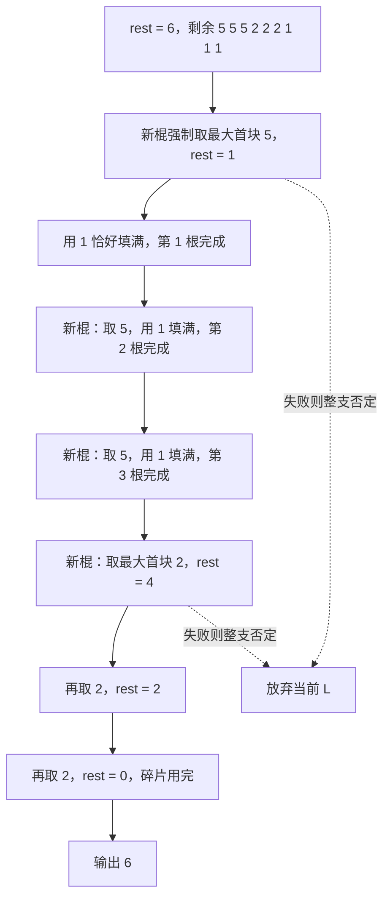

[[TOC]]

## 形式化题目

给定 $N$ 个正整数 $a_1, a_2, \dots, a_N$（$a_i \leqslant 50$），记 $S = \sum a_i$。
求最小的正整数 $L$，使得可以把这些数划分成 $S/L$ 个子集，且每个子集的元素和都等于 $L$。

换句话说：$N$ 段碎片来自若干根等长原木棍，求原木棍的最小可能长度。

以样例 $a = [5,2,1,5,2,1,5,2,1]$ 为例，$S = 24$。取 $L = 6$ 时，一种划分如下：

| 原木棍 | 组成的碎片 | 长度 |
| --- | --- | --- |
| 第 1 根 | $5 + 1$ | 6 |
| 第 2 根 | $5 + 1$ | 6 |
| 第 3 根 | $5 + 1$ | 6 |
| 第 4 根 | $2 + 2 + 2$ | 6 |

表中的每一行是一根拼回去的原木棍：前 6 个碎片两两配对，剩下三个 2 单独成一根。
四个子集和都为 6 且用光了所有碎片，所以 6 可行；比 6 更小的 $L$ 要么装不下长度为 5 的碎片
（$L < 5$），要么不能整除 $S = 24$，都不可能，因此答案是 6。

## 暴力解法

### 思路

答案一定落在 $[\max a_i,\ S]$ 之间，于是从小到大枚举 $L$，对每个 $L$ 判断"能否划分"。

最直白的判断方式是把 $k = S/L$ 根原木棍看成 $k$ 个容量为 $L$ 的桶，
把碎片从大到小依次尝试放进每个桶：

```text
dfs(i):                          # 处理第 i 个碎片
    if i == N: return True       # 全部放完
    for b in 0..k-1:
        if bins[b] + a[i] <= L:  # 桶 b 还装得下
            bins[b] += a[i]
            if dfs(i+1): return True
            bins[b] -= a[i]      # 回溯
    return False
```

枚举顺序保证第一个可行解就是最小 $L$。

### 代码

本层不单独给出代码：上面的伪代码已完整描述该做法，且该实现无法处理 $N = 60$ 的真实数据，
交付一个跑不动的暴力程序没有教学价值。它与正解的差异仅在剪枝，正解代码见下一节。

### 复杂度与瓶颈

每个碎片有 $k$ 种归属，最坏 $O(k^N)$，$N = 60$ 时完全不可行。

瓶颈在于**搜索树的节点数**：`bins` 是一个长度为 $k$ 的向量，
状态空间大，而且在同一根棍内交换碎片顺序会被反复搜索到。

## 正解

### 关键观察

1. **答案的下界是 $\max a_i$**：任何碎片都要被完整地放进某根原棍，所以 $L \geqslant \max a_i$。
2. **答案整除 $S$**：所有原棍长度之和就是 $S$，所以 $L \mid S$。
   结合第 1 条，候选 $L$ 只剩 $S$ 的少数几个约数。
3. **排序后从大到小放**：大碎片能去的位置少，先放它们能更快暴露矛盾，剪枝效率最高。
4. **同一层等长碎片只试一次**：两个等长碎片互换得到的是同一个局面，试第二个毫无新信息。
5. **一根棍的首块失败 $\Rightarrow$ 整体失败**：所有"新棍"此刻都是空的、完全等价，
   把首块换个空棍只是重复同一局面。
6. **一块恰好填满却失败 $\Rightarrow$ 整体失败**：若不用它填满而留出空隙，
   填空隙的只能是更小的碎片，而这些小碎片直接用来填这个空隙同样合法，局面不会更好。
7. **下标单调**：同一根棍内按碎片下标递增的顺序取，避免同一组碎片的不同排列被重复搜索。

### 思路

**第一步：改状态。** 不要维护 $k$ 个桶的向量，而是"拼满一根，再拼下一根"。
递归时只需要两个量：手上这根**还差多少** `rest`，以及这一层允许使用的**最小下标** `idx`。

```text
dfs(idx, rest):
    if rest == 0:                 # 这根拼满
        if 碎片用完: return True
        idx, rest = 0, L          # 重开一根
    for i in idx..N-1:
        if used[i] or a[i] > rest: continue   # 用过 / 放不下
        used[i] = True
        if dfs(i+1, rest - a[i]): return True
        used[i] = False
    return False
```

状态从"$k$ 维容量向量"缩成一对 `(idx, rest)`，剪枝点也随之变得清晰。

**第二步：加上剪枝。** 把观察 2、4、5、6、7 落到代码里：

- 枚举 $L$ 时先做 `total % length != 0` 判断，直接跳过所有非约数（观察 2）。
- 同一层用变量 `prev` 记住上一个尝试过的长度，`cur == prev` 就 `continue`（观察 4）。
- `rest == length` 表示正在开新棍，此时若首块搜索失败，立刻 `return False`（观察 5）。
- `cur == rest` 表示这一块刚好填满，此时若搜索失败，立刻 `return False`（观察 6）。
- 递归下一层的下标：拼满时传 `0`（重开一根），否则传 `i + 1`（观察 7）。

代码里这两条"立刻失败"的判据写在同一个 `if` 里：

```python
if rest == length or cur == rest:  # 首块 / 恰好填满却失败 ⇒ 该 length 一定无解
    return False
```

另外，`rest == 0` 表示这根拼满，此时若所有碎片都已使用就整体成功；
这一步用 `any(not u for u in used)` 判断，而不是额外维护一个剩余片数计数器，
是因为 $N \leqslant 60$，这一次线性扫描相比回溯本身的代价可以忽略。

下面的流程图展示样例中 $L = 6$ 时，正解如何逐根拼满。它先取最大的 5 开第一根，
用 1 补满；第二、三根同理；最后一根由三个 2 拼成。



实线是样例真实走过的成功路径，虚线是两条剪枝各自否定的情形。
每次开新棍都强制取当前最大的剩余碎片（观察 5），这一步失败就没有再试其它首块的必要：
所有新棍此刻都是空的，换个首块只是重复同一个局面，直接否定当前 $L$ 即可。
这就是图中虚线表示的分支。

### 代码

@include-code(./main.py, python)

### 复杂度

设 $d$ 为 $S$ 的约数中不小于 $\max a_i$ 的个数，则最多只需对 $d$ 个候选 $L$ 各做一次搜索。

- 时间：枚举 $L$ 需 $O(S)$ 次整除判断，真正进入搜索的只有 $d$ 次；
  单次搜索最坏是指数级，但经上述四条回溯剪枝后实际搜索树被压到可接受规模。
  这与本题 C++ 参考实现（同为 DFS + 剪枝）同阶。
- 空间：$O(N)$，用于 `used` 数组与递归栈，递归深度不超过 $N = 60$。

> 说明：Python 在部分 $N = 60$ 的强数据上会超出原题 1000 ms 的时限，
> 本仓库按 `python-oj-short` 约定允许 Python TLE；关键在于算法没有退化成暴力枚举，
> 剪枝后的搜索与 C++ 正解完全一致。

## 总结

本题的核心套路是：

1. 先由 $\max a_i$ 和 $S$ 的整除性把候选答案缩小到约数集合；
2. 把"$k$ 个桶"的状态改写成"逐根拼满"的 `(idx, rest)` 状态；
3. 再用四条剪枝（等长去重、首块失败即失败、填满失败即失败、下标单调）压住搜索树。

这四条剪枝的论证方式值得记住：它们都形如"若这样分配失败，那么任何等价或更优的分配也会失败"。
考试时若一时想不到全部剪枝，至少先写对（2）约数枚举与（3）从大到小排序，
再把能想通的剪枝逐条加回去，用真实数据检验是否通过。
