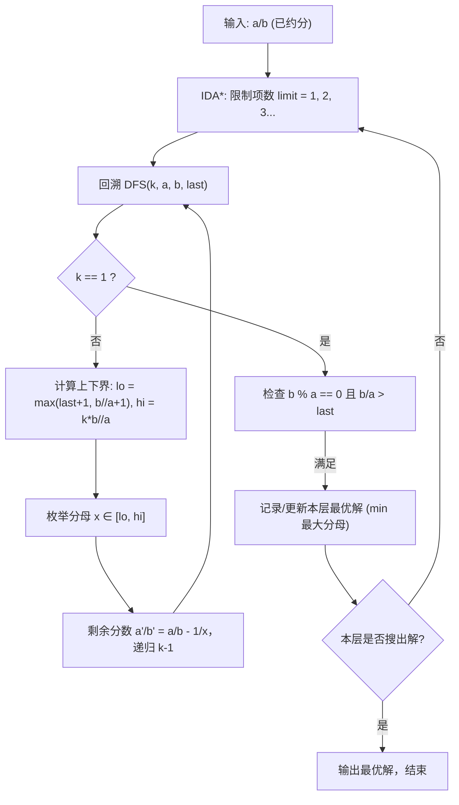

[[TOC]]

## 形式化题目

给定正整数 $a, b$（满足 $0 < a < b < 1000$ 且 $\gcd(a, b) = 1$），求一组正整数序列 $x_1 < x_2 < \dots < x_k$ 使得：
$$\frac{a}{b} = \sum_{i=1}^k \frac{1}{x_i}$$

使得满足以下评价标准的解最优：
1. 项数 $k$ 最小；
2. 在 $k$ 最小的前提下，最大分母 $x_k$ 最小（对应最小的分数 $\frac{1}{x_k}$ 最大）；
3. 若最大分母仍相同，分母序列的字典序最小。

输出按升序排列的分母序列 $x_1, x_2, \dots, x_k$。

## 正解

### 思路

本题是经典的**迭代加深搜索（IDA*）**与**数学剪枝**问题。

#### 1. 为什么采用 IDA*？
题目首先要求加数个数 $k$ 尽可能少。如果使用普通的深度优先搜索（DFS），搜索深度可能无限延伸或陷在很深的分支中；如果使用广度优先搜索（BFS），由于状态分支多且状态记录占用内存巨大，极易出现内存超限（MLE）。
因此，我们限制搜索深度 $limit = 1, 2, 3, \dots$ 逐层加深（IDA*）：
- 只要在某一层深度 $limit$ 找到了可行解，该深度即为项数最少的全局最优项数；
- 在同一层内，遍历所有可能解并更新最优解，即可保证选出最大分母最小、字典序最小的答案。

#### 2. 搜索分支上下界推导与剪枝
假设当前正在搜索第 $limit - k + 1$ 项，还剩余 $k$ 项未确定，剩余需要凑出的分数为 $\frac{a}{b}$，上一项确定的分母为 $last$。
当前待选分母设为 $x$：

1. **下界（$lo$）**：
   - 题目要求分母严格递增，故 $x \ge last + 1$。
   - 当剩余项数 $k > 1$ 时，若选择的单位分数 $\frac{1}{x} \ge \frac{a}{b}$，后续继续相加必将超出目标分数。因此 $\frac{1}{x} < \frac{a}{b} \implies x > \frac{b}{a} \implies x \ge \lfloor \frac{b}{a} \rfloor + 1$。
   - 综合得到下界：$lo = \max(last + 1, \lfloor \frac{b}{a} \rfloor + 1)$。

2. **上界（$hi$）**：
   - 剩余未确定的分母必须严格递增，因此后续的每个分数都严格小于当前分数，即 $\frac{1}{x_i} < \frac{1}{x}$。
   - 即使剩下的 $k$ 个数都取到最大可能值（极限近似 $\frac{1}{x}$），它们的和也不会超过 $k \times \frac{1}{x} = \frac{k}{x}$。
   - 如果 $\frac{k}{x} < \frac{a}{b}$，则即使剩下全部取当前最大可能值，其总和也无法凑齐剩余的 $\frac{a}{b}$。
   - 因此必须满足 $\frac{k}{x} \ge \frac{a}{b} \implies x \le \lfloor \frac{k \cdot b}{a} \rfloor$。
   - 综合得到上界：$hi = \lfloor \frac{k \cdot b}{a} \rfloor$。

3. **叶子节点常数优化（$k = 1$）**：
   - 当只剩下最后一项（$k = 1$）时，不再进行循环枚举，而是直接判断 $\frac{1}{x} = \frac{a}{b}$ 是否成立。
   - 此时 $x = \frac{b}{a}$，必须满足 $b \pmod a == 0$ 且 $x > last$。若成立，则直接得到一组可行解。

### 代码

@include-code(./main.py, python)

### 复杂度

- **时间复杂度**：在深度上限为 $d$（本题中 $d \le 8$）的迭代加深搜索中，上下界剪枝将每一步分支严格夹在 $[ \lfloor \frac{b}{a} \rfloor + 1, \lfloor \frac{k \cdot b}{a} \rfloor ]$ 内，极大缩减了搜索树节点数。在 $a, b < 1000$ 的数据范围内，搜索耗时远小于 1000ms（实际运行耗时几十毫秒至数百毫秒）。
- **空间复杂度**：$O(d)$，递归深度与保存当前分母序列的空间均受深度上限 $d$ 约束，空间开销微乎其微。

## 总结

埃及分数问题是 IDA* 与数学不等式剪枝的典范应用：
1. 利用题目的“项数最少”目标，把 BFS 的逐层扩展优势与 DFS 的极低空间消耗通过 IDA* 结合起来；
2. 利用分母递增的特性，通过 $\frac{1}{x} < \frac{a}{b}$ 和 $\frac{k}{x} \ge \frac{a}{b}$ 确定严格的取值区间 $[lo, hi]$，将看似无穷的搜索空间压缩到极小范围。

## 图示解析

