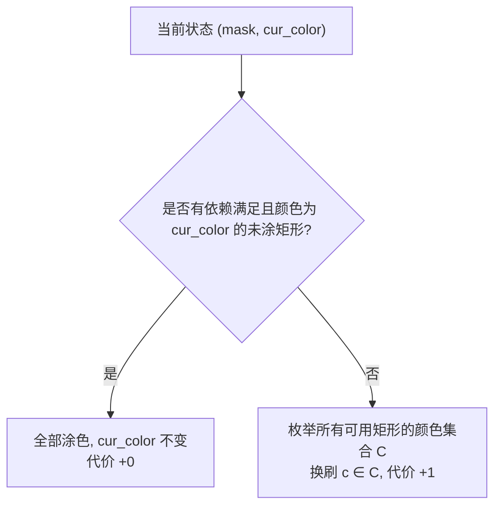

[[TOC]]

## 形式化题目

给定平面上 $N$ 个互不重叠的矩形，每个矩形 $i$ 由其左上角与右下角坐标 $[y_{i,1}, x_{i,1}, y_{i,2}, x_{i,2}]$ 以及颜色 $c_i \in [1, 20]$ 指定。

涂色必须遵守以下约束：
1. **拓扑依赖限制**：矩形 $i$ 只有在所有紧靠其上方的矩形涂色完成后才能涂色。矩形 $u$ 紧靠在矩形 $v$ 上方，当且仅当 $u$ 的下底边与 $v$ 的上顶边共线（$y_{u,2} = y_{v,1}$）且两者的水平投影区间存在正长度的重叠。
2. **刷子使用限制**：每次拿起一把某种颜色的刷子，可以将当前所有依赖已满足且对应颜色的未涂矩形涂色；如果一把刷子被放下后再次拿起，每一次拿起都计入一次总数。

求将所有 $N$ 个矩形涂色完成所需拿起刷子的最少总次数。

## 正解

### 思路

数据规模满足 $N \leqslant 15$，矩形数量极小。每一个矩形的状态仅有两种：已涂或未涂。因此可以用一个长度为 $N$ 的二进制掩码 $mask$ 完整描述当前哪些矩形已经被涂好。

#### 1. 紧靠上方依赖建模

矩形 $u$ 是矩形 $v$ 的直接先决条件，当且仅当：
- $y_{u,2} = y_{v,1}$（$u$ 的下边界与 $v$ 的上边界贴合）；
- 且在横坐标投影上有交集，即非互不相交：$\neg(x_{u,2} \leqslant x_{v,1} \lor x_{u,1} \geqslant x_{v,2})$。

我们为每个矩形 $v$ 预处理一个位掩码 `pre_mask[v]`，其中第 $u$ 位为 1 表示矩形 $u$ 是矩形 $v$ 的紧靠上方矩形。
当前状态为 $mask$ 时，矩形 $v$ 能够被涂色的充要条件为其尚未涂色且 `(mask & pre_mask[v]) == pre_mask[v]`。

#### 2. 状态定义与贪心优化

定义状态函数 $dfs(mask, cur\_color)$ 表示在已涂矩形集合为 $mask$、当前手中持有的刷子颜色为 $cur\_color$ 时，涂完剩余所有矩形所需额外拿起刷子的最少次数。

- **贪心策略**：如果手中已有颜色为 $cur\_color$ 的刷子，且当前有若干矩形满足前驱条件且颜色恰好为 $cur\_color$，那么**必然立刻将它们全部涂满**，绝不需要放下刷子换别的颜色。因为提前把同色可用矩形涂好，只会使更多的后续矩形依赖被解除，而不会使任何限制变劣。
- **换刷转移**：当手中没有刷子（初始 $cur\_color = 0$）或当前颜色没有更多可涂矩形时，枚举所有当前依赖已解开的未涂矩形所涉及的颜色集合 $C$。尝试拿起颜色 $c \in C$ 的刷子，代价增加 1，转移到子状态 $1 + dfs(mask, c)$。

所有依赖关系构成的偏序图是一个有向无环图（DAG），利用 Python 的 `@cache` 装饰器进行记忆化搜索即可。

### 代码

@include-code(./main.py, python)

### 复杂度

- **时间复杂度**：$\mathcal{O}(2^N \cdot N \cdot |\Sigma|)$，其中 $N \leqslant 15$ 是矩形数，$|\Sigma| \leqslant 20$ 是颜色总数。因为每个矩形受 DAG 拓扑顺序限制，并且同一颜色的可用矩形会被贪心一步全部合并涂完，实际可达的合法状态数远小于理论上限 $2^{15}$（通常在数千以内），可以在数十毫秒内快速完成。
- **空间复杂度**：$\mathcal{O}(2^N \cdot |\Sigma|)$。记忆化缓存只需存储被访问到的合法状态，空间消耗在数十兆以内，完全在 128MB 限制内。

## 总结

本题的关键在于利用矩形几何贴合关系建图形成先决条件拓扑图，再结合 $N \leqslant 15$ 的数据规模进行状态压缩。通过同色可用矩形立即全部染色的贪心策略，有效剪除了不必要的换刷分支，使状态空间极大收缩。
