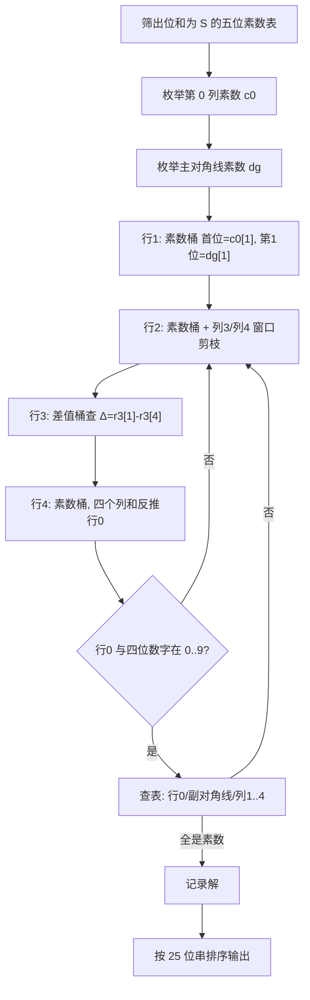

[[TOC]]

## 形式化题目

给定整数 `S`（位和）与 `d`（左上角数字）。在 5×5 数字方阵中：

- 每一行从左到右、每一列从上到下、主对角线从左上到右下、副对角线**从左下到右上**（都是"从左到右"）读出的 5 位数字串都必须是素数；
- 这些素数每个的数位和都等于 `S`；
- 左上角格子等于 `d`，行/列/对角线首位不能为 0。

输出所有满足条件的方阵（每个方阵 5 行、每行 5 个数字），两组方案之间空一行，方案按 25 个数字组成的 25 位数升序排列；无解输出 `NONE`。

## 正解

### 思路

**素数表是唯一原料。** 五位素数不到 10^5 个，先筛出"位和恰好为 `S`"的那部分（记个数为 `P`，首位非 0 自动满足）。例如 `S=11` 时 `P=143`，`S=23` 时 `P=757`——中段位和的素数最多，是最坏情况。

**朴素做法及其瓶颈。** 最直接的想法是逐行 DFS：每行从素数表里选一个，用"每一列已放的前缀必须能延伸成某个素数"剪枝。但这个剪枝强度取决于位和：当 `S=23` 时，任取两个数字开头的两位前缀几乎都能延伸成某个素数（剩余三位有近千种补法），第一层剪枝几乎失效，`757 × 757` 的第二层组合就会失控。位和类约束在中段最弱，这是按行搜索的天然短板。

**换成固定三条"素数链"。** 注意方阵里有三条互相只共享左上角一格的完整素数链：第 0 行、第 0 列、主对角线，它们的首位都是左上角 `d`。把**第 0 列**（记 `c0`）和**主对角线**（记 `dg`）固定后，第 `i` 行就被钉死两位——第 0 位是 `c0[i]`、第 `i` 位是 `dg[i]`：

| 行\列 | 0 | 1 | 2 | 3 | 4 |
|:---:|:---:|:---:|:---:|:---:|:---:|
| **0** | ● | □ | □ | □ | □ |
| **1** | ░ | ◆ | · | · | · |
| **2** | ░ | · | ◆ | · | · |
| **3** | ░ | · | · | ◆ | · |
| **4** | ░ | · | · | · | ◆ |

（● 左上角；□ 第 0 行；░ 第 0 列；◆ 主对角线；· 12 个自由格）

于是第 `i` 行根本不用逐位搜索：候选就是素数桶 `[首位=c0[i], 第 i 位=dg[i]]` 里的素数，平均只有 `P/90 ≈ 8` 个；又因为行本身是素数，该行 3 个自由格的和自动等于 `S - c0[i] - dg[i]`，无需再检查。

**枚举顺序：先 `(c0, dg)`，`r0` 留到最后。** 若把三条链都当独立枚举对象，是 `F³` 对组合（`F` 为首位是 `d` 的素数个数）。但第 0 行的 4 个非首位数字恰好是列 1..4 的"列顶"，一旦行 1..4 选定，列 `j` 的自由格和就确定了，由列和式 `r0[j] + dg[j] + 自由格和 = S` 直接**反推**出 `r0[j]`——第 0 行一个循环都不用枚举，组合数降为 `F² ≈ 90² = 8×10³`。

**副对角线的方向与 Δ 过滤。** 副对角线"从左到右"读是指从左下 `(4,0)` 读到右上 `(0,4)`，方向极易弄反。用 `11 2` 这组真实数据的唯一解验证：

| 读法 | 数字串 | 判定 |
|:---|:---:|:---|
| 从左下 `(4,0)` 到右上 `(0,4)`（正确） | `11171` | 素数 ✔ |
| 从右上 `(0,4)` 到左下 `(4,0)`（错误） | `17111` | `17111 = 71 × 241` ✘ |

副对角线的位和式 `c0[4] + r3[1] + dg[2] + r1[3] + r0[4] = S` 与列 4 的位和式 `r0[4] + r1[4] + r2[4] + r3[4] + dg[4] = S` 都含未知的 `r0[4]`，联立消元得

`r3[1] - r3[4] = dg[4] + r1[4] + r2[4] - c0[4] - dg[2] - r1[3] (记作 Δ)`

右边在 `r1`、`r2` 选定后是常数。所以行 3 也不用枚举：把行 3 的素数桶按 `第1位 - 第4位` 再建一层**差值桶**，查 `Δ` 即可，恰好也把副对角线的位和约束一次做掉。

**窗口剪枝与终检。** 选 `r1 × r2` 时，列 3 只剩行 4 一位、列 4 只剩行 3 一位自由格，两位都在 `[0,9]`，立刻得到 `r1[3]+r2[3] ∈ [S-18-dg[3], S-dg[3]]` 这类窗口剪枝；`r3` 选定后对列 1、列 2 同理。`r4` 选定后四个列和反推出 `r0` 的四个数字（须在 `[0,9]`），最后查一遍素数表：`r0`、副对角线、列 1..4（行 1..4、列 0、主对角线本来就来自素数表）。全部通过即得到一个解。

**不重不漏与输出。** 一个合法方阵的 `(c0, dg, r1..r4)` 分解是唯一的，所以每个解恰好被枚举一次，无需去重。所有行都是 5 位等长串，25 位串的字典序就是 25 位数的大小，排序后用空行分隔输出即可。

整个搜索流程如下：



### 代码

Python 版：

@include-code(./main.py, python)

C++ 版（同一算法）：

@include-code(./main.cpp, cpp)

### 复杂度

- 预处理：筛位和为 `S` 的五位素数，只对约 `6×10³` 个候选试除，`O(9×10⁴ + P·√N)`。
- 主搜索：设 `F` 为首位等于左上角的素数个数。外层 `F²` 对 `(c0, dg)`，内层是两个约 `P/90` 的桶相乘，行 3 由差值桶 `O(1)` 命中、行 4 桶枚举后常数次查表，总代价 `O(F² · (P/90)²)` 次整数运算；最坏点 `S=23` 时约 `101² × 8.4² ≈ 7×10⁵` 个桶对，远小于朴素逐行 DFS 的组合数。
- 空间：素数表与桶 `O(P)`。
- 实测（Python，本题最慢点 `23 3`）：0.61s，全部 10 组官方数据通过。

## 图示解析

以测试点 `S=11, d=2` 的唯一解为例，看三条链如何锁住整张方阵：

```
+---+---+---+---+---+
| 2 | 5 | 1 | 2 | 1 |   行0 = 25121（链 □）
+---+---+---+---+---+
| 1 | 0 | 2 | 7 | 1 |   行1：首位=列0[1]=1，第1位=对角线=0
+---+---+---+---+---+
| 5 | 4 | 1 | 0 | 1 |   行2：首位=5，第2位=1
+---+---+---+---+---+
| 2 | 1 | 6 | 1 | 1 |   行3：首位=2，第3位=1；副对角线格 (3,1)=1
+---+---+---+---+---+
| 1 | 1 | 1 | 1 | 7 |   行4：首位=1，第4位=7
+---+---+---+---+---+
     列0 = 21521（链 ░）  对角线 = 20117（链 ◆）
```

- 行 1 的候选桶 `[首位=1, 第1位=0]`、行 2 的 `[首位=5, 第2位=1]`……每行平均只有几个素数可选；
- 副对角线按从左下到右上读出 `(4,0)(3,1)(2,2)(1,3)(0,4) = 1,1,1,7,1 → 11171`，是素数；若读反成 `17111` 则是合数，整个解会被漏掉；
- 列 1..4 与行 0 的数字最后由列和反推、查表确认，任何一格出界（不在 `[0,9]`）就整枝剪掉。

## 总结

- 质数方阵是"位和约束 + 多链耦合"的构造搜索题：位和处在中段时按行 DFS 的前缀剪枝失效，必须换更强的固定对象。
- 关键三步：① 用列 0 + 主对角线两条素数链把每行钉死两位，候选缩成平均 8 个的小桶；② 枚举顺序上把第 0 行留到最后由列和反推，省掉一整层枚举；③ 副对角线（注意从左下往右上读）与列 4 的位和式联立消元，把行 3 变成差值桶查询。
- 配合"剩余自由格 ≤ 位数 × 9"的窗口剪枝和末端素数表查证，组合数从朴素搜索的指数级压到 `F²·(P/90)²`，Python 也能轻松通过。
