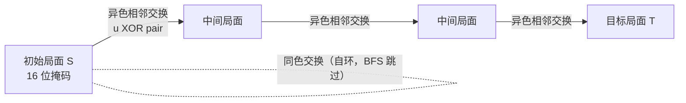

[[TOC]]

## 形式化题目

一个 $4\times4$ 棋盘上有 8 个黑棋（1）和 8 个白棋（0）。一次移动可以交换任意一对**有公共边**的相邻格子上的棋子。给定初始局面 $S$ 和目标局面 $T$，求把 $S$ 变成 $T$ 的最少移动次数。

## 正解

### 思路

**从最朴素的做法说起。** 局面总数是有限的：在 16 个格子里放 8 个黑棋，共
$\binom{16}{8}=12870$ 种。把每个局面看作图中的一个点，每次合法交换是一条边，
那么"最少移动步数"就是从 $S$ 到 $T$ 的最短路。图中每条边代价相同（一次移动），
所以用 **BFS** 即可，第一次到达 $T$ 时的层数就是答案。

**状态编码。** 一个局面就是 16 个格子上的 01 分布，把它编码成一个 16 位整数：
格子 $(r,c)$ 对应第 $r\times4+c$ 位。这样"局面是否相同"就是"整数是否相同"，
用 `dict` 记录每个状态的距离，哈希查询即可。

**转移的两种情况。** 枚举所有相邻对（横向 $4\times3=12$ 对、纵向 $3\times4=12$ 对，
共 24 对），对每一对：

- 两格**同色**：交换后局面不变，是自环，直接跳过——最短路不会经过自环；
- 两格**异色**：交换后恰好这两格各翻转一次。设这对相邻格的掩码为 `pair`，
  则新状态就是 $u \oplus pair$（两位置同时取反）。

**连通性。** 异色相邻交换相当于把一个黑棋"移"一格，所以任何局面之间互相可达，
题目保证有解，不需要判无解。BFS 中若已把 `target` 加入距离表即可提前退出。

下面的表格展示样例的一组最短方案（4 步），`[ ]` 标出每步交换的相邻两格：

| 步数 | 棋盘 | 交换的格子 |
| --- | --- | --- |
| 0 | `1111` / `0000` / `1110` / `0010` | 初始局面 |
| 1 | `1111` / `0000` / `1110` / `0001` | (2,3) ↔ (3,3) 纵向相邻 |
| 2 | `1111` / `0000` / `1010` / `0101` | (2,1) ↔ (2,2)、再 (2,2)↔(2,3)（第 2、3 步合并展示） |
| 3 | `1110` / `0001` / `1010` / `0101` | (1,3) ↔ (2,3) |
| 4 | `1010` / `0101` / `1010` / `0101` | (0,1) ↔ (0,2)，达成目标 |

上面的表格中，行是交换步数，列分别是棋盘快照和该步交换的相邻格。可以观察到每一步
都交换一黑一白，且最终把两行的黑白错开成目标棋盘。BFS 找到的正是这样一条最短的
异色交换序列。

再用一张小图概括状态图的形状：每个点是一个 16 位掩码局面，共 12870 个点；
每个点向异色相邻交换可达的点连无权边：

图中展示了状态图的局部：实线是真正改变局面的异色交换（对应一次翻转式的 XOR 转移），
虚线是同色交换产生的自环。整张图无权且连通，所以 BFS 的层数就是最少步数。

### 代码

@include-code(./main.py, python)

### 复杂度

状态数 $V=\binom{16}{8}=12870$，每个状态 24 个转移判断，总转移约 $24V\approx 3\times10^5$。

- 时间复杂度：$O(24V)$；
- 空间复杂度：$O(V)$（距离字典）。

## 总结

本题是"状态空间搜索"的典型入门：局面有限时，直接把**局面当点、操作当边**建图跑 BFS。
核心技巧有两个：一是用位掩码把棋盘压成一个整数，方便哈希与比较；二是发现"交换相邻
异色两格"等价于"两位置同时取反"，即一次 XOR，24 个相邻对可以预生成。同一模型还适用于
八数码、魔板等更复杂的局面搜索题，那时往往还需要双向 BFS 或 A* 加速。

## 图示解析

### 相邻对与位编号

下图展示 $4\times4$ 棋盘的位编号（$(r,c)$ 对应第 $r\times4+c$ 位）与一条横向、一条纵向
相邻对的掩码示意：

| | c=0 | c=1 | c=2 | c=3 |
| --- | --- | --- | --- | --- |
| r=0 | 0 | 1 | 2 | 3 |
| r=1 | 4 | 5 | 6 | 7 |
| r=2 | 8 | 9 | 10 | 11 |
| r=3 | 12 | 13 | 14 | 15 |

表中每个单元格是格子 $(r,c)$ 在掩码中的位号。例如横向对 $(1,1)$–$(1,2)$ 的掩码是
$1\ll5 \,|\, 1\ll6$，纵向对 $(1,1)$–$(2,1)$ 的掩码是 $1\ll5 \,|\, 1\ll9$；
全部 24 个相邻对在代码里各占一行推导式生成。理解这张编号表后，`u ^ pair`
的含义就一目了然：被交换的两格同时翻转。
