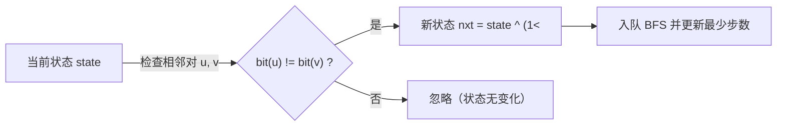

[[TOC]]

## 形式化题目

给定一个大小为 $4 \times 4$ 的 01 矩阵作为初始状态，以及另一个大小相同的 01 矩阵作为目标状态（保证两个矩阵中 1 的总数相同）。

一次合法操作定义为：选择网格中上下或左右相邻的两个格子，若其中一个格子为 1 且另一个格子为 0，则交换这两个格子的值。

求将初始状态变换为目标状态所需的最少操作次数。

## 正解

### 思路

本题要求从一个状态变换到另一个状态的最少操作步数，且每次操作的代价均为 1，是一个典型的无权图最短路问题，可以使用**宽度优先搜索（BFS）**求解。

#### 1. 状态表示与压缩

网格大小固定为 $4 \times 4$，共有 16 个格子。每个格子的状态只有 0 和 1 两种情况：
- 我们可以将网格中的位置 $(r, c)$（其中 $0 \leqslant r, c < 4$）映射到二进制数的第 $r \times 4 + c$ 位。
- 整个 $4 \times 4$ 网格的状态可以用一个 16 位的二进制非负整数（即范围在 $[0, 2^{16}-1]$ 内）唯一表示。
- 在包含 $k$ 个玩具的情况下，总的状态数上限为组合数 $\binom{16}{k} \leqslant \binom{16}{8} = 12870$。状态总数非常小，完全可以放入内存。

#### 2. 状态转移

一次玩具移动，等价于交换相邻位置上的 0 和 1。
在 $4 \times 4$ 的网格中，相邻格子对共有 24 对：
- 横向相邻：每行 3 对，共 4 行，合计 $4 \times 3 = 12$ 对；
- 纵向相邻：每列 3 对，共 4 列，合计 $4 \times 3 = 12$ 对。

对于给定的相邻格子对 $(u, v)$：
1. 提取状态中第 $u$ 位和第 $v$ 位的值；
2. 若两位置的值不同（即一个为 0、另一个为 1），则两者发生交换后的新状态为：
   $$nxt = state \oplus (1 \ll u) \oplus (1 \ll v)$$
3. 若两位置的值相同（同为 0 或同为 1），则交换后状态不变，不产生有效转移。

#### 3. BFS 搜索流程

1. 将初始状态和目标状态分别按位压缩成整数 $start$ 与 $target$；
2. 若 $start = target$，直接返回 0；
3. 建立一个队列，将 $start$ 入队，并用哈希表（或距离数组）记录起点距离 $dist[start] = 0$；
4. 每次从队头取出当前状态，遍历预处理好的 24 对相邻格子；若生成的新状态尚未被访问，则记录其最短步数并压入队列；
5. 一旦首次生成的状态为 $target$，即找到全局最少移动次数，立即返回答案。

### 代码

@include-code(./main.py, python)

### 复杂度

- **时间复杂度**：合法状态总数不超过 $\binom{16}{8} = 12870$ 种。每个状态最多检查 24 个相邻转移，边数 $E \leqslant 24 \times 12870 \approx 3 \times 10^5$。BFS 遍历所有可达状态的时间复杂度为 $O(V + E)$，在毫秒级内即可完成。
- **空间复杂度**：$O(V)$，存储队列和访问标记数组（或哈希表）最多需要记录 12870 个状态，内存占用在 20MB 以内。

## 总结

- **位运算压缩**：对于小尺寸棋盘（如 $4 \times 4$ 仅 16 位），位运算压缩状态不仅极大地节省了内存，还能利用异或运算 $\oplus$ 高效地完成两个相邻位的交换操作。
- **状态空间分析**：分析出实际状态数被限定在组合数 $\binom{16}{k} \leqslant 12870$ 范围内，直接锁定了使用朴素 BFS 即可最优且高效地解决无权图最短路问题。
