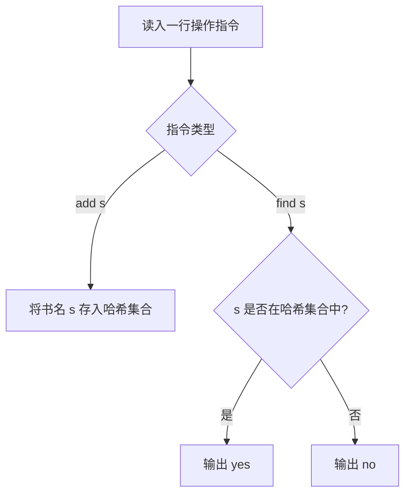

[[TOC]]

## 形式化题目

维护一个动态的字符串集合 $S$（初始 $S = \varnothing$），依次处理 $n$ 次操作：

1. $\text{add}(s)$：将字符串 $s$ 插入集合，$S \leftarrow S \cup \{s\}$；
2. $\text{find}(s)$：查询字符串 $s$ 是否属于集合，若 $s \in S$ 输出 `yes`，否则输出 `no`。

匹配要求区分大小写，且字符串中可能包含空格。

## 正解

### 思路

对于图书的存储与检索，最朴素的做法是使用动态数组顺序存放每一次添加的书名。每次遇到 `find(s)` 查询时，遍历数组并逐一比较字符串。但该做法每次查询的最坏时间复杂度为 $O(|S| \cdot L)$（$L$ 为字符串最大长度），在 $n = 30000$ 的数据规模下，最坏总时间复杂度可达 $O(n^2 \cdot L)$，会超出时间限制。

检索的核心瓶颈在于无序线性扫描。由于题目仅需判断某个完整字符串是否存在于集合中，不涉及前缀查询或字典序排序，因此最直接高效的结构是**哈希集合（Hash Set）**：

1. **插入操作 $\text{add}(s)$**：计算字符串 $s$ 的哈希值，将其加入哈希集合中。
2. **查询操作 $\text{find}(s)$**：通过哈希函数在 $O(L)$ 的期望时间内完成成员资格判断，若存在则输出 `yes`，否则输出 `no`。

在输入处理上，书名中可能包含空格，因此读取每行指令时仅按第一个空格做一次切分（如 `line.split(' ', 1)`），即可正确分离操作指令与书名。

### 代码

@include-code(./main.py, python)

### 复杂度

- **时间复杂度**：平均 $\mathcal{O}(n \cdot L)$。其中 $n$ 为操作次数（$n \leqslant 30000$），$L$ 为书名的最大长度（$L \leqslant 200$）。每次哈希计算与匹配均耗费 $\mathcal{O}(L)$ 时间，整体运算极为高效。
- **空间复杂度**：$\mathcal{O}(m \cdot L)$。其中 $m \leqslant n$ 为加入集合的不同书名数量，哈希集合存储所有不重复的图书名称。

## 总结

本题是哈希表维护动态字符串集合的典例。面对“单点插入 + 成员判定”问题，哈希集合以常数级的定位能力消除了线性扫描瓶颈，是处理此类精确匹配检索的通用最优解法。
