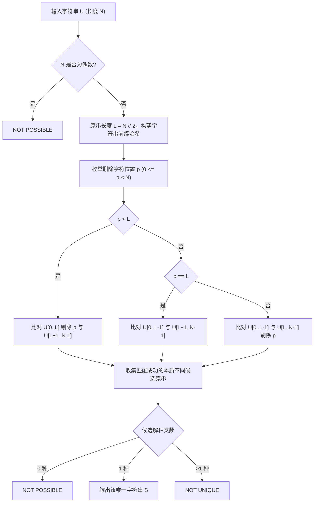

[[TOC]]

## 形式化题目

给定一个长度为 $N$ 的字符串 $U$。已知 $U$ 是由某个未知原字符串 $S$ 复制两遍得到 $T = S + S$ 后，在 $T$ 的某个位置插入一个字符而形成的。

要求求出满足条件的原字符串 $S$：
- 若不存在合法的 $S$，输出 `NOT POSSIBLE`；
- 若存在多个本质不同的合法原字符串 $S$，输出 `NOT UNIQUE`；
- 若合法的 $S$ 唯一，输出该字符串。

## 正解

### 思路

由题意可知，$U$ 的长度是由 $S$ 的长度 $L$ 满足 $N = 2L + 1$ 得到的。

1. **长度奇偶性判定**：
   若 $N$ 为偶数，显然不可能由 $S+S$ 插入一个字符生成，直接输出 `NOT POSSIBLE`。当 $N$ 为奇数时，原串长度必然为 $L = \lfloor N / 2 \rfloor$。

2. **插入位置的分段讨论**：
   插入字符的位置 $p \in [0, N-1]$ 仅可能位于三种区域：
   - **插入在前半段（$p < L$）**：
     此时后半段子串 $U[L+1 \dots N-1]$（长度为 $L$）没有受到任何改动，它必然等于原串 $S$。只需验证前半段挖去字符 $U[p]$ 后的子串 $U[0 \dots p-1] + U[p+1 \dots L]$ 是否与后半段相等。
   - **插入在正中间（$p = L$）**：
     此时前半段 $U[0 \dots L-1]$ 与后半段 $U[L+1 \dots N-1]$ 均未受到破坏，验证两者是否完全相同。
   - **插入在后半段（$p > L$）**：
     此时前半段子串 $U[0 \dots L-1]$（长度为 $L$）未受到改动，它必然等于原串 $S$。只需验证后半段挖去字符 $U[p]$ 后的子串 $U[L \dots p-1] + U[p+1 \dots N-1]$ 是否与前半段相等。

3. **利用字符串哈希进行 $O(1)$ 快速比对**：
   预处理字符串 $U$ 的前缀哈希值数组与基底幂次数组，使得任意子串的哈希值可以在 $O(1)$ 复杂度内求出。
   对于在区间 $[l, r)$ 内剔除下标 $p$ 的子串拼合哈希值，可由左侧区间 $[l, p)$ 与右侧区间 $[p+1, r)$ 在 $O(1)$ 时间内拼合而成：
   $$hash = (hash_{[l, p)} \times BASE^{r - p - 1} + hash_{[p+1, r)}) \pmod{MOD}$$

4. **去重统计**：
   注意题目要求的是判断“原串 $S$”是否唯一，而不是“插入位置”是否唯一。例如当字符串全为相同字母时，删除任意位置都可以构成相同的 $S$，此时原串是唯一的。因此我们使用集合（Set）收集所有匹配成功的候选字符串，最后根据集合的大小判定输出。

### 代码

@include-code(./main.py, python)

### 复杂度

- **时间复杂度**：预处理哈希数组需遍历一遍字符串，耗时 $O(N)$；枚举每个位置进行 $O(1)$ 的哈希拼接与比对，共 $N$ 次操作，耗时 $O(N)$；本质不同的候选原串至多只有 2 种（前半段与后半段），集合插入与切片开销为常数级别。总时间复杂度为 $O(N)$。
- **空间复杂度**：存储前缀哈希数组与幂次数组各需要 $O(N)$ 的空间，总空间复杂度为 $O(N)$。

## 总结

本题的关键在于利用原串 $T = S + S$ 的对称性，将单字符插入问题转化为“前后半区讨论”。由于只插入了一个字符，前后两半必然有一半保留了完整的原串 $S$，使得潜在的候选原串只有常数个。再结合前缀字符串哈希进行 $O(1)$ 拼合比对，即可将复杂度压至线性的 $O(N)$。
