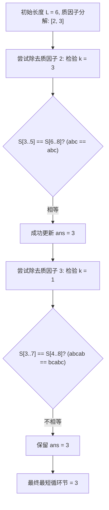

[[TOC]]

## 形式化题目

给定一个长度为 $n$ 的小写英文字母字符串 $S$。给出 $q$ 次询问，每次询问给出区间 $[a, b]$（$1 \le a \le b \le n$），求子串 $S[a..b]$ 的最短循环节长度 $k$。即要求 $k$ 整除 $b - a + 1$，且 $S[a..b]$ 可由其长度为 $k$ 的前缀重复拼接而成。

## 字符串哈希与质因子试除法

### 思路

#### 1. 循环节判定的等价条件

设子串 $T = S[a..b]$ 的长度为 $L = b - a + 1$。
若正整数 $k$ 是 $T$ 的循环节长度，首先必须满足 $k \mid L$。
其次，$T$ 具有长度为 $k$ 的循环节等价于：**$T$ 去掉末尾 $k$ 个字符的前缀，与 $T$ 去掉开头 $k$ 个字符的后缀完全相等**。
即：
$$S[a .. b - k] = S[a + k .. b]$$

通过预处理字符串 $S$ 的前缀哈希值，可以在 $O(1)$ 时间内比较任意两个子串是否相同，从而在 $O(1)$ 时间内验证 $k$ 是否为一个合法的循环节。

#### 2. 循环节性质与质因子分解

如果枚举 $L$ 的全部约数进行验证，对于每个询问开销较大。
注意到：若 $k_1$ 和 $k_2$ 都是整除 $L$ 的循环节，则 $\gcd(k_1, k_2)$ 也是 $L$ 的循环节。因此，$L$ 的所有循环节长度构成的约数集合对 $\gcd$ 封闭，存在唯一的最小循环节，且其他所有合法循环节都是最小循环节的倍数。

这意味着我们可以从最大可能长度 $L$ 开始，尝试将它的各个质因子逐一除去：
1. 对 $L$ 进行质因数分解：$L = p_1^{c_1} p_2^{c_2} \cdots p_m^{c_m}$。
2. 令当前候选循环节长度 $ans = L$。
3. 依次考虑每个质因子 $p$：若 $ans / p$ 仍然是合法循环节（即 $S[a .. b - ans/p] = S[a + ans/p .. b]$），则说明质因子 $p$ 可以被消去，令 $ans \leftarrow ans / p$；否则保留。
4. 遍历完所有质因子后，$ans$ 即为最短循环节长度。

#### 3. 快速质因数分解

由于 $n \le 5 \times 10^5$，可以预先利用线性筛（欧拉筛）预处理出每个数的最小质因数 `min_p[x]`。
对于给定的区间长度 $L$，每次只需沿着 `min_p[L]` 不断除以对应质因数，即可在 $O(\log L)$ 时间内求出 $L$ 的所有质因子。
每个质因子只做一次 $O(1)$ 的哈希检验，因此单次询问的检查次数不超过 $\sum c_i \le \log_2 n \approx 19$ 次。

### 图示解析

以样例中子串 `abcabc`（长度 $L = 6$，$a = 3, b = 8$）为例，检验过程如下：

### 代码

Python 版：

@include-code(./main.py, python)

C++ 版（同一算法）：

@include-code(./main.cpp, cpp)

### 复杂度分析

- **时间复杂度**：
  - 线性筛与字符串哈希预处理时间复杂度为 $O(n)$。
  - 每次询问质因数分解与哈希验证次数不超过质因子总重数 $\sum c_i = O(\log L)$。$q$ 次询问总耗时 $O(q \log n)$。
  - 总时间复杂度为 $O(n + q \log n)$。
- **空间复杂度**：
  - 线性筛数组、质数表、前缀哈希数组及幂次数组大小均为 $O(n)$。
  - 总空间复杂度为 $O(n)$。

## 总结

1. 字符串循环节的充要条件可以转化为前后缀字符串的相等性匹配，借助前缀哈希可实现 $O(1)$ 判定。
2. 循环节的 $\gcd$ 封闭性保证了质因子贪心试除的正确性。配合线性筛预处理最小质因数，避免了全量因子枚举，将单次询问降至对数级别。
