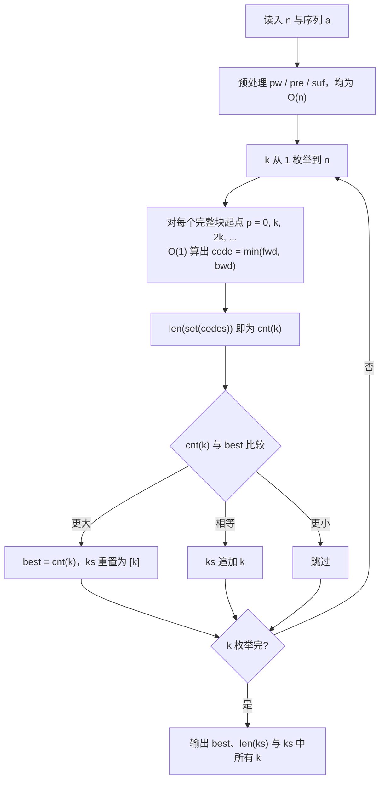

[[TOC]]

## 形式化题目

给定长度为 $n$ 的整数序列 $a_1, a_2, \dots, a_n$ 与正整数 $k$。按从左到右、每 $k$ 个元素一组切分，
得到 $m = \lfloor n/k \rfloor$ 个块

$$B_1 = (a_1, \dots, a_k),\quad B_2 = (a_{k+1}, \dots, a_{2k}),\quad \dots,\quad B_m = (a_{(m-1)k+1}, \dots, a_{mk}),$$

末尾不足 $k$ 个元素的部分直接丢弃。规定**块的反转与原块等价**：块 $x$ 与它的反转 $x^{R}$ 视为同一个块。

记 $\mathrm{cnt}(k)$ 为这 $m$ 个块在"反转等价"下的不同块数。求

$$\mathrm{best} = \max_{1 \leqslant k \leqslant n} \mathrm{cnt}(k), \qquad K = \{\, k \mid \mathrm{cnt}(k) = \mathrm{best} \,\},$$

并输出 $\mathrm{best}$、$|K|$ 以及 $K$ 中所有元素（升序）。

## 正解

### 思路

#### 朴素做法的瓶颈在哪里

对每个 $k$，把 $\lfloor n/k \rfloor$ 个块放进集合去重，去重时把块和它的反转当作同一元素。
块的总数是

$$\sum_{k=1}^{n} \left\lfloor \frac{n}{k} \right\rfloor \approx n \ln n = O(n \log n),$$

$n = 200000$ 时约 $2.4 \times 10^6$ 块。这个规模本身没问题，问题出在**单个块的处理不是 $O(1)$**：

- 若逐字符与其他块比较，单块最坏 $O(n)$，整体退化到 $O(n ^ 2 \log n)$；
- 若把块存成 `tuple` 并用 `min(t, t[::-1])` 去重，`t[::-1]` 要复制 $O(k)$ 个元素，
  实测 $n = 200000$ 时约 166 秒。

所以要做的是：**给每个块一个定长的整数指纹，让单块编码降到 $O(1)$**。

#### 滚动哈希：$O(1)$ 取块的指纹

先做三项 $O(n)$ 预处理（下列式子都在模 $2^{64}$ 意义下）：

- 幂表 $pw[i] = B^{i}$；
- 正向前缀哈希 $pre[i] = a_1 B^{i-1} + a_2 B^{i-2} + \dots + a_i$；
- 反向前缀哈希 $suf[i] = a_n B^{\,n-i} + a_{n-1} B^{\,n-i-1} + \dots + a_i$。

于是位置 $p$ 起、长度 $k$ 的块

$$\text{fwd}(p,k) = pre[p+k] - pre[p] \cdot B^{k}, \qquad
\text{bwd}(p,k) = suf[p] - suf[p+k] \cdot B^{k}$$

都可以在 $O(1)$ 内算出。

#### 关键观察：$\text{bwd}$ 就是反转块的正读哈希

$suf[p] - suf[p+k] B^k$ 展开后的指数从 $k-1$ 递减到 $0$，对应的序列是

$$a_{p+k-1},\ a_{p+k-2},\ \dots,\ a_p,$$

正好是把块 $(a_p, \dots, a_{p+k-1})$ **颠倒过来**之后的正读哈希。
也就是说，我们不需要真的构造反转数组，反向表天然给出了它。

设块为 $x$、其反转为 $x^{R}$，则

$$\text{fwd}_x = \text{bwd}_{x^{R}}, \qquad \text{bwd}_x = \text{fwd}_{x^{R}},$$

两个指纹在反转下**互换**。因此定义

$$\text{code}(x) = \min(\text{fwd}_x,\ \text{bwd}_x),$$

就有 $\text{code}(x) = \text{code}(x^{R})$——反转等价被自动合并进同一个整数。
把它当集合键，`len(set(...))` 就是这个 $k$ 的不同块数。

#### 为什么用 $2^{64}$ 而不是大素数

素数取模需要真正的取余运算，CPython 对 60 位以上整数的 `%` 开销明显。
改用 $2^{64}$ 后所有取模变成 `& ((1 << 64) - 1)`，实测把最坏用例从 1.05 s 压到 0.74 s，
这正是本解能压进 1000 ms 的关键。可行性依赖两点：

1. 底数 $B$ 取**奇数**（$B = 1000003$），与 $2^{64}$ 互素，于是 $B^{k}$ 在环 $Z_{2^{64}}$ 中可逆，
   区间还原公式仍然成立；
2. 减法可能得到负数，`& MASK` 等价于"加 $2^{64}$ 再取模"，结果正确。

下面的表格是样例在 $k=2$ 时的实际指纹，可以看到第 5 块 $(2,3)$ 与第 10 块 $(3,2)$ 尽管顺序相反，
却得到相同的 `code`，因此只算一个不同块。

| 起点 $p$ | 块 | $\text{fwd}$ | $\text{bwd}$ | $\text{code}=\min$ |
| --- | --- | --- | --- | --- |
| 0 | `(1,1)` | 1000004 | 1000004 | 1000004 |
| 2 | `(1,2)` | 1000005 | 2000007 | 1000005 |
| 4 | `(2,2)` | 2000008 | 2000008 | 2000008 |
| 6 | `(3,3)` | 3000012 | 3000012 | 3000012 |
| 8 | `(3,1)` | 3000010 | 1000006 | 1000006 |
| 10 | `(2,3)` | 2000009 | 3000011 | 2000009 |
| 12 | `(3,1)` | 3000010 | 1000006 | 1000006 |
| 14 | `(2,2)` | 2000008 | 2000008 | 2000008 |
| 16 | `(1,3)` | 1000006 | 3000010 | 1000006 |
| 18 | `(3,2)` | 3000011 | 2000009 | 2000009 |

表中 10 个块只产生 6 种不同的 `code`，与样例所说的 $k=2$ 有 6 个不同子串一致；
其中 `(3,1)`、`(1,3)` 共享 `1000006`，`(2,3)`、`(3,2)` 共享 `2000009`。

#### 算法主干

每轮只做 $\lfloor n/k \rfloor$ 次 $O(1)$ 编码，总编码次数 $O(n \log n)$。

### 代码

@include-code(./main.py, python)

### 复杂度

- 时间：预处理 $O(n)$，枚举 $k$ 的总编码次数 $\sum_{k=1}^{n} \lfloor n/k \rfloor = O(n \log n)$，
  故 **$O(n \log n)$**。
- 空间：三张长度 $n+1$ 的表，加上单个 $k$ 的哈希集合，**$O(n)$**。

与数据仓里 OI 官方的替代解 `kor2.cpp`（正反双向哈希 + 排序去重）同阶，
优于 `kor.cpp` 的后缀数组解法 $O(n \log^2 n)$。

## 总结

- 本题的规模瓶颈是"块的总数 $O(n \log n)$ 还能接受，但单块处理必须 $O(1)$"。
- 正反两向前缀哈希让"块"和"块的反转"都能在 $O(1)$ 内取到指纹；
  再对两个指纹取 $\min$，就把"反转视为相同"编码进了同一个整数。
- Python 侧用 $2^{64}$ 取模配合位与 `& MASK`（底数取奇数以保证可逆）压掉取模开销，
  最坏用例从 1.05 s 降到 0.74 s，实测 32 组官方数据在 1000 ms / 128 MB 内全部通过。
