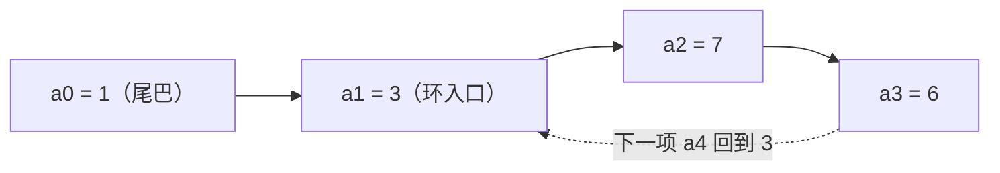

[[TOC]]

## 形式化题目

给定整数 $A, B, C$，定义数列

$$a_0 = 1, \qquad a_{i+1} = \bigl(A \times a_i + (a_i \bmod B)\bigr) \bmod C.$$

求这个数列**第一次出现重复项的位置**：即最小的下标 $j$，使得存在 $i < j$ 且 $a_i = a_j$。
若这个位置超过 $2\times10^6$，输出 $-1$。

下表按样例输入 $A=2, B=2, C=9$ 从 $a_0$ 起逐项递推：第一列是下标，第二列代入递推式，
第三列是项的值，第四列判断它是否在之前的项里出现过。

| 下标 $i$ | 递推 $a_i = (2 a_{i-1} + a_{i-1} \bmod 2) \bmod 9$ | $a_i$ | 之前是否出现过 |
| --- | --- | --- | --- |
| 0 | 题目给定 | 1 | —— |
| 1 | $(2\times1+1) \bmod 9$ | 3 | 否 |
| 2 | $(2\times3+1) \bmod 9$ | 7 | 否 |
| 3 | $(2\times7+1) \bmod 9$ | 6 | 否 |
| 4 | $(2\times6+0) \bmod 9$ | 3 | **是**（等于 $a_1$） |

$a_4$ 撞上了 $a_1$ 已经出现过的值 $3$，所以第一次出现重复项的位置是 $4$，与样例输出一致。

## 正解

### 思路

把递推式看成**函数迭代**：$a_{i+1}$ 只由前一项 $a_i$ 决定（$f(x) = (Ax + (x \bmod B)) \bmod C$），
所以数列的走向是一张"每个点只有一条出边"的函数图，必然长成 ρ 形——先走一段互不相同的
尾巴，再进入一个环。用样例 $A=2, B=2, C=9$ 画出这张图：

从图里能读出三件事：从 $a_1$ 起，每一项都取 $[0, C)$ 中的值（对 $C$ 取模的结果），
而项数无限，所以**重复一定发生**；第一次重复的值恰好是**环入口的值**；"第一次出现重复的项的标号"就是尾巴长度加环长
（样例中尾巴 $a_0=1$，环 $3\to7\to6\to3$，$a_4$ 绕回入口，答案 $4$）。
但题目把答案封顶在 $2\times10^6$，我们不必去求尾巴长和环长——直接从 $a_0$ **逐项模拟**，
第一次踩到旧值就停。

模拟唯一的子问题是判重：值 $x$ 之前出现过吗？朴素的两两比较是 $O(T^2)$（$T$ 为模拟步数），
$2\times10^6$ 项时不可行。注意到每项都在 $[0, C)$ 内，可以按**值域**打标记：
$30\%$ 的数据 $C \leqslant 10^5$，开一个 `bool vis[C]` 数组，每步 $O(1)$ 查改即可拿到这部分分。

可 $100\%$ 的数据 $C \leqslant 10^9$，`vis[C]` 要约 1GB，开不下。换个角度数空间需求：
答案一旦超过 $2\times10^6$ 就输出 $-1$，所以最多模拟 $2\times10^6$ 项，真正会被登记的值
至多 $2\times10^6+1$ 个——标记结构的大小应该跟**出现过的项数**挂钩，而不是跟值域 $C$ 挂钩。
把定长数组换成**哈希集合**：只把走过的值放进集合，查询、插入平均 $O(1)$。

实现上有两个边界：

- 集合初值要放 $a_0 = 1$：值 $1$ 也可能再次出现（例如 $A=0, B\geqslant 2, C>1$ 时 $a_1 = 1$），
  漏掉它会把答案算大；
- "超过 $2\times10^6$ 输出 $-1$"**不包含恰好等于**：模拟下标取闭区间 $[1, 2\times10^6]$，
  第 $2\times10^6$ 项若是重复仍要输出这个下标。

### 代码

@include-code(./main.py, python)

### 复杂度

- 时间 $O(T)$，其中 $T = \min(\text{首次重复的位置},\ 2\times10^6)$（首次重复在封顶之后
  才发生时取 $2\times10^6$）：至多 $2\times10^6$ 次递推与哈希集合操作，单次平均 $O(1)$。
- 空间 $O(T)$：集合只登记实际出现过的值，与值域 $C$ 无关。

两点 Python 侧说明（本仓库短解法允许 TLE/MLE 风险）：最坏情况（输出 $-1$）集合里约有
$2\times10^6$ 个整数对象，实测峰值约 200MB，可能超出 OJ 的 128MB 内存限制；同样的算法用
C++ 的 `unordered_set<int>` 实现约占几十 MB，可在限制内通过。时间上最坏数据本地实测
$0.38s$（本地校验把 1s 限时放宽到 20s），OJ 的 1s 按 C++ 标准给出。

## 总结

- **模型**：递推数列是函数迭代，结构为 ρ 形（尾巴 + 环）；重复一定发生，
  第一次重复发生在绕环回到入口的那一项。
- **算法**：逐项模拟 + 哈希集合判重；答案封顶 $2\times10^6$，超出输出 $-1$。
- **关键转折**：判重结构的大小只跟"出现过的项数"（至多 $2\times10^6+1$）有关、
  与值域无关，于是 $C$ 高达 $10^9$ 时把定长标记数组换成哈希集合。
- **易错点**：集合初值必须包含 $a_0 = 1$；"超过 $2\times10^6$"不含恰好 $2\times10^6$。
