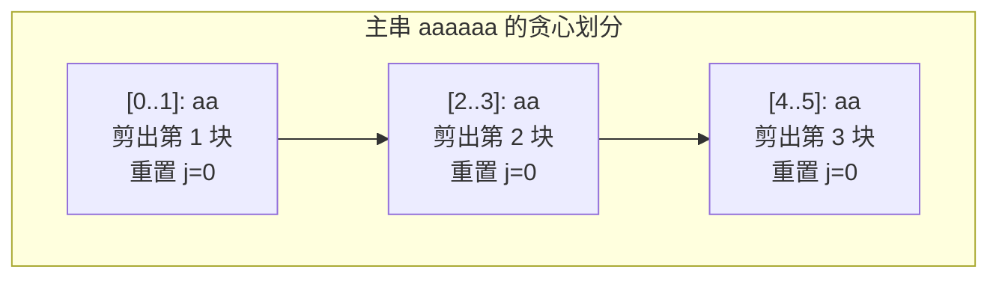

[[TOC]]

## 形式化题目

给定一个主串 $S$ 和一个模式串 $T$。

要求在主串 $S$ 中选取若干个与 $T$ 完全相等的互不相交（无任何字符重叠）的子串，求最多能选取的子串个数。

## 正解

### 思路

本题本质是**区间不相交贪心选择问题**与**字符串匹配**的结合。

#### 1. 贪心策略的最优性

每个出现在主串中的完整模式串 $T$ 对应一个区间 $[l, r]$，其中区间长度固定为 $|T|$。
若我们在位置 $r$ 首次匹配到了一个合法的模式串，根据不相交区间的经典贪心性质：在可选区间中，优先选择右端点最小的区间，能够为后续字符留下尽可能多的匹配空间，从而保证选取数量最大。

因此，从左到右扫描文本串，一旦发现完整的匹配，就应当**立即将其剪下**。

#### 2. KMP 匹配与指针重置

使用 KMP 算法可以在 $O(|S| + |T|)$ 的线性时间内完成模式串在主串中的匹配：

1. **预处理前缀数组 $\pi$**：对于模式串 $T$，计算其前缀函数 $\pi[i]$（即子串 $T[0 \dots i]$ 的最长公共真前后缀长度）。
2. **文本串流式匹配**：维护当前已匹配的模式串前缀长度 $j$。遇到不匹配字符时沿 $j = \pi[j - 1]$ 回退。
3. **剪切操作的实现**：当 $j = |T|$ 时，说明找到了一个完整匹配。由于剪下的饰条不能与后续饰条发生任何重叠，当前被匹配的所有字符均不可复用。我们直接将匹配指针重置为 $j = 0$。这相当于从剪下饰条的下一个字符开始，重新从头匹配模式串，既保证了无重叠，又保留了算法线性扫描的连续性。

下图展示了样例 `aaaaaa` 匹配模式串 `aa` 时的贪心剪切过程：

### 代码

@include-code(./main.py, python)

### 复杂度

- **时间复杂度**：预处理模式串 $T$ 的前缀数组需要 $O(|T|)$；匹配主串 $S$ 时，指针 $j$ 的单调递增总量不超过 $|S|$，回退总量亦不超过 $|S|$，因而匹配阶段为 $O(|S|)$。单组数据总时间复杂度为 $O(|S| + |T|)$。
- **空间复杂度**：需要存储模式串的 $\pi$ 数组，额外空间复杂度为 $O(|T|)$。

## 总结

1. **贪心转化**：固定长度子串的不重叠计数，等价于按右端点升序选取贪心区间，扫描时“逢匹配即剪”是最优策略。
2. **指针重置技巧**：常规 KMP 在完全匹配后会利用 $j = \pi[j - 1]$ 寻找重叠匹配；而本题要求互不相交，只需将匹配状态清零（$j = 0$），便优雅地避免了重叠。
