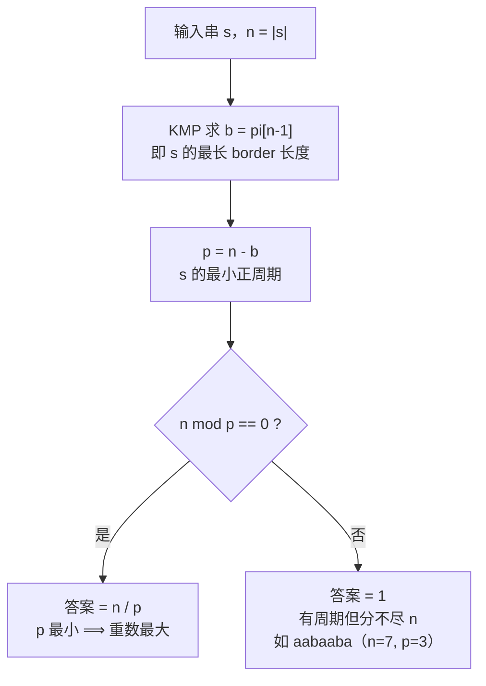

[[TOC]]

## 形式化题目

给定若干个字符串 $s$（仅含英文字母，以单独一行 `.` 结束输入），对每个 $s$ 求最大的
$k$，使得存在串 $t$ 满足

$$s = \underbrace{t\,t\,\cdots\,t}_{k\ \text{个}}$$

也就是求 $s$ 能表示为某个子串重复连接而成的最大重数。

## 正解

### 思路

**第一步：把「重复连接」换成「周期」。** 设 $n = |s|$。若 $s = t^k$，则
$|t| = n/k$ 必须整除 $n$，并且 $s$ 满足「错位 $|t|$ 格后完全相同」，
即 $|t|$ 是 $s$ 的一个**周期**。反过来，若 $p$ 是 $s$ 的周期且 $p \mid n$，
则 $s$ 恰好是 $s[0..p-1]$ 重复 $n/p$ 次。

于是题目变成：**求 $s$ 的最小正周期 $p$；若 $p \mid n$ 输出 $n/p$，否则输出 $1$。**
（$p$ 最小 ⟺ $n/p$ 最大，所以「最小周期」正好对应「最大重数」。）

朴素做法是枚举子串长度 $p$ 再逐字符验证，$O(n^2)$；只枚举 $n$ 的约数能降到
$O(n \cdot d(n))$，但 $n = 10^6$ 时仍然太慢。我们希望**一次线性扫描直接拿到最小周期**。

**第二步：最小周期 = 长度 − 最长 border。** 称 $s$ 的 **border** 为「既是 $s$ 的前缀、
又是 $s$ 的后缀」的真子串，设最长 border 长度为 $b$，令 $p = n - b$。

- $p$ **是周期**：前缀 $s[0..b-1]$ 等于后缀 $s[n-b..n-1]$，逐位对应即得
  $s[i] = s[i+p]$（$0 \leqslant i < b$），这正是周期 $p$ 的定义。
- $p$ **最小**：若 $q < p$ 也是周期，同理 $s$ 会有一个长度 $n - q > n - p = b$ 的
  border，与 $b$ 最长矛盾。

用 `ababab` 看一眼这个「错位重合」的几何含义（$n=6$，最长 border 是 `abab`，$b=4$）：

| 下标 | 0 | 1 | 2 | 3 | 4 | 5 |
| --- | --- | --- | --- | --- | --- | --- |
| 前缀 `abab` | a | b | a | b | | |
| 后缀 `abab` | | | a | b | a | b |

上表两行分别是 $s$ 的前 $b$ 个字符和后 $b$ 个字符。把后缀行整体左移
$p = n - b = 2$ 格（即与前缀行对齐）后，两行在每一列都相同——这就是「周期为 2」，
于是 `ababab` $=$ `ab` $\times 3$。

**第三步：用 KMP 失败函数求最长 border。** 记

$$pi[i] = \text{前缀 } s[0..i] \text{ 的最长 border 长度}$$

求 $pi[i]$ 时利用「$s[0..i-1]$ 的所有 border 长度构成链条
$pi[i-1],\; pi[pi[i-1]-1],\; \dots$」这一性质：从 $b = pi[i-1]$ 出发，
若 $s[b] \ne s[i]$ 就令 $b \leftarrow pi[b-1]$ 继续找更短的候选，
直到 $b = 0$ 或 $s[b] = s[i]$，配上则 $b$ 加一。

以 `ababab` 为例逐字符走一遍：

| $i$ | $s[i]$ | 回退过程 | $pi[i]$ | 得到的 border |
| --- | --- | --- | --- | --- |
| 0 | a | — | 0 | 无 |
| 1 | b | $s[0] \ne \texttt{b}$ | 0 | 无 |
| 2 | a | $s[0] = \texttt{a}$ | 1 | `a` |
| 3 | b | $s[1] = \texttt{b}$ | 2 | `ab` |
| 4 | a | $s[2] = \texttt{a}$ | 3 | `aba` |
| 5 | b | $s[3] = \texttt{b}$ | 4 | `abab` |

表中第 3 列是「沿 border 链回退」的结果，第 4 列是本轮的 $pi[i]$。
最终 $b = pi[5] = 4$，$p = 6 - 4 = 2$。

`while` 回退看似可能很慢，但 $b$ 每轮至多加 1，回退的总步数不会超过总增加次数，
所以**均摊 $O(1)$ 每字符**，整个失败函数是 $O(n)$ 的。

**第四步：整除判定。** 算出 $b = pi[n-1]$、$p = n - b$ 后：

- $n \bmod p = 0$：答案是 $n/p$；
- 否则答案是 $1$。

第二种情况必须单独处理，这是本题最容易错的地方。例如 `aabaaba`（$n = 7$）
的 $pi = [0,1,0,1,2,3,4]$，$b = 4$，$p = 3$。它**确实**以 3 为周期
（`aab|aab|a`），但 $3 \nmid 7$，所以它不能写成某个子串的整数次重复，答案是 1。

练一练：$n = 7$ 时 $3 \nmid 7$ 是显然的，但要是换个长度呢？只要 $p \mid n$ 就
一定有解，这也是下面代码里那个 `if` 的全部含义。

### 代码

@include-code(./main.py, python)

### 复杂度

设输入中所有串的总长为 $N = \sum |s_i|$，最长串长为 $M$。

- 时间复杂度：$O(N)$，每个串一次线性 KMP 扫描；
- 空间复杂度：$O(M)$，失败函数数组的长度与当前串等长。

## 总结

本题是 KMP 失败函数最经典的应用之一，套路可以概括成一句话：

> **$s$ 的最小正周期 $p = |s| - pi[|s|-1]$；当且仅当 $p \mid |s|$ 时 $s$ 是重复串。**

三个值得记住的点：

1. 「重复连接」与「周期」是同一件事，但**多了一个整除条件**，两者不能混为一谈。
2. KMP 的失败函数不只是用来匹配的，它同时编码了串的全部 border 结构，
   是 $O(n)$ 求最小周期的标准工具。
3. 同族结论还有：若 $p \mid n$，答案就是 $n/p$，也就是「最大重数 = 最小周期对应的重数」。

同一模型可以直接迁移到「循环节」「字符串的幂」「Period」一类题目上。

## 图示解析

下图概括从输入串到答案的判定流程，重点是最后那个整除分支：

图中主链是「求 border → 求最小周期 → 整除判定」三步，右侧分支是唯一的
「否」出口。读者应注意到：走到 $F$ 的串并非没有周期，而是周期无法整分长度，
这正是本题与「判断循环节」类题目的差别所在。
三种典型输入的对照（都用同一套代码处理）：

| 输入 | $n$ | $pi[n-1]$ | $p = n - pi[n-1]$ | $n \bmod p$ | 答案 |
| --- | --- | --- | --- | --- | --- |
| `aaaa` | 4 | 3 | 1 | 0 | 4 |
| `ababab` | 6 | 4 | 2 | 0 | 3 |
| `aabaaba` | 7 | 4 | 3 | 1 | 1 |
| `abcd` | 4 | 0 | 4 | 0 | 1 |

表中第 4 列是最小周期，第 5 列是整除判定。最后两行说明：
`abcd` 的 $p = n$，整除成立但重数是 1；`aabaaba` 的 $p$ 更小却分不尽 $n$，
答案同样是 1——两条不同的路径得到同一个输出，这也是为什么代码里必须同时写
「求最小周期」和「整除判定」两步。
