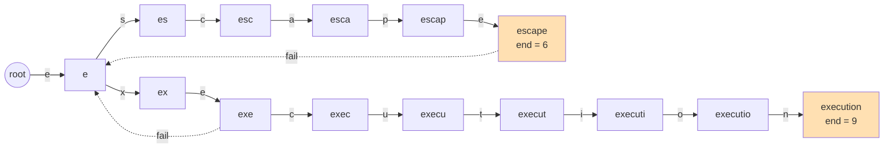

[[TOC]]

## 形式化题目

给定主串 $S$（$1 \leqslant |S| \leqslant 10^5$）和 $n$ 个屏蔽词 $t_1 \sim t_n$（$1 \leqslant \sum |t_i| \leqslant 10^5$，均为小写字母），保证任何 $t_i$ 都不是 $t_j$（$i \neq j$）的子串。反复执行：在当前串中查找屏蔽词的一次出现并删除它（"从头开始寻找"即删最左出现），直到串中不再含屏蔽词，输出最终的串（保证非空）。

由"互不为子串"得到两个关键推论：**同一位置结尾的屏蔽词至多一个**（否则短的成为长的后缀）；**某次出现的开始位置唯一对应一个屏蔽词**。

## 正解

### 思路

**朴素做法与两个瓶颈。** 按题面模拟：每次从头找最左出现的屏蔽词，删除后回到开头再找。单次查找是 $O(|S| + |t|)$，最多删除 $O(|S| / \min|t|)$ 次，最坏总代价约 $O(|S| \cdot \sum |t|)$，对 $10^5$ 规模必然超时。瓶颈有两个：一是每次查找都要重新扫整条串；二是删除后要"从头再找"。下面分别用两个经典工具消掉它们。

**瓶颈一：把"从头找"变成"转移一步"——AC 自动机。** 把所有屏蔽词插入 trie，BFS 求出 fail 指针并把缺边补全成 fail 转移（trie 图），之后每读一个字符只需 $O(1)$ 查一次转移表。自动机状态的含义是：*当前串的最长后缀中，是某个屏蔽词前缀的最长者*。当转移落点是某个屏蔽词的结尾节点时，恰好说明**当前串的末尾出现了屏蔽词**。

为什么只需检查末尾？设已读入前缀反复删除后的保留串为 $R$（归纳保证它不含屏蔽词），再读入字符 $c$。若 $R \cdot c$ 中有屏蔽词出现，它必然以 $c$ 结尾——否则它完全落在 $R$ 内，与 $R$ 无屏蔽词矛盾。又因为同一位置结尾的屏蔽词至多一个，所以 $R \cdot c$ 中至多出现一次屏蔽词：要么安全，要么整段弹出后自然干净。于是"反复从头找"就等价于"逐字符读入、末尾命中即删"，这是一次扫描能做完的根本原因。

**瓶颈二：把"从头再找"变成"恢复状态"——栈。** 删除让串变短，但被删部分之前的字符从未变过，变的只是拼接处。因此用两个平行栈：`kept` 存保留的字符，`states` 存每个前缀对应的自动机节点（`states[i]` 是前缀 `kept[:i]` 的状态，`states[0]` 是根）。命中长度为 $L$ 的屏蔽词时，把两栈各弹出 $L$ 个元素，然后 `cur = states[-1]`——这正是"删除后的串"的自动机状态，拼接处的匹配由自动机自动接上。

下面的图展示样例中两个屏蔽词建成的自动机（实边是 trie 边，虚边是关键的 fail 边，橙色节点是词尾）：



两个词只共享根和节点 `e`。重点看两条 fail 边：`escape` 和 `exe` 的 fail 都指向节点 `e`——一个屏蔽词的后缀可以同时是另一个屏蔽词的前缀。这正是"删除后拼接处能产生新屏蔽词"的结构来源。

用样例 $S =$ `begintheescapexecutionatthebreakofdawn` 走一遍扫描，下表展示保留栈的四个阶段：

| 阶段 | 本段读入 | 末尾是否命中 | 命中后栈 `kept` | 命中后状态 `cur` |
| --- | --- | --- | --- | --- |
| 1 | `beginthe` | 否 | `beginthe` | 节点 `e` |
| 2 | `escape` | 是（`escape`，$L=6$） | `beginthe`（弹出 `escape`） | 节点 `e`（取自栈顶记录） |
| 3 | `xecution` | 是（`execution`，$L=9$） | `beginth`（弹出栈中的 `e` 与刚读的 `xecution`） | 根 |
| 4 | `atthebreakofdawn` | 否 | `beginthatthebreakofdawn` | — |

阶段 3 是全题最微妙的一步：删除 `escape` 后状态恢复为节点 `e`（`beginthe` 的最长后缀是前缀的只有 `e`），而 `e` 恰好也是 `execution` 的前缀，于是继续读入 `xecution` 时沿 $ex \to exe \to \cdots \to execution$ 一路匹配，最终弹出的 $9$ 个字符 = 栈里残留的 `e` + 刚读入的 8 个字符。如果删除后恢复的状态差一个字符（比如回退成 `beginth` 的状态），后面的匹配就全错了——这也是本题实现时最容易写错的地方。

**词尾长度的预处理。** 建自动机时用 `end[v] = end[v] or end[fail[v]]` 把"以该节点结尾的屏蔽词长度"沿 fail 链传播，命中时才知道要弹几个字符。由于屏蔽词互不为子串，fail 链上至多一个词尾，`or` 就够了，无需比较取 max。命中时"先把当前字符入栈再统一弹出 $L$ 个"，可以顺便避开单字符屏蔽词时 `del kept[-0:]` 会清空整个列表的 Python 切片坑。

### 代码

@include-code(./main.py, python)

### 复杂度

- **时间** $O(26 \cdot \sum |t_i| + |S|)$：建自动机对每个节点扫 $26$ 个转移；扫描每字符 $O(1)$ 转移，且每个字符至多入栈一次、出栈一次（均摊），删除的总代价不额外增长。
- **空间** $O(26 \cdot \sum |t_i| + |S|)$：trie 图转移表约 $26 \times 10^5$ 个整数，加栈与 `fail`/`end` 数组，实测峰值约 $53$MB。

## 总结

- 题面"删掉再从头找"看似要反复扫串，但由"屏蔽词互不为子串"推出"删除只发生在保留串末尾、同一结尾至多一个屏蔽词"，从而把整个过程压成一次从左到右的扫描。
- AC 自动机负责 $O(1)$ 定位"末尾是否出现屏蔽词"，栈里的 `states` 负责 $O(1)$ 恢复删除后串的状态，两者配合把两个瓶颈都消掉，总复杂度 $O(26 \cdot \sum |t_i| + |S|)$。
- 实现要点：`end` 沿 fail 链用 `or` 传播；命中分支先入栈再统一弹出；兼容本题面的 $n$ 词格式与 USACO 原始数据的单词格式（真实测试数据是后者）。

## 图示解析

这张图串起本题从建模到得到答案的主线：

```text
题意：S 中出现屏蔽词就删，删完"从头再找"
`- 关键观察：删除只发生在保留串末尾，同一结尾位置至多一个屏蔽词
   `- 模型：屏蔽词建 AC 自动机，栈平行保存字符与每个前缀的状态
      |- 末尾命中：按 end 长度整段弹出，状态恢复为栈顶记录值
      |           → 拼接处（beginth + execution）自动续接匹配
      `- 复杂度：建图 O(26·∑|t|)，扫描均摊 O(|S|)
```

先看每个节点代表的推理结论，再顺着分支检查"末尾命中"如何同时解决查找与删除后重找两个瓶颈。
图中只保留正文已经证明过的关键关系，不替代正文中的样例推演和正确性说明。
