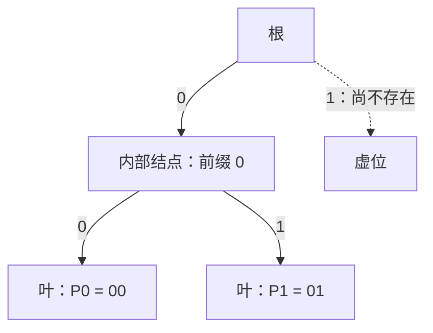

[[TOC]]

## 形式化题目

给定含 $N$ 个元素的数组 $A$（下标从 $1$ 开始），求下式的最大值：

$$\left(A_{l_1} \oplus A_{l_1+1} \oplus \cdots \oplus A_{r_1}\right) + \left(A_{l_2} \oplus A_{l_2+1} \oplus \cdots \oplus A_{r_2}\right)$$

其中两段互不相交：

$$1 \leqslant l_1 \leqslant r_1 < l_2 \leqslant r_2 \leqslant N$$

即选出两个**非空、不相交**的连续子数组，使它们的异或和之和最大。

样例：$N=5$，$A = [1,2,3,1,2]$，输出 $6$。达到 $6$ 的四元组有 $(1,2,3,3)$（$1\oplus2=3$ 加 $A_3=3$）、$(1,2,4,5)$（$3$ 加 $1\oplus2=3$）、$(3,3,4,5)$（$3$ 加 $3$）。

## 正解

### 思路

**朴素做法：枚举两段的所有组合。** 子数组共 $\Theta(N^2)$ 个，两两配对（要求 $r_1 < l_2$）是 $\Theta(N^4)$ 量级的组合。即使先用前缀异或把单次求值压到 $O(1)$，组合数不变——原题 $N$ 最大 $4 \times 10^5$，完全不可行。真正需要的不是每对子数组的值，而是**两类极值**：每个前缀、后缀区间内各自的"最大子数组异或"。

**第一层优化：分割点拆分。** 两段不相交，就一定存在某个分割点 $k$（$1 \leqslant k < N$）把它们隔开：左段完全落在 $A[1..k]$，右段完全落在 $A[k+1..N]$。左右两段互不制约，于是

$$\text{答案} = \max_{1 \leqslant k < N} \big(f(k) + g(k+1)\big)$$

其中 $f(k)$ 是 $A[1..k]$ 内的最大子数组异或，$g(i)$ 是 $A[i..N]$ 内的最大子数组异或。用样例 $A=[1,2,3,1,2]$ 把每个分割点算一遍：

| 分割点 $k$ | $f(k)$：$A[1..k]$ 内最大子数组异或 | $g(k+1)$：$A[k+1..5]$ 内最大子数组异或 | 两段之和 |
| --- | --- | --- | --- |
| 1 | 1 | 3 | 4 |
| 2 | 3 | 3 | **6** |
| 3 | 3 | 3 | **6** |
| 4 | 3 | 2 | 5 |

答案 $6$ 在 $k=2,3$ 处取得，恰好对应样例给出的三组最优四元组：$(1,2,3,3)$ 对应 $k=2$，$(1,2,4,5)$ 与 $(3,3,4,5)$ 的两段分别落在 $k=3$ 的两侧。这层变换把 $\Theta(N^4)$ 的"段对组合"降成"求 $f$、求 $g$、再 $O(N)$ 扫一遍合并"。

**第二层优化：前缀异或。** 记 $P_0 = 0$，$P_i = A_1 \oplus \cdots \oplus A_i$，中间项两两抵消：

$$\mathrm{xor}(A[l..r]) = P_r \oplus P_{l-1}$$

于是 $f(k) = \max_{1 \leqslant r \leqslant k} h(r)$，其中 $h(r) = \max_{0 \leqslant j < r} \left(P_r \oplus P_j\right)$——"以 $r$ 结尾的最大子数组异或"就是拿 $P_r$ 去和**所有更早的前缀异或**配对求最大异或。瓶颈集中到了这一步：逐个 $j$ 扫描求 $h(r)$，总代价 $O(N^2)$，$N=4\times10^5$ 时约 $1.6\times10^{11}$ 次运算，仍然不可行。

**第三层优化：01-Trie 上的贪心。** 把 $P_0, P_1, \dots, P_{r-1}$ 按二进制从高位到低位插入一棵 01-Trie（每层一个二进位，往左是 $0$、往右是 $1$），查询 $P_r$ 时逐层决策：设当前位为 $b$，若"反向位 $1-b$"的儿子存在就走过去（该位异或得 $1$），否则只能顺 $b$ 的儿子走（该位得 $0$）。贪心正确性来自高位的权重：第 $s$ 位的收益 $2^s$ 严格大于所有低位之和 $2^s - 1$，所以"高位能取 $1$ 就先取 $1$"不会被任何低位组合反超。单次查询/插入都是 $O(B)$，$B$ 为值域位数（$B \leqslant 30$）。

以样例演示：$B = \mathrm{bit\_length}(\max A) = 2$，查询 $P_2 = 3 = 11_2$ 时 Trie 里只有 $P_0 = 00$、$P_1 = 01$：

第 $1$ 位 $b=1$，想找反向的 $0$ 号儿子——存在，走过去并把该位记 $1$；第 $0$ 位 $b=1$，反向的 $0$ 号儿子（$P_0$ 的路径）也存在，再记 $1$；累计 $11_2 = 3 = P_2 \oplus P_0$，落点是 $P_0$，对应子数组 $A[1..2] = 1 \oplus 2 = 3$。注意根的 $1$ 号儿子此时并不存在——若 $b=0$ 想找反向的 $1$ 就只能顺着 $0$ 走，这正是"不存在才退让"的含义。

**先查后插**保证查询 $P_r$ 时集合里只有 $P_0 \dots P_{r-1}$：partner 下标 $j < r$，对应子数组 $A[j+1..r]$ 非空且右端点恰为 $r$。在扫 $f$ 的过程中维护前缀最大值 $f(k) = \max(f(k-1), h(k))$，一遍即得所有 $f$。

**后缀复用与合并。** $g$ 与 $f$ 是同一个函数作用在反转数组上：`prefix_best(a[::-1])` 的结果再反转就是 $g$。最后 $O(N)$ 扫一遍 $\max_k f(k) + g(k+1)$ 即为答案。

### 代码

@include-code(./main.py, python)

`prefix_best` 写成生成器逐个产出 $f(k)$，不落整张表；Trie 用 `array('i')` 平坦存储两个儿子槽并按需扩容，避免 Python 对象开销撑爆 128MB 内存；`solve` 中右半 $g$ 先物化成数组，左半 $f$ 边生成边与 $g(k+1)$ 相加取最大。

### 复杂度

- 时间复杂度：$O(N \cdot B)$，$B = \mathrm{bit\_length}(\max A) \leqslant 30$（真实数据 $B=18$）。两遍 `prefix_best`，每遍 $N{+}1$ 个前缀各做一次 $O(B)$ 查询加一次 $O(B)$ 插入，合计约 $4NB$ 层操作，$N = 4 \times 10^5$、$B = 18$ 时约 $2.9 \times 10^7$ 层。与 C++ 正解（同样前缀异或 + 01-Trie）同阶。
- 空间复杂度：$O(N \cdot B)$，Trie 结点数不超过 $1 + (N{+}1)B$；`array('i')` 每结点两槽各 4 字节，按需扩容，实测峰值不超过 128MB。
- 实测：数据仓全部 10 组真实数据（$N$ 从 $10^4$ 到 $4 \times 10^5$）输出全部一致，单组最大用时约 4.2s（本地限时 20s）。OJ 限时 1s，Python 有 TLE 风险，属 python-oj-short 允许范围；算法复杂度与标准 C++ 正解同阶，不是暴力。

## 总结

- 两段不相交 $\Rightarrow$ 枚举分割点 $k$：答案 $= \max_k f(k) + g(k+1)$，把"段对组合"（$\Theta(N^4)$）拆成前后缀各自的单段极值加一次线性扫描。
- 子数组异或 $=$ 两个前缀异或之异或：$\mathrm{xor}(A[l..r]) = P_r \oplus P_{l-1}$，"以 $r$ 结尾的最大子数组异或"化为"$P_r$ 与历史前缀集合的最大异或"。
- 01-Trie 逐位贪心：第 $s$ 位收益 $2^s$ 大于所有低位之和，反向儿子存在就走；**先查后插**保证 partner 下标更小、子数组非空。
- $g$ 与 $f$ 同构，反转数组复用同一函数；边界：全零数组 $B=1$ 时 Trie 退化为一层仍正确，重复前缀异或共用路径不影响"存在性"判断。
