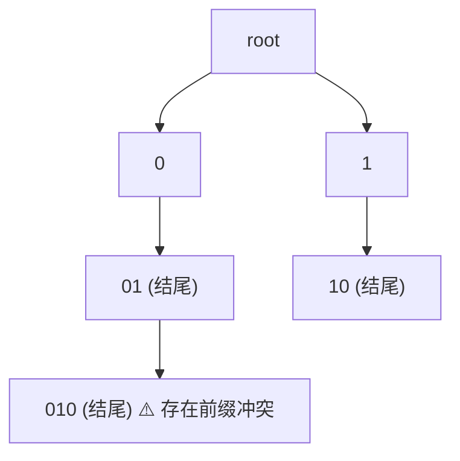

[[TOC]]

## 形式化题目

给定一个由若干个非空 01 数字串组成的集合 $S = \{s_1, s_2, \dots, s_n\}$。

若集合中不存在两个不同的字符串 $s_i, s_j \in S$ 满足 $s_i$ 是 $s_j$ 的前缀，则称该集合具有立即解码性（immediately decodable）。请对多组测试集合分别判定是否具有该性质。

## 直接正解：字典序排序相邻检查

### 思路

判定前缀冲突的经典数据结构是字典树（Trie）。但是本题数据规模较小（$2 \le n \le 8$，$1 \le l \le 10$），我们可以利用**字典序排序的连续性性质**得出更加精炼优雅的做法：

1. **核心观察**：若字符串 $A$ 是字符串 $B$ 的真前缀，则在字典序下必然有 $A < B$。更关键的是，所有以 $A$ 为前缀的字符串在字典序排序后必然紧随 $A$ 之后，形成一段连续区间。
2. **相邻充分性**：若集合中存在某个串是另一个串的前缀，那么在按字典序升序排序后的序列中，必然至少存在一对相邻的元素 $(S[i], S[i+1])$，满足 $S[i+1]$ 以 $S[i]$ 为前缀。
3. **算法流程**：
   - 将集合中的所有字符串按字典序从小到大排序；
   - 遍历排序后所有相邻的字符串对 $(s_i, s_{i+1})$，检查是否满足 $s_{i+1}\text{.startswith}(s_i)$；
   - 一旦存在任意一对相邻元素满足前缀关系，则该集合不可立即解码；若所有相邻对均不满足，则该集合可立即解码。

### 代码

@include-code(./main.py, python)

### 复杂度分析

- **时间复杂度**：设每组数据串个数为 $n$，最大长度为 $L$。排序耗时 $\mathcal{O}(n \log n \cdot L)$，相邻串检查耗时 $\mathcal{O}(n L)$。每组数据总体时间复杂度为 $\mathcal{O}(n \log n \cdot L)$。在 $n \le 8, L \le 10$ 时，计算量在百次操作以内，运行时间 $\approx 0\text{ ms}$。
- **空间复杂度**：存储该组字符串占用 $\mathcal{O}(n L)$ 空间，额外辅助内存极小，远低于 128 MB 限制。

## 总结

利用字典序中“前缀串必排在衍生串前且紧邻其衍生区间首位”的数学性质，我们将全集合的成对前缀检查规约为一次排序加相邻线性扫描，代码极为简洁高效。对于更大规模数据（例如 $n = 10^5$），同样可以使用该排序法或标准的 Trie 树在 $\mathcal{O}(\sum |s|)$ 时间内在线完成。
