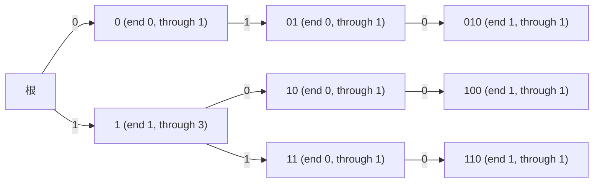

[[TOC]]

## 形式化题目

给定两个二进制串集合：

- 信息集合 $X = \{x_1, x_2, \dots, x_N\}$，$x_i$ 长度为 $b_i$；
- 密码集合 $Y = \{y_1, y_2, \dots, y_M\}$，$y_j$ 长度为 $c_j$。

对每条密码 $y_j$，求下标 $i$ 的个数，使得 $x_i$ 与 $y_j$ 的前
$\min(|x_i|, |y_j|)$ 位完全相同。

**等价刻画**：设 $|x_i| \leqslant |y_j|$，比较长度就是 $|x_i|$，条件即
$x_i = y_j[0:|x_i|]$，也就是"$x_i$ 是 $y_j$ 的前缀"；$|y_j| \leqslant |x_i|$
的情形完全对称。因此

$$x_i \text{ 与 } y_j \text{ 匹配} \iff x_i \text{ 是 } y_j \text{ 的前缀} \ \lor\ y_j \text{ 是 } x_i \text{ 的前缀}.$$

也就是说，题目要求的全部是比较"谁是谁的前缀"。

### 样例

4 条信息 $\{010,\ 1,\ 100,\ 110\}$，5 条密码 $\{0,\ 1,\ 01,\ 01001,\ 11\}$，
逐条密码按上面的等价刻画核对：

| 密码 | 比较长度（$\min$） | 匹配的信息 | 条数 |
| :---: | :---: | :--- | :---: |
| $0$ | 1 | $010$ | 1 |
| $1$ | 1 | $1,\ 100,\ 110$ | 3 |
| $01$ | 2 | $010$ | 1 |
| $01001$ | 3（与 $010$） | $010$ | 1 |
| $11$ | 2 | $1$（密码是它的前缀）、$110$（它是密码的前缀） | 2 |

注意第 5 行：密码 $11$ 与信息 $1$ 比较时较短者是信息、与信息 $110$ 比较时较短者是
密码，**两个方向都要统计**；而 $01001$ 虽然更长，也只与 $010$ 的前 3 位相同，答案仍为 1。

---

## 正解

### 思路

#### 朴素做法与瓶颈

最直接的做法是对每条密码遍历全部 $N$ 条信息逐位比较。当 $N = M = 5 \times 10^4$ 时，
比较对数达到 $2.5 \times 10^9$，显然超时。更本质的问题是这些比较**互相不共享**：
每条密码都从头与每条信息比一遍，大量比较其实反复核对了相同的前缀——所有以 `1`
开头的信息，在和每一条以 `1` 开头的密码比较时都重做了第一位。

#### 把两两比较改写成前缀归属查询

等价刻画告诉我们，匹配只有"信息是密码前缀"和"密码是信息前缀"两种情形。于是不再
逐对比较，而是把全部信息组织成一棵 **01-Trie（字典树）**：相同前缀自动共享成同一条
路径，一条信息就是树上从根出发的一条路径。每个节点维护两个计数：

- `through[v]`：路径**经过** $v$ 的信息条数（恰好终止在 $v$ 的也算经过）；
- `end[v]`：**恰好终止**在 $v$ 的信息条数。

插入信息 $x_i$ 时，沿路每进入一个节点 `through += 1`，到达终点再 `end += 1`；
重复出现的信息按条数累加，不会丢。

#### 查询：沿途终止数 + 终点剩余经过数

查询密码 $y$ 时，沿树逐位走，答案由两部分组成：

1. **比密码短、且是密码前缀的信息**：它们的终点恰好落在 $y$ 的查询路径上，
   等于路径上各节点 `end` 之和；
2. **比密码长、以密码为前缀的信息**：它们的路径经过 $y$ 的终点 $v$ 但不在 $v$ 终止，
   等于 `through[v] - end[v]`（经过 $v$ 的 = 终止在 $v$ 的 + 继续往下的）。

若中途走不动（孩子不存在），说明更深处不再有任何信息，第 2 类不存在，答案就只是
沿途的 `end` 之和。两部分的分界处理保证不重不漏：与密码**完全相等**的信息既是
"密码前缀"也是"信息前缀"，它的 `end[v]` 在沿途被计入一次、在最后又被 `through - end`
减掉一次，恰好只算一条。

下图是样例信息建出的 Trie，括号内为每个节点的 `end`（终止数）与 `through`（经过数）：

以密码 `11` 为例：先走到节点 `1`，沿途累计 `end = 1`（信息 `1` 恰好终止于此，属于
第 1 类）；再走到终点 `11`，补上 `through - end = 1 - 0 = 1`（信息 `110` 属于第 2 类），
合计 2，正是样例答案。节点 `1` 的 `through = 3` 则解释了密码 `1` 的答案 3：信息
`1`、`100`、`110` 全部经过它。

### 代码

@include-code(./main.py, python)

`build_trie()` 用三个平行列表 `ch`、`end`、`through` 存树（`ch[v][t]` 为孩子编号，
`0` 兼作"不存在"与根），`match_count()` 实现上面的两部分计数：`ONE = b'1'` 把字节
`b'1'` 布尔化直接当孩子下标（`b'0' → 0`，`b'1' → 1`），走不动时 `return ans`
返回沿途 `end` 之和，全部走通则 `return ans + through[v] - end[v]`。

### 复杂度

- **时间**：建树 $O(\sum b_i)$，查询每条密码至多走自己的长度、断路即停，共
  $O(\sum c_j)$，合计 $O(\sum b_i + \sum c_j)$。由 $\sum b_i + \sum c_j \leqslant 500000$，
  总步数不超过 $5 \times 10^5$，与 $N \cdot M$ 无关，线性读入与输出同阶。
- **空间**：节点数不超过信息产生的不同前缀数加根，即 $O(\sum b_i) \leqslant 5 \times 10^5$，
  每节点存 2 个孩子下标与 2 个计数。真实数据本地实测峰值约 44 MB、单组约 0.06 s，
  低于 128 MB 内存限制（本地验证 13 组数据全部输出一致）。

---

## 总结

匹配条件等价于"一条串是另一条的前缀"，因此把全部信息插入 01-Trie、让公共前缀共享，
并让每个节点同时记录"经过数"与"终止数"。查询密码时沿路径累加沿途终止数（比密码短的
匹配者），走通后补上终点的"经过数减终止数"（比密码长的匹配者），两部分恰好不重不漏。
一次建树加每条密码一次树上行走，把 $O(N \cdot M)$ 的两两前缀比较压缩到
$O(\sum b_i + \sum c_j)$ 的线性复杂度。
