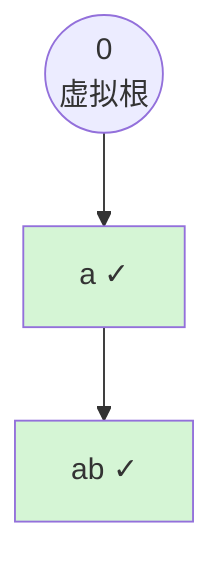
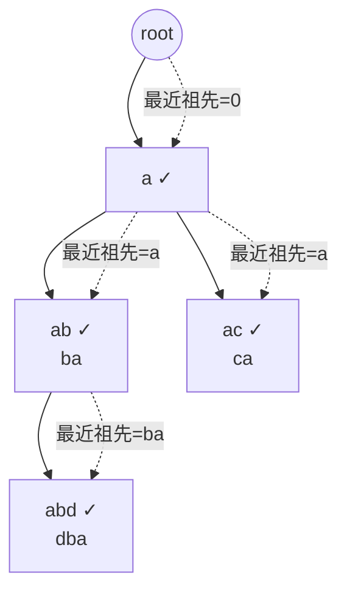
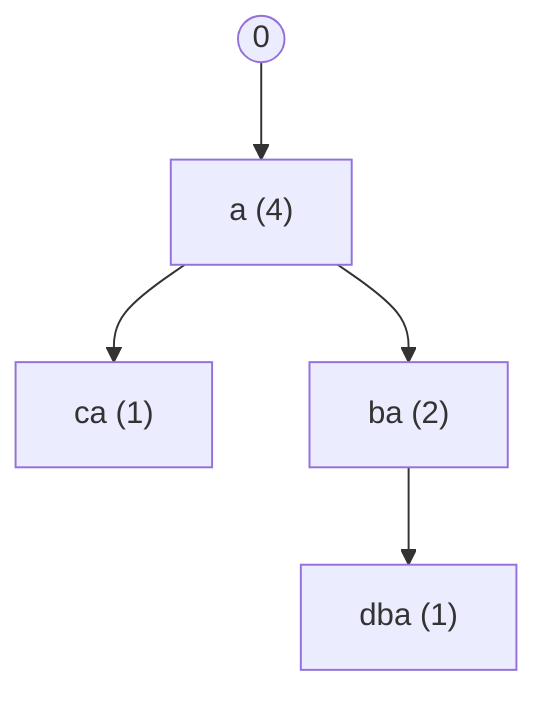

[[TOC]]

## 形式化题目

给定 $n$ 个两两不同的字符串 $w_1, w_2, \ldots, w_n$。选择一个排列 $p_1, p_2, \ldots, p_n$ 作为填写顺序。对位置 $x$ 上的单词 $w$，记 $S(w)$ 为所有是 $w$ 真后缀的单词出现位置的集合，代价为

$$
\text{cost}(w) =
\begin{cases}
n \times n, & \text{存在 } u \in S(w) \text{ 出现在 } x \text{ 之后},\\[2pt]
x - y, & \text{所有后缀都在 } x \text{ 之前},\ y = \max S(w) \text{（无后缀时 } y = 0\text{）}.
\end{cases}
$$

求 $\sum_{i=1}^{n} \text{cost}(p_i)$ 的最小值。

**约束**：$1 \leqslant n \leqslant 10^5$，所有单词长度之和 $1 \leqslant \sum |len| \leqslant 5.1 \times 10^5$，单词均为小写字母且两两不同。

### 样例

输入为 `a`、`ba`。`a` 是 `ba` 的后缀，因此 `a` 必须先填：

| 填写顺序 | 位置 1 的代价 | 位置 2 的代价 | 总代价 |
| :---: | :---: | :---: | :---: |
| `a`, `ba`（合法） | `a`：无后缀，代价 $1$ | `ba`：最长后缀 `a` 在位置 1，代价 $2-1=1$ | **2** |
| `ba`, `a`（非法） | `ba`：后缀 `a` 尚未填，代价 $n^2=4$ | `a`：代价 1 | 5 |

反着填会让 `ba` 触发 $n^2 = 4$ 的惩罚，总代价反而更大。可见最优解一定让"所有后缀先于单词本身"。

---

## 正解

### 思路

#### 第一步：为什么永远不该触发 $n \times n$

只要把单词按长度**从小到大**填写，长单词的所有后缀都更短、已经填完，所以这种顺序一定合法。合法顺序的代价最多是 $\sum_{x=1}^{n} x = \frac{n(n+1)}{2} < n^2$（$n \geqslant 1$ 时成立），比任何触发 $n \times n$ 的方案都便宜。因此**最优解一定是合法序**：每个单词都排在它所有后缀之后。

#### 第二步：反转单词，让"后缀"变成"前缀"

$u$ 是 $w$ 的后缀，等价于 $\text{rev}(u)$ 是 $\text{rev}(w)$ 的前缀。把每个单词反转后插入字典树，那么 **$w$ 的所有后缀 = 树上从根到 $w$ 所在节点的路径上、所有"单词结尾"节点所代表的单词**。后缀的偏序被字典树翻译成了树上祖先关系。

#### 第三步：只留单词节点，得到一棵森林

路径上可能有许多"中转节点"（不是任何单词的结尾），它们对填写顺序毫无影响。对每个单词节点 $v$，让它连向路径上**最近的单词结尾祖先** $p(v)$（不存在就连向虚拟根 $0$）。因为"后缀的后缀还是后缀"，只要 $v$ 排在 $p(v)$ 之后就自动排在它所有后缀之后。

以 `a`、`ba` 为例，反转后得到 `a`、`ab`：

（✓ 表示单词结尾。）`ab` 的最近单词祖先正是 `a`，因此新树就是 0 → `a` → `ab`。`a` 是 `ba` 的后缀这件事，被准确记录成了父子关系。

#### 第四步：代价公式化简

合法序下，$w$ 的所有后缀都在它前面。其中**位置最大**的那个后缀 $y$ 一定是**最长**的后缀（越长的后缀必须越晚填），也就是 $p(w)$。所以

$$\text{cost}(w) = \text{pos}(w) - \text{pos}(p(w)), \qquad \text{pos}(0) = 0.$$

整题变成：

> 在树上选择一个合法的 DFS 前序，最小化 $\sum_{v} \bigl(\text{pos}(v) - \text{pos}(p(v))\bigr)$。

#### 第五步：贪心 —— 子树小的儿子先访问

每个节点都要为"自己与父亲之间的位置间隔"付费。把 $0$ 的每个儿子看成一件"任务"，任务耗时是它整棵子树的单词数。这和经典的**排队接水**完全同型：一个节点的所有儿子应当**按子树大小升序**访问。

交换论证：设相邻访问的两个兄弟子树为 $A$、$B$。交换它们不影响两棵子树**内部**各节点的父子间隔，只影响 $A$ 之后所有兄弟子树的起点。若 $|A| \geqslant |B|$，交换后（$B$ 在前）总代价变化为 $|B| - |A| \leqslant 0$，不会变差。反复交换即可把任意访问顺序整理成"大小升序"且代价不增。

于是最优顺序 = **树上按子树大小升序访问儿子的 DFS 前序**。

#### 样例推演

对 `a`、`ba`：`a` 的子树大小为 2，它是虚拟根唯一的儿子。

| 访问节点 | 位置 `pos` | 父亲位置 | 代价 |
| :---: | :---: | :---: | :---: |
| `a`（虚拟根的儿子） | 1 | 0 | $1-0=1$ |
| `ab`（即 `ba`） | 2 | 1 | $2-1=1$ |
| | | **总计** | **2** |

### 代码

@include-code(./main.py, python)

### 复杂度

设 $S = \sum |len|$，字典树节点数 $V \leqslant S + 1$。

- **时间**：建树 $O(S)$；求最近终止祖先与子树大小均 $O(V)$；各节点对儿子排序总计 $O(n \log n)$；迭代 DFS $O(n)$。合计 $O(S + n \log n)$。
- **空间**：邻接表与各数组共 $O(S + n)$；单键字典把 `(节点, 字符)` 压成整数，实测在 $n = 10^5$、$\sum|len| \approx 5 \times 10^5$ 的数据上峰值内存约 64MB，低于 128MB。

---

## 总结

本题的完整链条是：

1. 合法序一定优于触发 $n^2$ 的顺序 → 只需考虑"后缀先填"的顺序；
2. 反转单词后建 Trie，后缀关系 = 祖先关系；
3. 只保留单词结尾节点、连向最近的单词祖先，得到一棵树；
4. 代价化简为 $\text{pos}(v) - \text{pos}(p(v))$，等价于"排队接水"；
5. 按子树大小升序 DFS，$O(S + n\log n)$ 解决。

---

## 图示解析

下面用一个有分支的例子走通全流程。单词为 `a`、`ba`、`ca`、`dba`，反转后为 `a`、`ab`、`ac`、`abd`。

第一步：反转建 Trie，标出单词结尾节点（✓）与每个单词节点的最近单词祖先（虚线）。

第二步：只保留单词节点并按最近祖先连边，得到模型树；括号内是子树大小。

第三步：按子树大小升序 DFS。`a` 的儿子有 `ca(1)` 和 `ba(2)`，先访问小的 `ca`，再访问 `ba`，`ba` 之后才轮到 `dba`。

| 访问顺序 | 单词 | $\text{pos}$ | 父亲位置 | 代价 |
| :---: | :---: | :---: | :---: | :---: |
| 1 | `a` | 1 | 0 | 1 |
| 2 | `ca` | 2 | 1 | 1 |
| 3 | `ba` | 3 | 1 | 2 |
| 4 | `dba` | 4 | 3 | 1 |
| | | | **总计** | **5** |

观察重点：把小的子树 `ca` 提前，可以让 `ba` 和 `dba` 这两个"大块"整体后移，反之则会让 `ca` 凭空多出与 `ba` 的间隔代价。这就是该贪心的直观来源。
