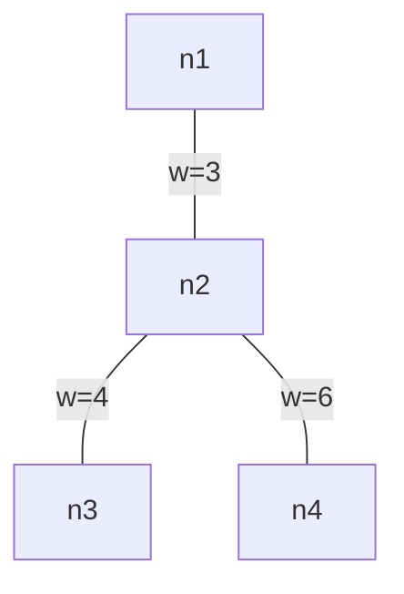

[[TOC]]

## 形式化题目

给定一棵 $n$ 个点的带权树，点编号从 $1$ 到 $n$，共 $n-1$ 条边；边 $(u, v)$ 的权为 $w$。
树上任意两点之间有唯一简单路径，定义这条路径的长度为**路径上所有边权按位异或**：

$$
\mathrm{xor}(u, v) = \bigoplus_{e \in \mathrm{path}(u, v)} w_e .
$$

求所有点对路径长度的最大值 $\max\limits_{1 \leqslant u < v \leqslant n} \mathrm{xor}(u, v)$。

**约束**：$1 \leqslant n \leqslant 10^5$，边权 $0 \leqslant w < 2^{31}$（实测数据最大 $2147400037$）。

### 样例

下图为样例的树，边标注权值：

最长的异或和路径是 $1 \to 2 \to 3$，长度 $3 \oplus 4 = 7$，与样例输出一致。
注意 $1 \to 3$ 与 $2 \to 3$ 等路径的候选值都更小，穷举所有点对共 $\binom{4}{2} = 6$ 条路径即可验证。

## 正解

### 思路

**朴素做法**是枚举点对再逐边求异或；即使预处理 LCA 把"走路"压到 $O(1)$，
候选仍是全部 $\binom{n}{2}$ 个点对，$n = 10^5$ 时约 $5 \times 10^9$ 次异或，必然超时。
瓶颈在于"路径"这个对象天然有 $O(n^2)$ 条——要优化，先得把一条路径**塌缩**成更小的东西。

**观察一：树上前缀异或，路径只由端点决定。** 任选根（取点 1），记

$$
d[u] = \text{根到 } u \text{ 的路径上所有边权的异或和}.
$$

从根走到 $u$ 再走到 $v$，走过的边恰好是"根 $\to u$"与"根 $\to v$"的对称差：
公共部分（根 $\to \mathrm{lca}(u,v)$ 段）每条边在异或里出现两次，而 $x \oplus x = 0$，
恰好消去。于是

$$
\mathrm{xor}(u, v) = d[u] \oplus d[v].
$$

这样"全部 $O(n^2)$ 条路径"就变成"全部点对的 $d$ 值异或"，而 $d$ 数组只需从根做一次遍历。
下表是样例的 $d$ 值（由 `viz_render.py` 生成）：

| 点 | 根到该点的边权序列 | $d$ 值 |
| :---: | :--- | ---: |
| 1 | （根，空路径） | 0 |
| 2 | 3 | 3 |
| 3 | 3 ⊕ 4 | 7 |
| 4 | 3 ⊕ 6 | 5 |

表里 $d[1] \oplus d[3] = 0 \oplus 7 = 7$ 正是样例答案——路径 $1 \to 2 \to 3$ 的异或
被完整地搬到了两个端点的 $d$ 值上。于是问题变成：**给定 $n$ 个数，求异或最大的一对**。

**观察二：最大异或对，01 字典树贪心。** 这一步即上一题 [[roj/1472]] 的结论。
比较两个异或值从最高位开始：第 $k$ 位的收益 $2^k$ 严格大于所有低位收益之和
$\sum_{i<k} 2^i$，所以"该位能取 $1$ 就一定先取 $1$"。把每个 $d$ 看成 31 位（bit 30..0）的
01 串，按高位到低位插入**01 字典树**；查询 $x$ 时从根逐层下降：

- 该位想走的**反向边**（与 $x$ 位相反的分支）存在，就走过去——本位异或锁定为 $1$，
  由高位优先这不可能被反超；
- 反向边不存在，说明所有候选在这一位都与 $x$ 同向，只能走同向边，本位异或为 $0$。

每层走进子树后，剩余候选恰好是"前缀已满足"的数，决策互不干扰，所以逐位贪心是独立决策；
下降终点必是一条真实的根到叶路径，对应某个真实插入的 $d[j]$，结果既不高估也不低估。

**实现要点**（对应 `main.py`）：

- **层数取 31 而不是 30**：实测最大边权 $2147400037 > 2^{30}$，位数必须覆盖值域，
  否则最高位被截断；固定从第 30 位降到第 0 位，$x = 0$ 也不会提前退出。
- **先插后查**：对每个 $d[x]$ 先 `insert` 再 `max_xor`。这允许 $x$ 与自己配对得 $0$，
  但所有异或值都 $\geqslant 0$，不改变最大值；同时保证首元素查询时树非空。
- **平坦存储**：结点数上界 $1 + 31n \approx 3.1 \times 10^6$，每个结点两个 int32 孩子槽，
  用 `array('i')` 存成 `trie[2u]`、`trie[2u+1]`，约 25 MB；
  若用列表套列表，光对象头就会顶破 128 MB 限制。
- **迭代遍历**：树可能退化成 $10^5$ 深的链，用显式栈求 $d$，不写递归。

### 代码

@include-code(./main.py, python)

### 复杂度

- 时间复杂度：$O(n + 31n)$。求 $d$ 一次遍历 $O(n)$；每个 $d$ 值插入、查询各走 31 层，
  合计约 $6.2 \times 10^6$ 次循环迭代（朴素点对枚举约 $5 \times 10^9$，是它的约 800 倍）。
  与标准 C++ 正解同阶；本地实测最重组约 0.7 s，Python 在 OJ 1000 ms 限时下有 TLE 风险（按仓库约定允许）。
- 空间复杂度：$O(n + 31n)$。建图与 $d$ 数组 $O(n)$；字典树平坦 `array('i')` 约 25 MB，
  本地含解释器峰值 78 MB，在 128 MB 限制内。
- 验证：真实测试数据 `xor0`–`xor9` 共 10 组，`verify.sh 1478` 全部输出一致（PASS=10）。

## 总结

- 异或的对消性（$x \oplus x = 0$）让路径公共段抵消：**路径异或只依赖端点**，
  一次遍历求出根前缀异或 $d$，$O(n^2)$ 条路径瞬间变成 $n$ 个数。
- 于是问题精确落到"序列最大异或对"——字典树章节的 [[roj/1472]]，贪心结论原样复用。
- 01 字典树逐层贪心的合法性来自**高位收益大于全部低位之和**：
  能取反向边就取，取不到说明所有候选都同向，没得选。
- 位数由**值域**决定：本题 $w < 2^{31}$ 要 31 层；层数不足会静默截断最高位，
  表现为部分数据答案偏小。
- 存储结点用平坦 `array('i')`（两槽一对）把空间压到 25 MB；
  深链用迭代遍历，避免 Python 递归爆栈。
