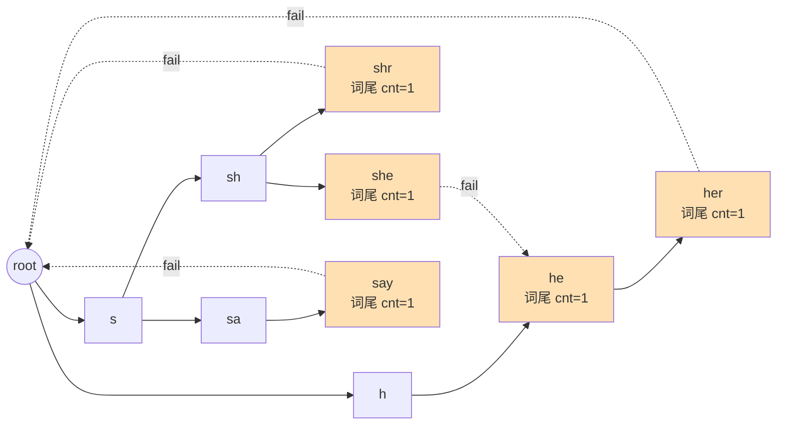

[[TOC]]

## 形式化题目

给定 $n$ 个查询词 $w_1, w_2, \dots, w_n$（小写字母，长度不超过 $50$）和一篇长为 $m$ 的文章 $S$。对每个 $w_i$ 只问一个问题：它是否在 $S$ 中作为连续子串出现过。输出出现过的 $w_i$ 的个数——**按输入逐个计数**，即两个内容相同的查询词只要出现，就各算一次。多组数据，$1 \leqslant n \leqslant 10^4$，$1 \leqslant m \leqslant 10^6$。

输入样例：

```
1
5
she
he
say
shr
her
yasherhs
```

输出样例：

```
3
```

样例推演：文章 `yasherhs` 中出现的查询词是 `she`（位置 3--5）、`he`（位置 4--5）、`her`（位置 4--6），共 3 个；`say`、`shr` 没出现。

## 正解

### 思路

**朴素做法。** 对每个 $w_i$ 在 $S$ 中单独搜一遍子串。最坏总代价 $O(n \cdot m \cdot |w_i|)$，$10^4 \times 10^6$ 完全不可行。瓶颈很明显：每个查询词都要把文章从头扫一遍，而且它们各自独立地重复走同一条扫描路径。

**把 $n$ 次扫描合成一次——Trie。** 把所有查询词插入同一棵 Trie，状态含义是：*当前已匹配的文本后缀中，是某个查询词前缀的最长者*。扫描时逐字符沿 Trie 走，一次遍历就能同时推进所有查询词的匹配进度。但 Trie 只能处理"精确沿边"的情况：在 `she` 的节点读到 `r` 时无路可走，而 `yasherhs` 里 `sher` 的正确后继是 `her` 的节点——**回退信息**缺失。

**fail 指针补上回退——AC 自动机。** 对每个节点定义 fail：它的最长真后缀中也是某个查询词前缀的那个节点（根为 0）。BFS 按层求 fail：处理节点 $u$（父指针 $p$、字符 $c$）时，从 $fail[p]$ 出发沿 fail 链向上找第一个有 $c$ 边的祖先 $f$，则 $fail[\text{child}] = go[f][c]$（找不到则为根）。这样任一状态读入字符时，若 Trie 上没有对应边，就沿 fail 链回退，直到根或找到边——扫描代价被 fail 链的深度变化摊还成均摊 $O(1)$。

**关键观察：只需标记状态，不必沿 fail 链逐次收集。** 查询词 $w$ 出现，等价于扫描中某个时刻自动机进入了 $w$ 的结束节点，**或者**进入了以该节点为 fail 祖先的任何状态（进入 $v$ 就意味着 $v$ 的整条 fail 链上的词都以当前文本为后缀出现过）。这恰好是 fail 树上的"后代命中 ⇒ 祖先命中"：先扫一遍文章，把到达过的状态标记 `hit`；再按 **BFS 逆序**（保证处理 $v$ 时它的 fail 后代已全部处理完）把命中沿 fail 边向上传播；最后统计所有词尾节点的 `hit` 之和。每个词只在其结束节点计一次，天然处理了"一个词出现多次只算一次"和"重复查询词各算一次"（`cnt` 在插入时累加）。

下图是样例 5 个查询词建成的自动机（实线为 Trie 边，虚线为 fail 边，橙色为词尾节点），注意 `she` 的 fail 指向 `he`、`her` 的 fail 也指向 `he`：



用样例走一遍扫描与传播，下表列出每个字符后的状态与当步命中的词：

| 已读入 | 当前状态 | 当步经 fail 收集到的词 | 累计命中 |
| --- | --- | --- | --- |
| `yash` | `sh` | — | — |
| `yashe` | `she` | `she`、`he`（fail 链 `she → he`） | `she`, `he` |
| `yasher` | `her` | `her` | `she`, `he`, `her` |
| `yasherh` | `h` | — | 同上 |
| `yasherhs` | `sh` | — | 同上 |

最终在 `she`、`he`、`her` 三个词尾节点上 `hit=1`，`say`、`shr` 未被传播覆盖，答案 3。注意"当步经 fail 链收集"只是为理解服务的等价说法，实现里不做这一步——它被第二阶段的 fail 树逆序传播替代，这正是本解法把逐字符的链上行走压成线性总代价的关键。

### 代码

@include-code(./main.py, python)

### 复杂度

- 时间复杂度：建自动机 $O(\sum_i |w_i|)$（每节点只对自己的真实出边求 fail），扫描 $O(m)$（fail 链回退均摊 $O(1)$），fail 树传播 $O(\text{节点数}) = O(\sum_i |w_i|)$，总计 $O\left(\sum_i |w_i| + m\right)$。
- 空间复杂度：$O\left(\sum_i |w_i|\right)$，每节点一个只存真实边的 dict，加 `fail`/`cnt`/`hit` 三个线性数组。

## 总结

- 朴素做法逐词搜文章，$O(nm)$；合并扫描的关键是把所有查询词放进同一棵 Trie，一次遍历同时推进全部匹配。
- Trie 缺回退信息，AC 自动机用 fail 指针补上：BFS 按"父的 fail 链上找同字符边"求 fail，扫描时无边即回退，均摊 $O(1)$。
- 统计不必逐字符走 fail 链收集：查询词出现 $\iff$ 某个到达状态位于其结束节点的 fail 子树中，于是先标记到达状态，再按 BFS 逆序沿 fail 向上传播，最后读词尾节点的 `hit`。
- 每词只在自己的结束节点计一次，重复查询词用 `cnt` 累加，天然满足"出现多次算一次、内容相同的查询词各算一次"。
