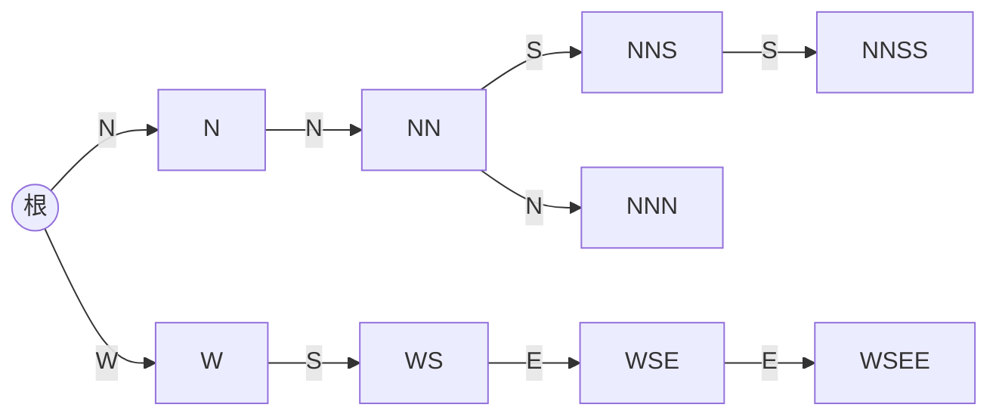

[[TOC]]

## 形式化题目

给定母串 $S$（$|S| = N$）和 $M$ 段文字 $T_1,\dots,T_M$，字符集都是 $\{\texttt E,\texttt S,\texttt W,\texttt N\}$。
对每段文字求最大的 $L$，使得 $T$ 的长度为 $L$ 的前缀是 $S$ 的**子串**；$L=0$ 表示连第一个字符都匹配不上。

样例中 $S=\texttt{SNNSSNS}$：`NNSS` 的前 4 位整体出现在位置 2..5，答案 $4$；`NNN` 只有 `NN` 出现，答案 $2$；`WSEE` 的首字符 `W` 不在 $S$ 中，答案 $0$。

## 正解

### 思路

朴素做法是枚举每段文字的每个前缀、拿去母串里找，单次查找就要 $O(N)$，总共 $O(M \cdot L \cdot N)$，在 $N \le 10^7$、$M \le 10^5$ 下必然超时。要同时利用两组冗余：

**观察 1（前缀共享 → trie）**：$M$ 段文字总共不超过 $10^7$ 个字符，把它们全部插进一棵 trie，公共前缀只存一份，节点数 $\le \sum|T| + 1$。于是「某段文字的前缀」这个集合恰好就是「trie 上某个节点代表的串」，问题变成：**对每个节点 $v$，判断 $str(v)$ 是否在 $S$ 中出现过**（记 $occ(v)$）。

**观察 2（单串匹配 → 从每个起点下走）**：串 $t$ 是 $S$ 的子串 $\iff$ 从 trie 根出发沿 $t$ 的字符能逐层走通。让 $S$ 的每个起点 $i$ 都从根开始，沿 $S_i, S_{i+1}, \dots$ 同步下走：走到某个节点，就说明这个节点代表的串以 $i$ 为左端点出现在 $S$ 中，给它打上 $occ$ 标记；走到没有对应孩子的节点、或窗口伸出母串，这个起点就被淘汰。

**观察 3（前缀封闭 → 答案一次读出）**：若某起点走到深度 $d$，它必然经过深度 $1..d-1$ 的祖先并同样打上标记，所以 $occ$ 沿每条 trie 路径是从根开始的一段前缀。扫完后，每段文字沿**自己的路径**下走，答案就是路径上最深的 $occ$ 节点深度。

把三步连起来：建 trie（$O(\sum|T|)$）→ 母串全体起点逐层同步扫描并标记 → 每段沿自身路径取最深命中层。这与本题经典正解「对母串建后缀自动机、每段在自动机上逐字符走、走几步答案就是几」是同一个匹配模型，只是把自动机建在了文字段一侧、按层扫描母串；扫描的工作量是输出敏感的 $\sum_i \ell_i$（$\ell_i$ 为起点 $i$ 的最长匹配），字符集只有 4，随机层的存活起点数每层约衰减为 $1/4$，长匹配只发生在文字段真正出现的位置附近，实测最大数据（$N=8\times10^6$）不到 1 秒。

Python 实现要点：$N$ 和 $\sum|T|$ 都是 $10^7$ 量级，逐层循环用 numpy 向量化——trie 插入按层批量建档（`np.unique` 去重一次性建孩子），扫描每层对整个「位置数组 + 节点数组」做批量取字符、查孩子、淘汰、打标记；trie 用扁平数组 `child[节点*4+字符]` 存储，$occ$ 用布尔数组。

### 代码

@include-code(./main.py, python)

### 复杂度

- 时间：trie 构建 $O(\sum|T|)$；扫描为输出敏感的 $O\!\left(\sum_i \ell_i\right) \le O(N \cdot L_{\max})$，本题数据下实测 symbol9（$N=8\times10^6$，$M=10^5$）约 0.86 s。经典的后缀自动机做法是 $O(N + \sum|T|)$ 最坏线性，本实现与其同模型，代价是扫描层依赖实际匹配深度。
- 空间：孩子表 $4 \times (\sum|T|+1)$ 个 `int32` 约 158 MB，$occ$ 标记约 10 MB，位置/节点数组峰值约 64 MB（python-oj-short 允许 Python 侧 MLE，不做内存硬限制）。

## 总结

- 把「每段文字的每个前缀」收敛成一棵 trie：$M$ 段文字的匹配需求变成对所有 trie 节点的 $occ$ 判定。
- 匹配方向反转：不是「拿串去母串里找」，而是「母串每个起点同时在 trie 上往下走」，走到即标记，一次扫描覆盖所有子串信息。
- $occ$ 沿路径前缀封闭，所以每段答案 = 自身路径上最深的命中节点深度，无需回溯。
- 实现上用 numpy 把逐层扫描向量化：批量 gather（取字符、查孩子）、compress（淘汰）、scatter（打标记），$10^7$ 量级数据在秒级完成。
- 验证：真实测试数据 9/9 全部 PASS，最大一组 0.86 s。

## 图示解析

以样例 $S=\texttt{SNNSSNS}$、文字段 `NNSS`、`NNN`、`WSEE` 为例。三个串共享前缀 `N`，trie 只有 9 个节点：

母串每个起点从根同步下走，× 表示该起点已淘汰：

| 深度 $d$ | 位置 0 (`S`) | 位置 1 (`N`) | 位置 2 (`N`) | 位置 3 (`S`) | 位置 4 (`S`) | 位置 5 (`N`) | 位置 6 (`S`) |
| --- | --- | --- | --- | --- | --- | --- | --- |
| 1 | × | `N` | `N` | × | × | `N` | × |
| 2 | — | `NN` | × | — | — | × | — |
| 3 | — | `NNS` | — | — | — | — | — |
| 4 | — | `NNSS` | — | — | — | — | — |
| 5 | — | ×（`NNSSN` 不在 trie） | — | — | — | — | — |

扫描结束时被打上 $occ$ 标记的节点：`N`、`NN`、`NNS`、`NNSS`（`W` 子树一个都没走到）。沿各段自身路径取最深命中层：`NNSS` → `NNSS`，深度 $4$；`NNN` → `NN`，深度 $2$；`WSEE` → 无命中，深度 $0$——与样例输出一致。
