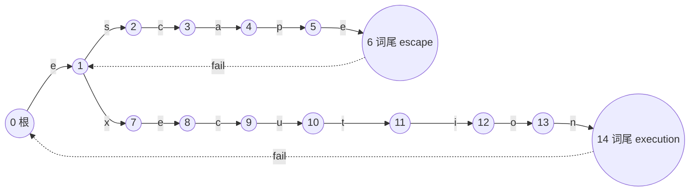

[[TOC]]

## 形式化题目

给定只含小写字母的主串 $S$ 与 $n$ 个屏蔽词 $t_1 \sim t_n$，满足 $|S| \leqslant 10^5$、
$\sum_{i=1}^{n} |t_i| \leqslant 10^5$，且保证任一 $t_i$ 都不是另一个 $t_j$ 的子串。

反复执行以下操作：在当前串中取**最靠左**的一个屏蔽词出现位置，删除该段，然后**重新从
串首**寻找；直到当前串不含任何 $t_i$ 为止。求终止时的串。保证结果非空。

题面中的"屏蔽词互不为子串"保证了同一开始位置不会同时属于两个词，因此每一步删除的
内容唯一。

## 正解

### 思路

**朴素做法的两个瓶颈。** 直接照题面模拟：每轮从左往右找第一个出现的屏蔽词，删掉，再
从头找。找一次要对每个位置比较 $n$ 个词，是 $O(|S| \sum |t_i|)$ 级别；而删除轮数最坏
也能达到 $O(|S|)$（例如 $S = $ `ababab...`、屏蔽词为 `ab`）。重扫次数本身就是
$O(|S|)$，于是总代价从 $O(|S|^2)$ 起步，无法通过。

这两个瓶颈可以分别消除。

**第一步：用 AC 自动机解决"找第一个出现"。** 把所有 $t_i$ 插入一棵 trie，BFS 求出
fail 指针，得到 AC 自动机。它的状态含义是"当前已读入串的最长可匹配后缀"，所以扫描
$S$ 时每个字符只需走一条转移边，一趟就能找出全部匹配。

这里有个必须处理的细节。如果只保留 trie 上真实存在的边，读字符时要沿 fail 链回退：

```python
while node and c not in go[node]:
    node = fail[node]
```

最坏情况会退化。设 $S$ 为 50000 个 `a` 后接 50000 个 `b`，屏蔽词为 `a`$\times$50001
和 `b`：前一半字符把自动机压到深度 50000 的链上，每个字符都要沿 fail 链走回根附近，
单字符 $O(\max |t_i|)$，本地实测超过 20 秒。

解决方式是在 BFS 求 fail 的**同时补全转移表**：对节点 $v$ 与字符 $c$，若 $v$ 没有 $c$
边，就令

$$go[v][c] \leftarrow go[fail[v]][c]$$

根上缺的边指向根。补全后单字符只需一次查表，$O(1)$。这一步不改变语义：$go[fail[v]][c]$
正是"沿 $v$ 的最长真后缀继续尝试读 $c$"的结果，与原来的 `while` 循环逐位等价（循环中
$f$ 的深度单调递减，在 $f$ 有 $c$ 边或 $f = 0$ 时终止）。

**第二步：用栈消除"重头扫描"。** 关键在于想清楚重头扫究竟在找什么。

删除发生时，当前串的结构是

```text
[ 已扫描并保留下来的前缀 P ] [ 尚未扫描的后缀 U ]
```

删除只会动 $P$ 的末尾。删完后新串为 $P' + U$，其中 $P'$ 是 $P$ 去掉末尾一段。此时
"从串首重新找"可能新产生的匹配只有三类：

- 完全落在 $P'$ 内：$P'$ 是先前保留下来的串，当时已无屏蔽词，不会凭空出现；
- 完全落在 $U$ 内：还没扫到，之后的扫描自然会处理；
- **跨越 $P'$ 与 $U$ 的接缝**：只能由 $P'$ 的一段后缀接上 $U$ 的一段前缀构成。

所以重头扫的实质，就是"让保留前缀的一段后缀去接后面的字符"。而 AC 自动机的状态恰好
编码了"当前串的最长可匹配后缀"——只要把自动机**回退到 $P'$ 对应的状态**再继续往后读，
得到的结果与真的重头扫一遍完全相同。

于是开两个同步的栈：

- `kept`：保留下来的字符，即答案；
- `state`：$state[i]$ 表示读完 $kept[0..i)$ 之后自动机所在的状态，$state[0] = 0$ 是根。

读入字符 $c$ 时做三件事：

1. `node = go[node][c]`，把 $c$ 压入 `kept`，把 `node` 压入 `state`；
2. 若 `lend[node]` 非 0，说明刚凑齐一个长度 `len` 的屏蔽词。题目保证无子串关系，所以
   一个状态至多是一个词的结尾，这个长度是唯一确定的；
3. 把 `kept` 与 `state` 都弹掉 `len` 个元素，然后 `node = state[-1]`。

第 3 步弹完后的 `state[-1]` 正是"该屏蔽词之前的全部保留内容"读完后的状态，也就是重头
扫到接缝处会停留的状态。这一步就是"重头重新找"的全部代价，摊还 $O(1)$。

下面这张图展示删除后"重头重新找"实际会到达的状态，以及栈如何一步跳过去：


图里左边是原始串与第一次命中的位置，中间是删除后的关键状态：$P' = $ `beginthe` 读完
后自动机停在状态 1，随后读 `x` 到达状态 7——这正是 `execution` 路径的第二个节点。
这说明被删区间两侧的字符在自动机上**自然衔接**，无需任何字符串拼接或重扫，第 16 到
22 步会一路走到 `execution` 的词尾命中第二次。两次删除共用同一套栈回退机制。

**自动机与栈的对应关系。** 下面是样例两个词构成的自动机（`fail` 边只画与本题相关的
两条）：



从根沿 `escape` 的路径走到词尾状态 6 时 `lend[6] = 6`，弹 6 个字符后 `state[-1]` 落在
状态 1，也就是 `beginthe` 尾部那个 `e`；从状态 1 读 `x` 沿真实边直接到状态 7，再接上
`ecution` 走到状态 14 命中 `execution`——**两个屏蔽词共用状态 1 这个前缀**，这正是接缝
处能继续匹配的结构基础。两条 `fail` 虚线标出的是词尾状态失配后该回退到哪。

#### 样例推演

下表是用正式解对样例 `begintheescapexecutionatthebreakofdawn` 逐步执行的结果，`kept`
是当前保留下来的串，`node` 是读完它之后的自动机状态。

| 步 | 读入 | 删除 | 剩余 kept | node |
| --- | --- | --- | --- | --- |
| 1–8 | `b`…`e` | | `beginthe` | 1 |
| 9 | `e` | | `beginthee` | 1 |
| 10 | `s` | | `beginthees` | 2 |
| 11 | `c` | | `begintheesc` | 3 |
| 12 | `a` | | `begintheesca` | 4 |
| 13 | `p` | | `begintheescap` | 5 |
| 14 | `e` | **escape** | `beginthe` | 1 |
| 15 | `x` | | `beginthex` | 7 |
| 16–21 | `e`…`o` | | `beginthexecutio` | 13 |
| 22 | `n` | **execution** | `beginth` | 0 |
| 23–38 | `a`…`n` | | `beginthatthebreakofdawn` | 0 |

观察三点。第一，第 14 步命中 `escape`（`lend = 6`）后 `node` 从 6 回退到 1，对应
`beginthe` 的末尾状态。第二，紧接的第 15 步读 `x` 就到达状态 7，之后一路走到 `execution`
的词尾——被删区间的左右两侧在自动机上自动衔接，没有任何显式拼接。第三，第 22 步命中
后 `node` 回到 0（根），此后剩余字符都不再构成屏蔽词，扫描结束时 `kept` 即答案。

### 代码

@include-code(./main.py, python)

### 复杂度

设 $L = \sum_{i=1}^{n} |t_i|$，$N = |S|$。

| 阶段 | 时间 | 空间 |
| --- | --- | --- |
| 建 trie | $O(L)$ | $O(L)$ 节点 |
| BFS 求 fail + 补全转移表 | $O(26L)$ | $O(26L)$ 转移表 |
| 扫描 $S$（含全部删除） | $O(N)$ | $O(N)$ 两个栈 |

合计时间 $O(26L + N)$，空间 $O(26L + N)$。扫描部分之所以是线性：每个字符最多入栈一次、
最多被删除一次，所以全部栈操作总计 $O(N)$ 次。

答案正确性由两条不变量维持：$state[i]$ 恒等于"只把 $kept[0..i)$ 喂给自动机"后的状态；
`kept` 恒不含屏蔽词。前者在压缩转移表下自然成立，后者由"任何新出现的屏蔽词必以刚读入
的字符结尾"保证——因为读入之前 `kept` 本身无词。

## 总结

难点不在 AC 自动机本身，而在"删除后要重头重新找"这个看似必须重扫的要求上。想清楚
重头扫只可能找到跨越"保留前缀 / 未扫描后缀"接缝的匹配，就发现 AC 自动机状态已经编码
了重扫所需要的全部信息：把每个字符读入后的状态压进栈，命中屏蔽词时弹掉对应长度并把
状态回退到弹完后的栈顶，$O(|S|)$ 次重扫就被压缩成了一趟线性扫描。

另外要留意转移表必须补全。只保留真实边的写法在浅层数据上完全正确，但在"超长重复串
压深 trie"的数据上会退化成 $O(|S| \cdot \max |t_i|)$，这是本题最容易踩的性能陷阱。

Python 在最长用例（$|S| = 10^5$、$\sum |t_i| \approx 10^5$）上内存会到 230 MB 左右，
超过 128 MB 的限制；算法本身与 C++ 正解同阶，用 C++ 落地时把转移表换成全局
`int go[L + 5][26]` 即可满足限制。
