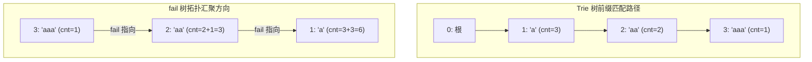

[[TOC]]

## 形式化题目

给定 $N$ 个仅由小写字母组成的非空字符串 $S_1, S_2, \dots, S_N$。

定义这篇“论文”由这 $N$ 个字符串共同组成，要求对每个 $1 \leqslant i \leqslant N$，计算模式串 $S_i$ 作为子串在全体字符串中出现的总次数：

$$ \text{ans}_i = \sum_{j=1}^N \text{count}(S_j, S_i) $$

其中 $\text{count}(T, P)$ 表示子串 $P$ 在文本串 $T$ 中的出现次数。

## 正解

### 思路

一个子串 $S_i$ 出现在文本中，等价于 $S_i$ 是该文本某个前缀的后缀。
多模式串匹配的核心工具是 **AC 自动机（Aho-Corasick Automaton）**。

#### 1. 朴素跳 fail 链的瓶颈

如果将所有模式串拼接后在 AC 自动机上匹配，并在每个前缀位置暴力沿着 `fail` 指针向上追溯所有匹配成功的模式串，在最坏情况（例如所有串都是相同字符构成的重复串 `a`, `aa`, `aaa`…）下，单次前缀可能需要回溯 $O(\sum |S_i|)$ 步，总时间复杂度将退化至 $O((\sum |S_i|)^2)$，导致超时。

#### 2. fail 树与拓扑聚合优化

若将 AC 自动机中所有节点的 `fail` 指向视作有向边 $u \to \text{fail}[u]$，这些边构成了一棵以根节点（节点 0）为根的树，称为 **fail 树**。

在 fail 树中：
- 节点 $u$ 是节点 $v$ 的祖先，当且仅当节点 $u$ 所代表的字符串是节点 $v$ 所代表字符串的后缀。
- 如果我们在 Trie 树上统计每个节点被所有串的前缀经过的次数 $\text{cnt}[v]$，那么一个模式串 $S_i$（对应节点 $pos_i$）的总出现次数，恰好等于 **fail 树上以 $pos_i$ 为根的整棵子树中所有节点的初始权值之和**。

由于 fail 指针总是从深度大的节点指向深度较小的节点，BFS 构建 AC 自动机时节点出队的先后顺序天然构成了 fail 树的一个拓扑序。

因此，我们无需显式建立 fail 树反向边做树形 DFS，直接按 BFS 出队顺序的**逆序**（自底向上）执行状态转移：

$$ \text{cnt}[\text{fail}[u]] \gets \text{cnt}[\text{fail}[u]] + \text{cnt}[u] $$

遍历完成后，$\text{cnt}[pos_i]$ 即为第 $i$ 个单词的总出现次数。

### 代码

@include-code(./main.py, python)

### 复杂度

- **时间复杂度**：$O(\sum |S_i|)$。建立 Trie 树、广搜构建 fail 指针以及逆序拓扑累加权值均对每个节点处理常数次，总运行时间与所有单词的总长度之和呈严格线性关系。
- **空间复杂度**：$O(\sum |S_i|)$。Trie 树的节点数量不超过 $\sum |S_i| + 1$，每个节点维护转移指针和整型计数变量，空间开销为线性阶。

## 总结

本题是 AC 自动机上经典利用 **fail 树子树聚合** 优化多模式串统计的范例。通过将前缀覆盖标记直接记录在 Trie 节点上，并沿 fail 树的拓扑逆序自底向上求和，彻底避免了暴力跳 fail 链的二次退化，实现了线性的时空复杂度。
