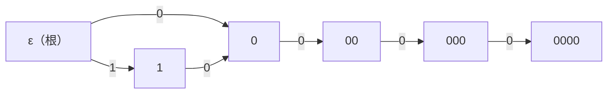

[[TOC]]

## 形式化题目

给定 $n$ 个非空 01 串构成的集合 $S$（病毒代码段，总长度 $\leqslant 3\times 10^4$）。判断是否存在一个无限长的 01 串 $T$，使得 $T$ 的任意连续子串都不属于 $S$；存在输出 `TAK`，否则输出 `NIE`。

样例 $S=\{01,\ 11,\ 00000\}$ 的答案是 `NIE`：要避开 `01`，0 后面不能接 1；要避开 `11`，1 后面也不能接 1。于是**每个**字符后面都只能接 0，除第一位外整串全为 0——无论第一位取 0 还是 1，`00000` 都必然出现，任何无限长串都不安全。反过来，题面例子 $S=\{011,\ 11,\ 00000\}$ 中 $010101\cdots$ 不含 `011`、`11`、`00000` 中的任何一个，是安全的。

## 正解

### 思路

**朴素想法：枚举安全前缀。** 逐位构造答案，把每个"不含病毒串的前缀"看成一个状态：前缀 $p$ 读入位 $b$ 得到 $pb$，若 $pb$ 仍安全就连边 $p \to pb$。在这张"安全前缀图"上，有环就能沿环无限读下去，无环则安全路径只有有限条——问题的答案就是**图中是否有环**。但安全前缀有无穷多条（一旦存在环就无穷），无法显式枚举。

**关键观察：状态可以合并。** 读入下一位时，判断会不会踩雷只取决于当前串还有哪些后缀是某个病毒串的前缀，而其中**最长的那个**已经决定了其余的（其余都是它的真后缀）。把"最长匹配后缀落在哪个位置"建成 Trie，节点就成为安全前缀的有限等价类：从根到节点 $v$ 的串代表一类前缀，读入 $b$ 后的最长匹配后缀就是从 $v$ 沿 $b$ 走一步的结果（Trie 中没有这条边就沿 fail 指针回退）。这正是 **AC 自动机**，节点数不超过总长度 $+1$。

**危险标记。** 节点 $v$ 危险 $\iff$ 从根到 $v$ 的串含有病毒串作子串 $\iff$ $v$ 本身是病毒串结尾，或 $fail[v]$ 危险（fail 指向"最长且同时是某病毒串前缀"的真后缀，fail 链恰好枚举了所有这类后缀）。BFS 建 fail 时顺手做一次 `END[w] |= END[fail[w]]`，沿 fail 深度递增方向传播一遍即得全部危险标记。建 fail 的同时把 Trie 缺失边补成 `TO[v][b] = TO[fail[v]][b]`，此后每个节点读 0/1 都唯一落到另一个节点，得到一张每个点出度恰为 2 的完整转移图。

**只看可达的安全子图。** 从根出发只沿两端都安全的边 BFS，用 `seen`/`total` 得到真正能用到的安全子图并统计入度 `indeg`；随后用 Kahn 拓扑排序判环：入度归零的点入队、删除并回删出边，`removed` 计数——所有可达安全节点都能删光（`removed == total`）则无环，输出 `NIE`；有点永远删不掉（环上节点入度恒大于 0）则有环，输出 `TAK`。Kahn 是迭代实现，不受 Python 递归深度限制。

正确性上，两个方向都直接：有环时先沿安全路径走到环上，再无限绕环，每步都停在安全节点，拼出的无限串不含任何病毒串；无环时安全子图是 DAG，任何路径长度有限，逐位生成必然在有限步内踏入危险节点，即任何无限长串都会包含病毒串。

下图是样例 $\{01,\ 11,\ 00000\}$ 的可达安全子图，节点标签是该状态代表的前缀，边标签是读入的位（危险节点 `01`、`11`、`00000` 及指向它们的边已删除）：

所有路径最终都走进死路 $e$——它读 0 会进入 `00000`，读 1 会进入 `01`，两条边都被删除，所以图中无环，答案为 `NIE`。对照题面例子 $\{011,\ 11,\ 00000\}$：此时 `0` 与 `01` 都安全且互为转移（`0` 读 1 到 `01`，`01` 读 0 回到 `0`），环上的读位序列正是 $010101\cdots$，答案为 `TAK`。

### 代码

@include-code(./main.py, python)

### 复杂度

设病毒串总长度为 $L$，节点数 $N \leqslant L+1$。插串 $O(L)$；建 fail、补边、危险传播中每个节点的每条边只处理一次，$O(N)$；可达安全子图 BFS 与 Kahn 各 $O(N)$（每点至多 2 条出边）。总计时间 $O(L)$，空间 $O(N)$。$L \leqslant 3\times 10^4$，对 1000ms / 128MB 的限制非常宽裕。

## 总结

- "是否存在无限长安全串"等价于"安全转移图中是否存在环"：有环则绕环无限读，无环则安全路径必然耗尽。
- 无穷多的安全前缀用 AC 自动机压缩成有限状态：最长匹配后缀决定一切，Trie 节点就是等价类。
- 危险标记沿 fail 链传播一次即完备；补全缺失边后，判环用迭代 Kahn 完成，输出 `TAK` / `NIE`。
