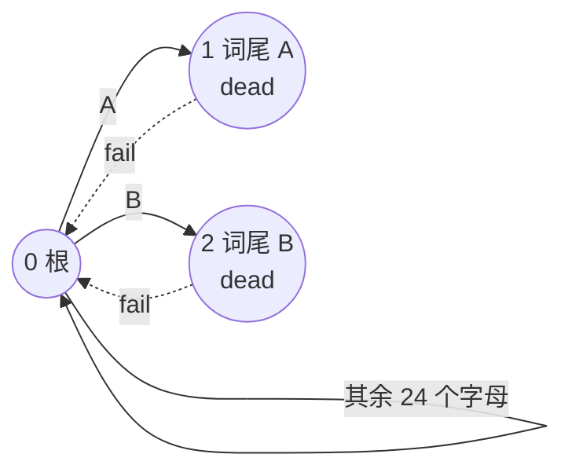
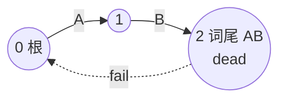

[[TOC]]

## 形式化题目

给定 $N$ 个只含英文大写字母的单词 $w_1, w_2, \ldots, w_N$，以及一个固定长度 $M$。

称一个大写字母串 $s$ 是**可读的**，当且仅当存在某个 $i$ 使得 $w_i$ 是 $s$ 的**子串**。
求**长度恰为 $M$** 的可读串个数，对 $10007$ 取模。

约束：$1 \leqslant N \leqslant 60$，所有单词与文本的长度均不超过 $100$，字符集为
$26$ 个大写字母。

**样例。** $N = 2$、$M = 2$，单词为 `A`、`B`。长度 2 的串共 $26^2 = 676$ 个；既不含
`A` 也不含 `B` 的串每一位只能取其余 $24$ 个字母，共 $24^2 = 576$ 个。故可读串为
$676 - 576 = 100$，与样例输出一致。这个减法正是全文的起点。

## 正解

### 思路

**朴素做法为什么不可行。** 最直接的办法是枚举全部 $26^M$ 个串，对每个串逐位匹配
$N$ 个单词。当 $M = 100$ 时 $26^{100}$ 无法枚举，连"列出所有候选"这一步都做不到。
所以必须换一种"不枚举串"的计数方式。

**第一步：正难则反。** 直接数"至少含一个单词"很麻烦——一个串可能同时命中多个单词，
要避免重复计数就得对 $N$ 个单词做容斥，而单词之间的重叠关系（谁是谁的子串、谁和谁
共享前缀）复杂到无法枚举。

反过来数它的补集则干净得多。"不可读"的定义是**对所有** $w_i$ 取否定：

$$S = \#\{\, s \in \Sigma^M : s \text{ 不含任何 } w_i \,\}, \qquad \text{answer} = (26^M - S) \bmod 10007$$

"不含任何单词"在从左往右构造串的过程中是可以增量维护的，而"至少含一个"不是。
于是问题从计数题变成了"在自动机上数路径"。

**第二步：判断"是否命中"只需要有限状态。** 从左往右一位一位构造文章时，决定"接下来
会不会命中某个单词"的全部信息是：**当前已读入串的最长可匹配后缀**（即最长的、同时是
某个单词前缀的后缀）。整个前缀的其余部分再也用不上了。

这正是 AC 自动机（Aho–Corasick 自动机）的状态定义。把 $N$ 个单词插入一棵 trie，求出
fail 指针后，每个 trie 节点就代表"当前最长可匹配后缀"这一状态，于是"前缀有没有命中
单词"完全由节点决定。以样例的词 `A`、`B` 为例，自动机只有 3 个节点：



从根读 `A` 到节点 1、读 `B` 到节点 2、读其余 24 个字母都留在根 0。节点 1 和 2 是
两个单词的词尾，走到它们就说明命中了。

**第三步：标记"死状态"。** 我们把"到达该节点时已经命中某个单词"的节点称为**死状态**
`dead[v]`。它有两种来源：

1. $v$ 本身就是某个单词的词尾；
2. $v$ 的 fail 链上存在某个词尾——也就是说，当前后缀的某个**真后缀**是一个完整单词。

第 2 种情况很容易被漏掉。例如单词是 `AB`：



节点 2 自己是词尾，`dead[2] = True`，这个图看着简单。但设想单词是 `AB`、`CD`，
读到 `XAB` 时最后一步落在节点 `AB` 上，命中；而如果单词是 `AB`、文本是 `ABAB`，
第二次的 `AB` 依然要在最后一步被抓住。**关键在于：只要某个词尾在 fail 链上，就说明
已经命中**，因为 fail 链恰好枚举了当前状态的全部"是某单词前缀"的真后缀。

实现上不需要在每次转移后沿 fail 链查一遍，只需在 BFS 中做一次下传：

$$\texttt{dead}[v] \mathrel{|}= \texttt{dead}[\texttt{fail}[v]]$$

因为 $\texttt{fail}[v]$ 的深度严格更小、在 BFS 中一定先被处理完，所以一次下传就把
整条 fail 链上的词尾信息传到了 $v$。

**第四步：补全转移表。** 如果只保留 trie 上真实存在的边，那么读一个字符时要沿 fail
链回退去找第一条该字符的边：

```python
while node and c not in go[node]:
    node = fail[node]
```

最坏情况会退化（想象 $100$ 个字符全部相同、trie 被压成一条长链）。解决办法是在 BFS
求 fail 的**同时**补全转移表：对节点 $v$ 与字符 $c$，若 $v$ 没有 $c$ 边，就令

$$go[v][c] \leftarrow go[\texttt{fail}[v]][c]$$

根上缺的边指向根自己。这一步不改变语义：$go[\texttt{fail}[v]][c]$ 正是"沿 $v$ 的最长
真后缀继续尝试读 $c$"的结果，与上面的 `while` 循环逐位等价。补全之后，每次转移只需
一次查表，$O(1)$。

**第五步：按长度递推计数。** 状态就是自动机节点，令 $dp_k[v]$ 表示"长度恰为 $k$、
全程未命中任何单词、且构造完停在节点 $v$"的串数。

- 初值：$dp_0[0] = 1$，空串停在根。
- 转移：枚举 $v$ 与 $c \in \Sigma$，令 $u = go[v][c]$。若 $u$ 是死状态，这条路径
  已经命中单词，直接丢弃；否则 $dp_{k+1}[u] \mathrel{+}= dp_k[v]$。
- 由不变量"未经过死状态 $\iff$ 未含任何单词"，$S = \sum_{v \notin D} dp_M[v]$。
- 最终答案 $(26^M - S) \bmod 10007$。

状态数只有 trie 的节点数（$\leqslant 101$），与 $M$ 无关，所以这个 DP 每层只要
$26 \times |V|$ 次转移。

#### 样例 DP 表（$N=2, M=2$，词 `A`、`B`）

26 个字母按从根读入后的去向分成三类：`A` 去节点 1、`B` 去节点 2、其余 24 个字母留在
根 0，而节点 1、2 都是死状态。于是"未命中"的串在 DP 里只能一直待在根节点：

| $k$ | $dp_k[0]$ 根 | $dp_k[1]$ (死) | $dp_k[2]$ (死) | 未命中串数 $S_k$ |
| --- | --- | --- | --- | --- |
| 0 | 1 | 0 | 0 | 1 |
| 1 | $1 \times 24 = 24$ | 0（落入即出局） | 0（落入即出局） | 24 |
| 2 | $24 \times 24 = 576$ | 0 | 0 | 576 |

第 1 行是初值 $dp_0[0] = 1$；第 2 行只有 24 条留在根的分支存活；第 3 行把 24 再乘
24 得 $S_2 = 576$。于是答案 $= 26^2 - 576 = 676 - 576 = 100$，与样例一致。

表格同时暴露了一个容易搞错的地方：**死状态的 DP 值恒为 0**，因为任何落入死状态的
转移都在当步被丢弃，不存在"先命中、后面又忘记"的可能。这正好对应子串语义——单词一旦
出现就永远算数。

### 代码

@include-code(./main.py, python)

### 复杂度

设 $L = \sum_{i=1}^{N} |w_i|$（题面保证 $L \leqslant 100$），自动机节点数
$|V| \leqslant L + 1$。

| 阶段 | 时间 | 空间 |
| --- | --- | --- |
| 建 trie | $O(L)$ | $O(26 \lvert V \rvert)$ 转移表 |
| BFS 求 fail、补全转移表、下传 dead | $O(26 \lvert V \rvert)$ | $O(\lvert V \rvert)$ 辅助数组 |
| $M$ 轮计数 DP | $O(26 \lvert V \rvert \cdot M)$ | $O(\lvert V \rvert)$ 滚动数组 |

合计时间 $O(26 \lvert V \rvert (M + 1))$，空间 $O(26 \lvert V \rvert)$。代入选最坏值
$|V| \approx 101$、$M = 100$，转移次数约 $2.6 \times 10^5$。

对照朴素枚举的 $O(26^M \cdot M)$：DP 的收益全部来自"用最长可匹配后缀代替整个前缀"
这一步状态压缩，把与 $M$ 成指数关系的枚举换成了与 $M$ 成线性关系的递推。

答案的正确性依赖两条不变量：$dp_k[v]$ 中每个串读完后确实停在 $v$（由转移表补全与
朴素回退的等价性保证）；"未经过死状态"确实等价于"不含任何单词"（由 `dead` 沿 fail
链下传的完备性保证）。

正文的每个概念在 `main.py` 中的落点如下，方便对照阅读：

| 正文概念 | `main.py` 中的位置 |
| --- | --- |
| 建 trie、求 fail、补全转移表、下传 `dead` | `build_automaton()` |
| 词尾标记 `dead[node] = True` | `build_automaton()` 插入循环末尾 |
| $\texttt{dead}[v] \mathrel{\|}= \texttt{dead}[\texttt{fail}[v]]$ | BFS 循环首行 |
| $go[v][c] \leftarrow go[\texttt{fail}[v]][c]$ | BFS 循环的 `else` 分支 |
| $dp$ 递推与 $S = \sum dp_M[v]$ | `count_safe()` |
| $(26^M - S) \bmod 10007$ | `solve()` 末两行 |

## 总结

这道题的关键不是 AC 自动机本身，而是**先想清楚"命中的否定"才是可增量维护的量**。

- 数"至少含一个单词"要面对 $N$ 个单词的重叠容斥；数"一个都不含"则天然可加，
  于是 $26^M - S$ 把问题转成了自动机上的路径计数。
- 判断"当前前缀是否已经命中"不需要记住整个前缀，只需记住它的**最长可匹配后缀**，
  而这正是 AC 自动机的状态。这一步是整个解法成立的支点。
- `dead` 必须沿 fail 链下传，否则会漏掉"刚读入的字符补全了一个更短的单词"这种情况。
- 转移表要在 BFS 中补全，把"沿 fail 链回退"这个最坏 $O(\max|w_i|)$ 的动作摊到建表
  阶段，扫描时每步 $O(1)$。

Python 在本数据范围下最慢用例约 $0.24$ 秒、峰值内存约 $17$ MB，无论时间还是空间都
有充足余量；同样的算法用 C++ 落地时，把转移表换成全局 `int go[L + 5][26]` 与
`int dp[L + 5]` 即可，写法完全一致。

## 图示解析

下图是整条解法的路线，从"不能枚举"出发，经过正难则反，落到自动机上的 DP：

```text
输入: N 个单词 + 长度 M
        |
        v
  枚举 26^M 个串?  --- 不可行 (M<=100)
        |
        v
  正难则反: 答案 = 26^M - S
                       |
                       v
        S = 一个单词都不含的串数
                       |
                       v
  判定"是否命中"只需有限状态
                       |
                       v
        AC 自动机 (状态 = trie 节点)
          |- 补全转移表 go[v][c] = go[fail[v]][c]  -> 每步 O(1)
          |- 下传 dead[v] |= dead[fail[v]]         -> 命中即出局
                       |
                       v
  dp_k[v]: 长度 k、未命中、停在 v 的串数
          dp_{k+1}[go[v][c]] += dp_k[v]  (落点非死)
                       |
                       v
  S = sum(dp_M[v])  ->  answer = (26^M - S) mod 10007
```

自上而下读：上半部分说明为什么必须放弃枚举，中间两步是建模（正难则反 + 用自动机
压缩状态），下半部分是两个实现细节（补全转移表、下传 `dead`）和最终递推。图中每个
方框都对应正文中的一个小节，可以当作阅读顺序的索引。
