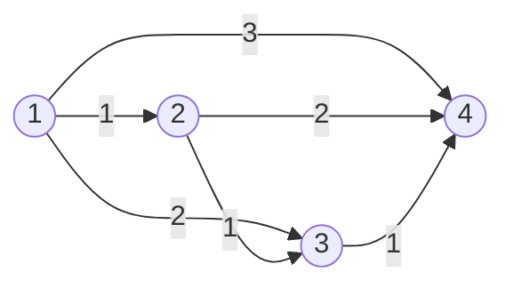

[[TOC]]

## 形式化题目

给定一个包含 $N$ 个顶点和 $M$ 条无向带权边的连通图，所有边权满足 $l \geqslant 1$。
记 $D_i$ 为图上从源点 $1$ 到顶点 $i$ 的最短路径长度。

求原图的生成树（以 $1$ 为根）的数量，使得树上节点 $i$ 到根节点 $1$ 的距离 $S_i$ 严格等于 $D_i$（对所有 $1 \leqslant i \leqslant N$）。
答案对 $2^{31} - 1$ 取模。

## 正解

### 思路

#### 1. 问题性质转化

题目所求的树即为**最短路径生成树（Shortest Path Tree, SPT）**。
在一棵以 $1$ 号节点为根的树中，每个非根节点 $u \in \{2, 3, \dots, N\}$ 恰好有一个父节点 $p_u$。
要使树上每个节点到根的距离均等于最短距离，即 $S_u = D_u$，对于树上的每一条父子边 $(p_u, u)$ 必须满足：
$$D_{p_u} + w(p_u, u) = D_u$$

由于题目中所有的边权均为正数（$l \geqslant 1$），若某个相邻节点 $v$ 满足 $D_v + w(v, u) = D_u$，则必有：
$$D_v < D_u$$

这意味着：
- 如果每个非根节点 $u$ 从所有满足 $D_v + w(v, u) = D_u$ 的相邻节点中任选一个作为父节点，得到的图包含 $N$ 个节点和 $N-1$ 条有向边。
- 沿着任意节点的父节点指针不断回溯，节点的最短距离 $D$ 严格单调递减。在有限集合上，严格单调递减的序列绝不可能成环，且必然能终止于全局最小值 $D_1 = 0$（即根节点 $1$）。
- 因此，这 $N-1$ 条边必然构成一棵以 $1$ 为根的树，并且满足所有节点的 $S_i = D_i$。

#### 2. 乘法原理计数

由于每个节点 $u$ 对父节点的选取仅依赖于其与前驱节点的距离关系，与其他非根节点的决策完全独立，因此不同节点的父节点选取可以独立进行。

设非根节点 $u$ 可选的合法前驱父节点数量为 $c_u$：
$$c_u = \sum_{(v, u) \in E} [D_v + w(v, u) = D_u]$$

根据乘法原理，满足条件的最短路径生成树总数即为：
$$\text{ans} = \prod_{u=2}^N c_u \pmod{2^{31}-1}$$

#### 3. 算法流程

1. 使用堆优化的 Dijkstra 算法，以顶点 $1$ 为源点计算到达所有顶点的最短路 $D_u$。
2. 遍历每个节点 $u \in \{2, \dots, N\}$，统计其所有相连的边中有多少条满足 $D_v + w = D_u$。
3. 将所有节点的备选边数相乘，并对 $2^{31}-1$ 取模即可。

### 样例图解

以输入样例为例：$4$ 个节点，$6$ 条边，边权分别为 $(1,2,1), (1,3,2), (1,4,3), (2,3,1), (2,4,2), (3,4,1)$。

经过 Dijkstra 算法计算，源点 $1$ 到各点的最短距离为：
- $D_1 = 0$
- $D_2 = 1$
- $D_3 = 2$
- $D_4 = 3$

检查各非根节点的前驱选择情况：
- 节点 $2$（$D_2=1$）：前驱只能是节点 $1$（边长 $1$），可选数 $c_2 = 1$。
- 节点 $3$（$D_3=2$）：
  - 节点 $1$：$D_1 + 2 = 0 + 2 = 2 = D_3$（有效）
  - 节点 $2$：$D_2 + 1 = 1 + 1 = 2 = D_3$（有效）
  - 共有 $2$ 种选择，故 $c_3 = 2$。
- 节点 $4$（$D_4=3$）：
  - 节点 $1$：$D_1 + 3 = 0 + 3 = 3 = D_4$（有效）
  - 节点 $2$：$D_2 + 2 = 1 + 2 = 3 = D_4$（有效）
  - 节点 $3$：$D_3 + 1 = 2 + 1 = 3 = D_4$（有效）
  - 共有 $3$ 种选择，故 $c_4 = 3$。

总方案数为：
$$\text{ans} = c_2 \times c_3 \times c_4 = 1 \times 2 \times 3 = 6$$

### 代码

@include-code(./main.py, python)

### 复杂度

- **时间复杂度**：$\mathcal{O}(M \log N)$。Dijkstra 堆优化耗时 $\mathcal{O}(M \log N)$；遍历各节点的所有入边统计候选前驱耗时 $\mathcal{O}(N + M)$；方案数乘法累乘耗时 $\mathcal{O}(N)$。整体耗时受 Dijkstra 支配，对于 $N \leqslant 1000, M \leqslant 5 \times 10^5$ 的数据规模，可以在毫秒级内完成。
- **空间复杂度**：$\mathcal{O}(N + M)$。用于存储邻接表、距离数组以及优先队列。

## 总结

最短路径生成树（SPT）计数问题的关键在于利用**正权边**所保证的拓扑偏序性：合法的树边只能由最短距离较小的点连向最短距离较大的点。这样，整棵树的构建被解耦为了每个非根节点独立选择唯一的入边前驱，从而将复杂的全图树形计数简化为利用乘法原理计算各点可选入边的连乘积。
