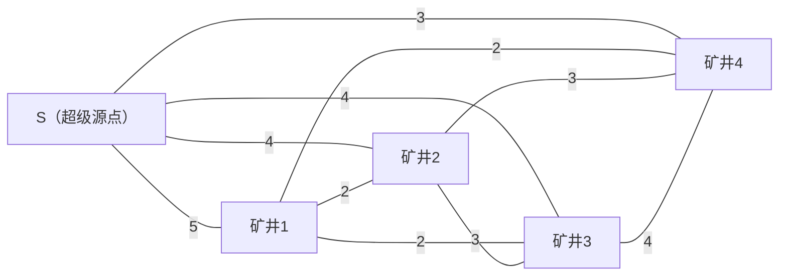

[[TOC]]

## 形式化题目

有 $n$ 口矿井，编号 $1 \sim n$。两种通电方式及其费用：

- 在第 $i$ 口矿井建发电站：费用 $v_i$，一座电站可以供给**任意多**口矿井；
- 在第 $i$、$j$ 口矿井之间拉电网：费用 $p_{i,j}$，满足 $p_{i,j} = p_{j,i}$、$p_{i,i} = 0$。

要求每一口矿井都有电（电网把矿井与已有电的矿井相连即可传递电力），求最小总花费。$1 \leqslant n \leqslant 300$，$0 \leqslant v_i,\, p_{i,j} \leqslant 10^5$。

样例 $n = 4$，$v = (5, 4, 4, 3)$，电网矩阵：

$$P = \begin{pmatrix} 0 & 2 & 2 & 2 \\ 2 & 0 & 3 & 3 \\ 2 & 3 & 0 & 4 \\ 2 & 3 & 4 & 0 \end{pmatrix}$$

输出 $9$：在 4 号矿井建电站（花费 3），再把它与另外三口矿井各连一条费用 2 的电网，合计 $3 + 2 + 2 + 2 = 9$。

## 正解

### 思路

**把两种花费统一成"边"。** 朴素想法是先枚举哪些矿井建电站、再决定怎么连电网——电站子集有 $2^n$ 种，指数级不可行。换个角度：如果把"在矿井 $i$ 建电站"也看成一条边呢？引入一个虚拟点 $S$（**超级源点**，可理解为"电网的总电源"），给每个矿井 $i$ 连一条 $(S, i)$ 边、权为 $v_i$。于是：

- 建电站 $i$ = 选中边 $(S, i)$；
- 拉电网 $(i, j)$ = 选中边 $(i, j)$，权 $p_{i,j}$；
- "所有矿井有电" = 每个矿井都能走到 $S$ = 含 $S$ 的图连通。

目标随之变成：**在 $n + 1$ 个点的完全图上求一棵最小生成树（MST）**。MST 中 $S$ 的度可以大于 1，对应"建多座电站"；具体建几座由 MST 自动决定，不必枚举。

样例加上超级源点 $S$ 后的建模如下，$S$ 与各矿井之间的边权即建站费 $v_i$，矿井之间的边权即电网费 $p_{i,j}$：

**为什么 MST 恰好等于最优供电方案？** 双向看：任给一个合法供电方案，它的"电网边 + 电站"里删掉环（电网成树、每个连通块留一座电站），再把每座电站与 $S$ 连边，就得到一棵含 $S$ 的生成树，权值不会变大——所以 最优方案 $\geqslant$ MST。反过来，任给一棵含 $S$ 的生成树，删掉 $(S, i)$ 这些边会把矿井分成若干连通块，每个块里恰有一条 $(S, i)$（即一座电站），供电合法且花费相等——所以 MST $\geqslant$ 最优方案。两边夹逼，MST 权值就是答案。

**选 Prim 而不是 Kruskal。** $n = 300$ 时完全图有约 $4.5 \times 10^4$ 条无向边，是稠密图：Kruskal 要排序 $O(n^2 \log n)$ 还要维护并查集；朴素 Prim + 邻接矩阵只要 $O(n^2)$ 双重循环，无需堆、无需排序，正好贴合输入本来就是矩阵这一点。维护 `best[x]` = 未选点 $x$ 连到已选点集的最便宜边权，每轮取 `best` 最小的点入树（切割性质保证不劣），再用它那一行刷新其余点的 `best`。

样例的 Prim 推演（从 $S$ 出发，$S$ 的 `best` 初值为 0）：

| 轮次 | 入选点 | 入树的边 | 边权 | 累计花费 |
| --- | --- | --- | --- | --- |
| 1 | $S$ | —（起点） | 0 | 0 |
| 2 | 矿井 4 | $(S, 4)$，即建电站 | 3 | 3 |
| 3 | 矿井 1 | $(4, 1)$ | 2 | 5 |
| 4 | 矿井 2 | $(1, 2)$ | 2 | 7 |
| 5 | 矿井 3 | $(1, 3)$ | 2 | 9 |

第一轮之后 `best = (5, 4, 4, 3, -)`，最便宜的是矿井 4 的 $v_4 = 3$，于是电站建在 4 号；它入树后把矿井 1/2/3 的 `best` 刷成 $2, 3, 4$，后续依次接入 1、2、3。总花费 $3+2+2+2 = 9$，与样例一致。观察重点：电站只出现在矿井 4 这一条 $(S, i)$ 边上——若当初接入的是更贵的 $v_1 = 5$，总花费会更大；MST 的贪心自动把电站放在了最合适的位置。

### 代码

读入后把矩阵拼成 $(n+1) \times (n+1)$ 的邻接矩阵：前 $n$ 行是 $P$ 的第 $i$ 行追加 $v_i$（矿井 $i$ 到 $S$ 的边），最后一行是 $v$ 加对角 0（$S$ 到各矿井的边）。`prim` 里 `min((best[i], i), ...)` 用元组比较同时取到最小值与编号，同权时按编号确定，行为稳定。

@include-code(./main.py, python)

### 复杂度

- 时间复杂度：$O(n^2)$，Prim 双重循环跑 $n + 1$ 轮、每轮扫 $n + 1$ 个点；$n = 300$ 时约 $9 \times 10^4$ 次比较。
- 空间复杂度：$O(n^2)$，存 $(n+1) \times (n+1)$ 邻接矩阵和两个 $O(n)$ 数组。

## 总结

- 建模是本题的全部难点：**引入超级源点，把"建电站"也变成一条权为 $v_i$ 的边**，供电问题就规约成 $n+1$ 个点上的最小生成树；MST 中 $S$ 的度自然决定建几座电站，无需枚举。
- 等价性靠双向归约证明：合法供电方案 $\to$ 含 $S$ 的生成树（不增权），生成树 $\to$ 合法供电方案（权相等），故 MST 权值即最优花费。
- 完全图选朴素 Prim（邻接矩阵）$O(n^2)$，比 Kruskal 的 $O(n^2 \log n)$ 更贴合稠密图与矩阵输入。10 组真实数据全部 PASS，单组 0.017–0.028 s、峰值 ≤ 23.4 MB，远在 1000 ms / 128 MB 限制内。
