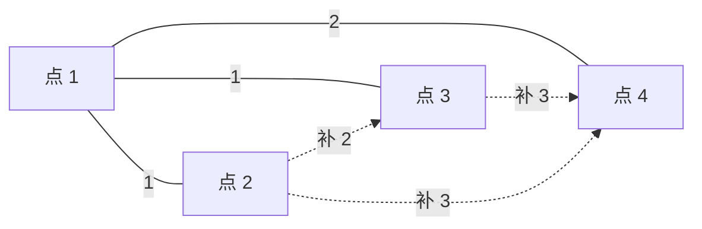

[[TOC]]

## 形式化题目

给定一棵 $n$ 个点的带权树 $T$（$n-1$ 条边，边权为正整数）。求**边权和最小**的完全图 $G$（$n$ 个点，每对点之间恰有一条边），使得 $G$ 的最小生成树**有且仅有** $T$ 一棵，并输出这个最小边权和。

注意两点：$T$ 必须是 $G$ 的生成树，所以树边原样进入 $G$、权值不可改；不确定的只有 $\binom{n}{2} - (n-1)$ 条非树点对之间的补边，问题就是给它们各定一个**最小的合法权值**。

样例 $n = 4$，树边 $(1,2)$ 权 1、$(1,3)$ 权 1、$(1,4)$ 权 2。下图中实线为树边，虚线为需要补的边及其权值：

输出 $12$：树边和 $1 + 1 + 2 = 4$，补边 $2 + 3 + 3 = 8$。细心观察补边的取值——$(2,3)$ 在树上的路径 $2 \to 1 \to 3$ 最大边权是 1，补边取 $1 + 1 = 2$；$(2,4)$、$(3,4)$ 的路径最大边权都是 2，补边取 $2 + 1 = 3$。这个"$+1$"正是全题的关键。

## 正解

### 思路

**朴素做法及其瓶颈。** 最直接的思路：枚举每个非树点对 $(u,v)$，用 LCA/倍增求出路径最大边权 $M(u,v)$，给补边赋一个合法权值后求和。每次查询 $O(\log n)$，总复杂度 $O(n^2 \log n)$——$n = 10^5$ 时点对有约 $5 \times 10^9$ 个，查询再快也无济于事。**瓶颈是点对本身有 $O(n^2)$ 个**，必须从"逐点对"改成"按边批量计数"。

**观察一：补边权的下界是 $M + 1$。** 设非树点对 $(u,v)$ 的路径最大边权为 $M$，给这条补边赋权 $w$：

- $w < M$：把该边加入 $T$ 形成环、删掉环上最大边，得到比 $T$ 更小的生成树，$T$ 根本不是 MST；
- $w = M$：同样换边得到等权的另一棵生成树，MST 不唯一，违反"有且仅有"；
- $w > M$：按 Kruskal 的顺序，处理到这条边时它的路径上所有边（权都 $\leqslant M$）已把两端连通，它永远不会入树——所以 Kruskal 输出的就是 $T$，$T$ 是 MST。

唯一性也由严格大于保证：任取另一棵生成树 $T'' \neq T$，它必含某条补边 $e$（两棵树都是 $n-1$ 条边）；删去 $T''$ 中的 $e$ 会把点集分成两块，而 $e$ 在 $T$ 上的路径必然横跨这条割，取其中的跨割边 $f$——若 $f \in T''$，则 $T''$ 含两条跨割边、必然有环，故 $f \in T$ 且 $f \notin T''$；把 $T''$ 里的 $e$ 换成 $f$ 仍是生成树，且 $w(f) \leqslant M < w(e)$，权值严格下降。每换一次，$T''$ 就多一条 $T$ 的边，最多 $n-1$ 次必换成 $T$，沿途严格降权，故任何 $T'' \neq T$ 都严格重于 $T$，$T$ 是唯一 MST。

边权是整数，所以每条补边的最小合法权值就是 $M + 1$，且各条补边互相独立、逐对取下界即全局最优。于是

$$\text{ans} = \sum_{\text{所有点对}} M(u,v) \;+\; \Big(\binom{n}{2} - (n-1)\Big) \times 1,$$

其中相邻点对的 $M$ 就是树边原权，第一项已把树边和算进去了。

**观察二：把点对按边聚合成块。** 一条树边对应一大批点对——"分居该边两侧"的点对，其路径最大边权至少是这条边。按**边权升序**做 Kruskal 式合并：权 $w$ 的边把大小 $a$、$b$ 的两个连通块并成一块时，跨两块的 $a \times b$ 个点对的路径必经过这条边（max $\geqslant w$）；而这些路径的其余部分由已处理的边组成——两端在块内连通只可能走已处理的边——权都不超过 $w$（max $\leqslant w$），所以这批点对的 $M$ **恰为 $w$**，一次贡献 $w \cdot a \cdot b$。每个点对恰好在"路径上最晚处理的那条边"处被统计一次，不重不漏，$O(n)$ 次合并就累计完 $O(n^2)$ 个点对。

样例的合并与计数过程：

| 合并次序 | 边权 $w$ | 合并块大小 $a, b$ | 新跨块点对 | 贡献 $w \cdot a \cdot b$ |
| --- | --- | --- | --- | --- |
| 1 | 1 | 1, 1 | $(1,2)$ | 1 |
| 2 | 1 | 2, 1 | $(1,3),(2,3)$ | 2 |
| 3 | 2 | 3, 1 | $(1,4),(2,4),(3,4)$ | 6 |
| 合计 | | | 6 对（全部点对） | 9 |

表中三行覆盖了全部 $\binom{4}{2} = 6$ 个点对，$\sum M = 9$；非树点对数 $\binom{4}{2} - 3 = 3$，故 $\text{ans} = 9 + 3 = 12$。对照逐对验证：非树补边 $2 + 3 + 3 = 8$，树边和 4，合计 12，与样例输出一致。

### 代码

`pair_max_edge_sum()` 实现观察二的合并计数（循环体 `total += w * size[ru] * size[rv]` 就是 $w \cdot a \cdot b$），`solve()` 负责读入、按权排序，并用组合数闭式给每个非树点对补上 $+1$。

@include-code(./main.py, python)

### 复杂度

- **时间**：排序 $O(n \log n)$，并查集（路径压缩）$O(n \,\alpha(n))$，总计 $O(n \log n)$，与同算法的 C++ 正解同阶。
- **空间**：$O(n)$，存边、父点表和块大小各一份。
- 答案最大约 $2.5 \times 10^{14}$，Python `int` 自动支持大整数；本地实测最大点 0.099s、峰值 55.6MB，对 1000ms / 128MB 的限制留有余量。

## 总结

1. 唯一 MST 的充要条件：每条非树边权严格大于它两端点在 $T$ 上的路径最大边权；整数权下补边最小取 $M + 1$。
2. 目标拆成两块：$\sum M$（含树边和）+ 非树点对数，后者是组合数闭式。
3. $\sum M$ 不逐点对求，而是按边权升序并查集合并，用"块大小乘积 $\times$ 边权"批量累计——把 $O(n^2)$ 的点对枚举压成 $O(n)$ 次合并，整体 $O(n \log n)$。
