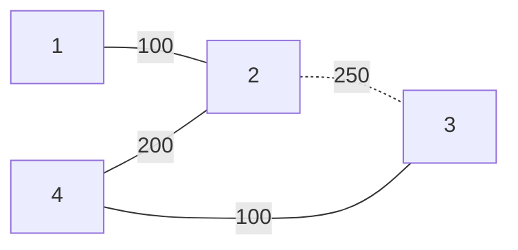

[[TOC]]

## 形式化题目

给定一个带权无向连通图 $G = (V, E)$，$|V| = n$，$|E| = m$，每条边 $e = (x, y)$ 有权值 $z$（可能有重边）。

生成树是包含全部 $n$ 个顶点的无环连通子图，其权值为所选边权之和。求**权值严格第二小**的生成树的权值，即所有与最小生成树（MST）权值不同、且大于 MST 权值的生成树中权值最小者。

样例：

```text
4 4
1 2 100
2 4 200
2 3 250
3 4 100
```

MST 取边 $1\text{-}2\ (100)$、$3\text{-}4\ (100)$、$2\text{-}4\ (200)$，权值 $400$；严格第二小的生成树把 $2\text{-}4$ 换成 $2\text{-}3$，权值 $450$。

## 正解

### 思路

#### 1. 从「枚举生成树」到「换边」

生成树总数是指数级的，不能枚举。但第二小的生成树离 MST 非常近——它与 MST 至多相差一条边（换边引理）：

> 把一条非树边 $(u, v)$ 加入 MST，必然形成唯一一个环；删掉环上除 $(u, v)$ 以外的任意一条边，就得到另一棵生成树。而任一生成树与 MST 的差异都可以通过这样的单次换边逼近，因此**严格次小生成树必然是「MST + 一条非树边，删环上最大边」的结果**。

于是做法分三步：

1. Kruskal 求出 MST，记录总权 $w_{MST}$、树的邻接表、每条原始边是否在树上；
2. 枚举每条非树边 $(u, v, w)$：在树上求 $u \to v$ 路径，取路径上的最大边权 $\mathrm{maxw}$；
3. 候选权值 $w_{MST} + w - \mathrm{maxw}$，在全部候选中取最小。

#### 2. 「第二小」必须严格：过滤等权换边

若 $w = \mathrm{maxw}$，换边后权值不变，候选值等于 $w_{MST}$——这只是把 MST 换了个形状（等权换边，重边场景很常见），并不是「第二小」。因此枚举时必须加条件 $w > \mathrm{maxw}$，只保留严格变大的候选。

这一步是本题唯一的正确性陷阱：真实测试数据里有大量等权重边，第一版代码不过滤时 10 组全部输出 MST 权值（比正确答案小），过滤后 10/10 通过。（$w < \mathrm{maxw}$ 不可能出现，否则原 MST 不是最小的，矛盾。）

#### 3. 样例推演

下图是样例的 MST（实线）与唯一非树边（虚线）：



非树边 $2\text{-}3$ 加入后形成环 $2\text{-}4\text{-}3$，环上最大边是 $2\text{-}4\ (200) < 250$，满足严格条件，候选 $= 400 + 250 - 200 = 450$：

| 候选 | 非树边 $w$ | 环上最大边 $\mathrm{maxw}$ | $w > \mathrm{maxw}$ | 候选权值 |
| --- | --- | --- | --- | --- |
| 1 | $2\text{-}3\ (250)$ | $200$（边 $2\text{-}4$） | 是 | $400 + 250 - 200 = 450$ |

答案 $450$，与样例输出一致。注意表中若某非树边满足 $w = \mathrm{maxw}$，该行必须丢弃。

#### 4. 为什么 $N \leqslant 500$ 可以直接树上 BFS

$L \leqslant 10^5$ 的次小生成树题需要 LCA + 倍增预处理路径最值；本题 $n \leqslant 500$、$m \leqslant 10^4$，对每条非树边做一次树上 BFS（记录 `parent` 再回溯取最大）只要 $O(n)$，总计 $O(nm)$ 完全够用，实现也更短。

### 代码

Python 版：

@include-code(./main.py, python)

C++ 版（同一算法）：

@include-code(./main.cpp, cpp)

### 复杂度

- **时间复杂度**：Kruskal 排序 $O(m \log m)$，并查集操作近似 $O(m)$；每条非树边一次树上 BFS $O(n)$，共 $O(nm)$。总计 $O(m \log m + nm)$，$n \leqslant 500,\ m \leqslant 10^4$ 时最坏约 $5 \times 10^5$ 量级的内层访问，最大一组实测 0.61 秒（本地验证脚本为 OJ 时限的 20 倍放宽）。
- **空间复杂度**：边表与邻接表 $O(n + m)$，BFS 的 `parent` 字典 $O(n)$，实测峰值 18.5MB，远小于 128MB 限制。

## 总结

严格次小生成树的标准换边法：先 Kruskal 求 MST，再枚举非树边，用「加入非树边形成的环上最大边」作替换对象，候选权值为 $w_{MST} + w - \mathrm{maxw}$。「第二小」要求严格大于 MST，所以必须丢弃 $w = \mathrm{maxw}$ 的等权换边——这是重边数据下最容易踩的坑。本题 $n$ 很小，路径最大边权用树上 BFS 现查即可，无需倍增预处理。
