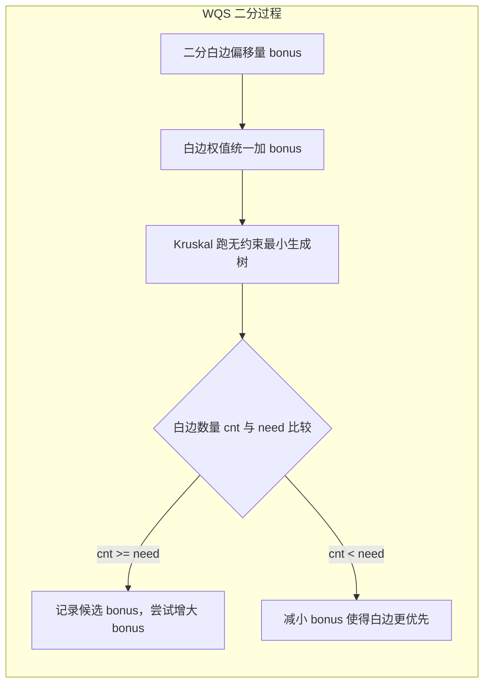

[[TOC]]

## 形式化题目

给定一个包含 $V$ 个顶点、$E$ 条边的无向带权连通图，边分为两类：白色（标记为 0）和黑色（标记为 1）。要求从图中选出一个生成树，满足：
1. 树中包含的白色边数**恰好**为 $\text{need}$；
2. 树上所有边的权值和最小。

保证图中至少存在一棵满足要求的生成树。

## 正解

### 思路

#### 1. 朴素瓶颈与凸性观察

直接寻找“恰好包含 $\text{need}$ 条白色边”的最小生成树是一个带基数约束的组合优化问题。如果单纯枚举白边的选取组合，或者记录选入白边数的动态规划，状态维度过大，在 $V \le 5\times 10^4, E \le 10^5$ 的规模下无法求解。

设函数 $f(k)$ 表示**恰好选取 $k$ 条白边时的最小生成树最小权值和**。由图拟阵交的性质与拟阵交凸优化理论可知：当我们在生成树中每多强制增加一条白边时，替换所产生的边权代价增量是非减的。也就是说，离散函数 $f(k)$ 关于白边数量 $k$ 构成一个**下凸函数**（凸包的斜率单调递增）。

#### 2. WQS 二分（带权二分）转化

既然点集 $(k, f(k))$ 是下凸的，我们可以用一条斜率为 $-x$ 的直线从下方去切该凸包：

$$\min_k \{ f(k) + k \cdot x \}$$

在现实意义中，给所有的白色边权值统一加上一个附加权值 $x$（偏移量 `bonus`）：
- 当 $x > 0$ 时，白边变贵，算法在选边时会减少白边的数量；
- 当 $x < 0$ 时，白边变便宜，算法在选边时会增加白边的数量。

对于任意固定的附加权值 $x$，给白边加上 $x$ 后的全局无约束最小生成树（直接运行标准 Kruskal），其选出的白边数量即为该切线在凸包上的切点横坐标，所得的权值和恰好等于截距 $f(k) + k \cdot x$。

因此，我们可以**对白边的额外权值 $x$ 进行二分**：
- 如果运行 Kruskal 选出的白边数量 $cnt \ge \text{need}$，说明当前白边仍然偏多（或刚好达标），白边还可以更贵一些，我们记录当前偏移量 $x$，并向右半区间 $[mid + 1, high]$ 继续二分；
- 如果选出的白边数量 $cnt < \text{need}$，说明白边太贵了导致选少了，应向左半区间 $[low, mid - 1]$ 缩小偏移量。

#### 3. 共线处理与答案还原

在实际计算中，可能存在多个点在凸包上共线（即存在某个斜率 $-x$，在此斜率下选不同数量白边的最小生成树权值完全相同）。此时可能恰好存在 $k = \text{need}$ 落在共线线段中间的情况。

为了保证二分收敛与截距正确：
- 我们在 Kruskal 排序/选边策略中约定：**当黑边与加权后的白边权值相同时，优先选取白边**。
- 这样，在共线段上我们总会贪心选取最右侧的端点（即白边数最大），保证只要线段覆盖了 $\text{need}$，就能判定出 $cnt \ge \text{need}$。
- 关键在于：共线段上所有点在切线下的截距都是相同的常数 $C = f(k) + k \cdot x$。因此，哪怕最终生成树选取的白边数 $k_{\max} > \text{need}$，原问题的答案依然可以直接通过截距还原：
  $$f(\text{need}) = \text{总权值} - \text{need} \cdot x$$

#### 4. 双指针归并优化

如果在每次二分判定中都对所有 $E$ 条边重新进行快速排序，单次复杂度为 $O(E \log E)$。注意到白边之间、黑边之间的相对大小关系在给白边加上常数 $x$ 后均不会改变。
因此，我们预先对白边列表和黑边列表分别排序一次；二分时，利用双指针以 $O(E)$ 的线性时间将两组有序边归并，结合并查集即可在极短时间内完成单次 Kruskal 检验。

### 代码

Python 版：

@include-code(./main.py, python)

C++ 版（同一算法）：

@include-code(./main.cpp, cpp)

### 复杂度

- **时间复杂度**：
  - 预处理对白边和黑边各自排序：$O(E_w \log E_w + E_b \log E_b) = O(E \log E)$；
  - 二分区间长度为 $[-105, 105]$，总迭代次数约为 $\approx 8$ 次；
  - 每次迭代双指针扫描归并 $O(E)$，并查集操作 $O(E \alpha(V))$；
  - 整体时间复杂度为 $O(E \log E + 8 \cdot E \alpha(V))$，运行极为迅速。
- **空间复杂度**：
  - 存储白边与黑边列表需 $O(E)$ 空间；
  - 并查集父节点数组需 $O(V)$ 空间；
  - 整体空间复杂度为 $O(V + E)$。

## 总结

本题是 **WQS 二分 / 带权二分（Aliens Trick）** 的典中典。它将带数量限制的图论优化问题转化为无约束的最优化问题，其本质利用了目标函数关于限制参数的凸性，通过二分拉格朗日乘子（斜率）完成降维求解。同时，预先分流排序配合二分内部线性双指针归并，大幅降低了时间常数。
