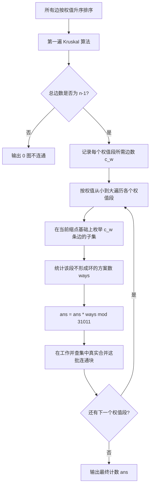

[[TOC]]

## 形式化题目

给定一个含 $n$ 个顶点、$m$ 条边的无向连通简单图，边权为正整数。定义两个生成树不同当且仅当它们所包含的边集不同。

求该图的最小生成树（MST）总数，结果对 $31011$ 取模。

数据保证相同权值的边数不超过 $10$ 条。

## 正解

### 思路

#### 1. 最小生成树的核心性质

对于任意无向带权图，所有可能的最小生成树都满足以下两条基本性质：

1. **各权值边数唯一性**：不同最小生成树中，各个权值 $w$ 所包含的边数 $c_w$ 是恒定且唯一的，与 Kruskal 算法求出的一棵生成树中该权值的边数完全相同。
2. **连通分量等价性（收缩性质）**：处理完所有权值严格小于 $w$ 的边之后，图中的点所构成的连通块（连通分量）划分是唯一确定的，与前面权值具体选择了哪一组树边完全无关。

由上述性质可知，**各个不同权值段的选边方案相互独立**。整张图的最小生成树方案数即为各权值段选边方案数的乘积（乘法原理）：

$$
\text{Ans} = \prod_{w} (\text{权值为 } w \text{ 的边中选取 } c_w \text{ 条且不产生环的方案数}) \pmod{31011}
$$

#### 2. 结合题目约束进行组合枚举

题目给出了一个极强的特殊性质：**相同权值的边不超过 $10$ 条**。

设某个权值段共有 $k$ 条边，Kruskal 探测出需要选取 $c_w$ 条边，则满足 $c_w \leqslant k \leqslant 10$。从 $k$ 条边中挑选 $c_w$ 条边的所有可能组合至多为：

$$
\binom{10}{5} = 252
$$

由于数量极小，我们完全可以直接枚举该权值段所有大小为 $c_w$ 的子集：
- 在当前的连通状态下，检查所选的 $c_w$ 条边是否会在连通块之间构成环。
- 若无环，则该组合是一个合法的生成森林方案，计数加 $1$。

#### 3. 算法全流程

1. **第一阶段（Kruskal 探测）**：
   - 将所有边按边权升序排序。
   - 运行标准 Kruskal 算法，按权值分段。记录每个权值段的所有候选边集合 $E_w$，以及该段实际并入生成树的边数 $c_w$。
   - 若最终加入生成树的总边数小于 $n - 1$，说明原图不连通，无最小生成树，直接输出 $0$。
2. **第二阶段（按段独立枚举）**：
   - 重新维护一个工作并查集。
   - 依次遍历每个权值段 $(E_w, c_w)$：
     - 若 $c_w = 0$，对答案贡献的倍率为 $1$，直接跳过。
     - 过滤掉两端点已在当前并查集中属于同一连通块的边。
     - 用组合枚举（`combinations`）在该段剩余边中选出 $c_w$ 条边，利用临时并查集验证是否成环，累加合法方案数 $\text{ways}$。
     - 答案累乘：$\text{ans} \gets (\text{ans} \times \text{ways}) \bmod 31011$。
     - 处理完毕后，在工作并查集中将 $E_w$ 中端点所属的不同连通块真实合并。
3. **输出**：输出累计的 $\text{ans}$。

### 代码

Python 版：

@include-code(./main.py, python)

C++ 版（同一算法）：

@include-code(./main.cpp, cpp)

### 复杂度

- **时间复杂度**：$O(m \log m + \sum \binom{k_i}{c_i} \cdot c_i \cdot \alpha(n))$。其中 $m \leqslant 1000$，$n \leqslant 100$，每个权值段边数 $k_i \leqslant 10$，组合数 $\binom{k_i}{c_i} \leqslant 252$。总运算次数在 $10^6$ 量级以内，在 Python 中可在 $0.02\text{ s}$ 内全部秒过。
- **空间复杂度**：$O(n + m)$，维护边表与并查集数组，空间开销远小于 $128\text{ MB}$。

## 总结

最小生成树计数问题通常需借助 Matrix-Tree 定理（矩阵树定理）求解，但在本题中，限制条件“相同权值的边不超过 $10$ 条”大大降低了难度，使得我们能通过 Kruskal 性质分解权值段，再利用简单的子集枚举独立求解各段方案数。

## 图示解析

下图展示了算法按权值分段处理与连通性传递的解题流程：

