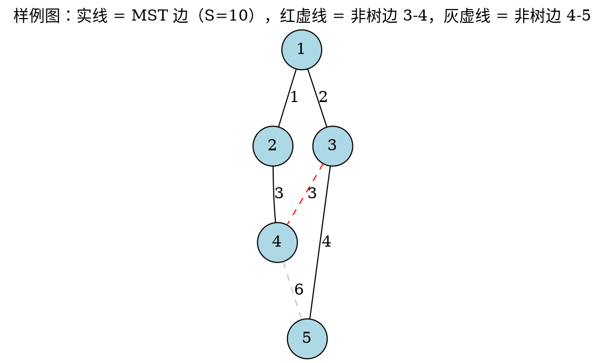
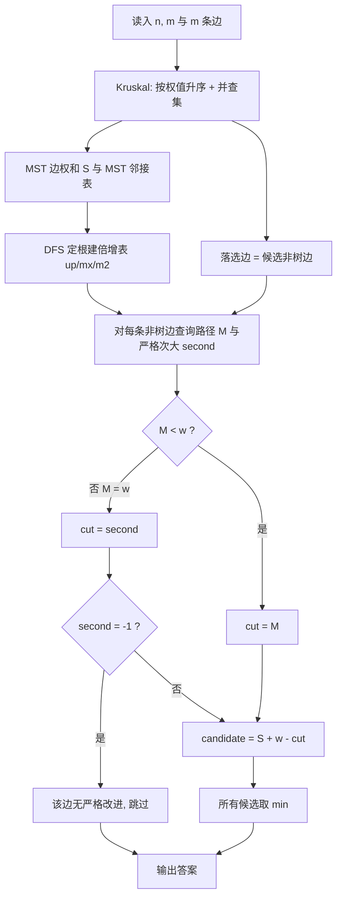

[[TOC]]

## 形式化题目

给定 $n$ 个点、$m$ 条边的无向连通图，无自环，边权非负且不超过 $10^9$。设最小生成树的边权和为 $S$，求所有边权和**严格大于** $S$ 的生成树中权值和最小者，输出该权值和。数据保证严格次小生成树存在。

样例的图与两棵候选生成树的关键边如下（实线为 MST 边，虚线为落选的非树边）：

MST 为 $\{1\text{-}2(1),\ 1\text{-}3(2),\ 2\text{-}4(3),\ 3\text{-}5(4)\}$，$S = 10$；落选的非树边只有 $3$-$4$（权 $3$）和 $4$-$5$（权 $6$）。读者应观察到：两条虚线边各自与实线边构成一个环，"删环上哪条边"决定了候选答案——这正是全文要解决的问题。

## 正解

### 思路

**朴素想法与瓶颈。** 先用 Kruskal 求出一棵 MST $T$、边权和 $S$。其余生成树怎么找？任取一条非树边 $e = (u, v, w)$ 加进 $T$，会形成一个环（$e$ 加上 $T$ 里 $u$ 到 $v$ 的路径 $P$），删掉 $P$ 上任意一条边 $f$ 就得到一棵新生成树，权值和为 $S + w - w(f)$。于是朴素做法是：枚举每条非树边，再从 $u$ 沿父链一路爬到 $v$，逐条扫描路径边找"可删的最大边"。单次扫描 $O(n)$，总计 $O(nm)$，在 $n, m$ 达 $10^5 / 3 \times 10^5$ 时不可行。瓶颈明确：**静态树上、按权值上界求路径可删边的快速查询**。

**关键观察：为什么严格性是本题的坑。** 枚举非树边换边之所以够用，是因为可以证明严格次小生成树一定能由 MST 单次换边得到（见"正确性"，本质是交换引理 + "MST 最优 ⇒ 每次换边权值不减"）。对单条 $e = (u, v, w)$：

1. 要新树权值和**严格**大于 $S$，必须 $w(f) < w$；要最小，就在满足条件的边里取权值最大的那条。
2. 由 $T$ 最优可知 $P$ 上最大边权 $M \leqslant w$（否则换掉 $M$ 得到更小的生成树，矛盾）。所以：
   - $M < w$：删最大边 $M$；
   - $M = w$：删**严格小于 $w$ 的最大边**，即路径的严格次大值（若整条路径都不小于 $w$，这条非树边无贡献）。

样例里非树边 $3$-$4$（$w = 3$）的路径 $3$-$1$-$2$-$4$ 边权为 $2, 3, 3$，最大值恰好等于 $w$：删掉 $3$ 只会得到 $10$，不严格；必须删 $2$，候选 $= 10 + 3 - 2 = 11$。这就是必须同时维护"最大 + 严格次大"的原因。

**倍增把查询压到 $O(\log n)$。** DFS 定根后，对每个点 $v$ 预处理 $2^k$ 级祖先 `up[k][v]`，以及 $v$ 到该祖先这段路径上的最大边权 `mx[k][v]` 和**严格小于它**的次大边权 `m2[k][v]`。两段首尾相接时的合并规则是：

$$
(m_1, m_2) \oplus (n_1, n_2) = \Big(\max(m_1, n_1),\ \max\{\,x \in \{m_1, m_2, n_1, n_2\} \mid x < \max(m_1, n_1)\,\}\Big)
$$

即"谁不是合并后的最大值，谁就有资格当次大候选"：本段最大值等于全局最大时只能用本段次大顶上。该运算可结合，"次大 $<$ 最大"的不变量始终保持。查询时先把深的一侧抬到同一深度（深度差的二进制位决定每一级跳不跳），再从高位向低位试探 `up[k][a] != up[k][b]`，两侧同步跳跃并合并经过的段，最后各爬一步到 LCA，整条路径的 $(M, \text{second})$ 就出来了。

**逐条换边取最小。** 对每条非树边算出 $(M, \text{second})$ 后，令 $\text{cut} = M$（当 $M < w$）否则 $\text{second}$；`cut = -1` 表示没有严格小于 $w$ 的路径边，跳过；否则候选为 $S + w - \text{cut}$。所有候选取 $\min$ 即答案。样例的完整推演：

| 非树边 | $T$ 上 $u$-$v$ 路径边权 | 严格小于 $w$ 的最大边 | 候选权值和 |
| --- | --- | --- | --- |
| $3$-$4$（$w=3$） | $3$-$1$-$2$-$4$：$2, 3, 3$ | $2$ | $10 + 3 - 2 = 11$ |
| $4$-$5$（$w=6$） | $4$-$2$-$1$-$3$-$5$：$3, 1, 2, 4$ | $4$ | $10 + 6 - 4 = 12$ |

两行取 $\min$ 得 $11$，与样例输出一致；注意第一行若按朴素直觉"删最大边"会算出 $10$，恰好不严格。

**正确性小结。** 设 $T'$ 是严格次小生成树，$A = T' \setminus T$、$B = T \setminus T'$。对每条 $a \in A$，$T + a$ 的唯一环必含 $B$ 的边（否则 $T'$ 自带环），交换引理可把 $A$ 与 $B$ 一一配对；由 $T$ 最优，每个配对的增量 $w(a) - w(b) \geqslant 0$，故 $\text{sum}(T') - S$ 是若干非负增量之和且为正，其中至少一个正增量不大于它——对应一次严格改进的单次换边不劣于 $T'$。因此枚举所有非树边的最优换边并取 $\min$，恰好得到严格次小生成树；而每次换边的最优删边就是上文按 $M < w$ / $M = w$ 分类选出的 $\text{cut}$。

### 代码

Python 版：

@include-code(./main.py, python)

C++ 版（同一算法）：

@include-code(./main.cpp, cpp)

### 复杂度

- 时间复杂度：$O(m \log m + n \log n + (m - n + 1) \log n) = O((n + m) \log n)$。排序主导 Kruskal，建表 $O(n \log n)$，每条非树边一次 $O(\log n)$ 查询。
- 空间复杂度：$O(n \log n + m)$。倍增表 3 张 $\times 17$ 层 $\times n$，加边表与邻接表；$2^{17} = 131072 > 10^5$。C++ 实现远小于 128MB；Python 因对象开销实测峰值约 200MB，算法阶数与 C++ 正解一致。

## 总结

- 严格次小生成树 = 在 MST 上对每条非树边做一次"最优换边"，所有严格改进的候选取 $\min$。
- 边权可以相等，所以必须同时维护路径的（最大边权，严格次大边权）：$M = w$ 时删最大边不严格，只能删严格次大。
- 倍增把"路径上最大 / 严格次大"的查询从 $O(n)$ 压到 $O(\log n)$，整体 $O((n + m) \log n)$ 与 C++ 正解同阶；Python 实现允许 TLE/MLE，但算法不退化为暴力。

## 图示解析

下图展示从读入到输出的完整求解流水线，以及"严格"分支在哪里起作用：

读者应重点看 `M < w ?` 这个分支：它就是"严格次小"区别于"非严格次小"的全部细节——$M = w$ 时必须落到 `second`，否则算出的候选等于 $S$，会被题目要求的"严格大于"排除。
