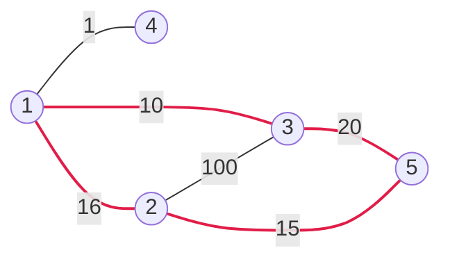

[[TOC]]

## 形式化题目

给定一张 $n$ 个点、$m$ 条边的无向带权图（可能有重边），求一个至少包含 3 个点、点不重复的简单环，使环上边的长度之和最小；输出环上按顺序排列的点，最小环不唯一时输出任意一个，无解输出 `No solution.`。

样例图（1–3 之间实际有 300 和 10 两条边，图中只画最短的那条）：

最小环是 $1 \to 3 \to 5 \to 2 \to 1$，权值和 $10 + 20 + 15 + 16 = 61$（图中加粗的四条边）。点 4 只与 1 相连、度为 1，不可能出现在任何环里。题面输出 `1 3 5 2` 与 `main.py` 实际输出的 `2 1 3 5` 是同一个环的不同起点——本题有 SPJ，起点与方向任意。

## 正解

### 思路

**朴素做法**：DFS 回溯枚举所有简单环并取最小。简单环的数量是指数级的，$n = 100$ 的稠密图完全跑不动。瓶颈在于环本身有指数多条，任何"把环逐个试"的框架都不可行，必须改写成"多项式个子问题，每个子问题一次查表/一次最短路"。

**按最大编号点拆环**：每个环都有唯一编号最大的点 $k$。在 $k$ 处把环断开，剩下的部分是一条 $i \to j$ 路径，其内部点编号全部小于 $k$，于是

$$\text{环长} = \text{dist}(i,\ j) + w(i,\ k) + w(k,\ j), \qquad i,\ j < k$$

枚举 $k$ 和端点对 $(i, j)$ 之后，问题变成："中间点编号严格小于 $k$"的两点最短路。

**用 Floyd 的阶段承接**：Floyd 第 $k$ 轮松弛**开始之前**，`dist[i][j]` 恰好就是只允许经过 $0..k-1$ 的最短路，与拆环需要的受限最短路完全一致。所以每一轮的顺序是：

1. **先探测**：对 $i < j < k$ 且 $i, k$、$k, j$ 都相邻的点对，用当前 $dist[i][j] + w(i,k) + w(k,j)$ 作为候选环，更优则记录；
2. **再并入**：做标准 Floyd 的 $k$ 阶段松弛，把 $k$ 变成允许的中间点。

先探测、后松弛的顺序不能换，这保证了探测时 `dist` 里还没有 $k$。任一环都在"它的最大点"那一轮被枚举到，而每个候选又都是合法环，两头夹逼即得最优。

**输出方案**：松弛时同步维护后继表 `nxt[i][j] = nxt[i][k]`（$i$ 去 $j$ 的下一个点）。找到最优环后，从 $i$ 沿 `nxt` 回溯到 $j$，再接上 $k$，就得到按环上顺序的点序列。

下表展示样例中 Floyd 各轮的候选环（点编号从 1 起，`dist` 取该轮探测时的值）：

| 轮次 $k$ | 候选 $(i, j)$ | 候选环 | 环长 | 说明 |
| --- | --- | --- | --- | --- |
| 3 | $(1, 2)$ | $1 \to 2 \to 3 \to 1$ | $16 + 100 + 10 = 126$ | $i, j$ 都与 3 相邻，直接成环 |
| 4 | 无 | — | — | 点 4 只与 1 相邻，凑不出 $i \to j \to 4 \to i$ |
| 5 | $(2, 3)$ | $2 \to 1 \to 3 \to 5 \to 2$ | $26 + 15 + 20 = 61$ | `dist(2,3) = 26` 走 $2 \to 1 \to 3$，更新最优 |

$k = 1, 2$ 时还没有两个更小的点，无候选。最终最优 61：回溯出路径 $2 \to 1 \to 3$，接上 $k = 5$，输出 `2 1 3 5`。

### 代码

@include-code(./main.py, python)

### 复杂度

- 时间：$O(n^3)$——外层 $k$ 共 $n$ 轮，每轮探测与松弛各 $O(n^2)$；$n \leqslant 100$ 时约 $10^6$ 次操作，Python 实测最重数据约 0.04s。
- 空间：$O(n^2)$——边权 `w`、受限最短路 `dist`、后继 `nxt` 三张 $n \times n$ 矩阵。

## 总结

把"枚举环"改写成"枚举环上编号最大的点 $k$"后，环就等于一条受限最短路加两条到 $k$ 的边；Floyd 的阶段不变量恰好是这种受限最短路，每轮先探测候选环、再把 $k$ 并入松弛，即可 $O(n^3)$ 求出最小环，并用后继表回溯出方案。重边取最小、自环忽略、无环输出 `No solution.` 是必须处理的边界。
