[[TOC]]

## 形式化题目

有一个 $n$ 行 $m$ 列的网格，格子用 $(r,c)$ 表示，相邻格子之间距离为 $1$。

- 相邻两格之间可能有一扇第 $g$ 类门（$1 \leqslant g \leqslant p$），可能有一堵墙，也可能什么都没有。
  没有出现在输入里的相邻格子之间既无门也无墙。
- 若干格子上放有钥匙，一把钥匙只对应一个门的类别 $q$；持有第 $q$ 类钥匙即可打开所有第 $q$ 类门，
  开门不消耗钥匙。
- 拿钥匙与开门都不额外耗时。

求从 $(1,1)$ 出发走到 $(n,m)$ 的最少步数；若无法到达则输出 $-1$。

样例的迷宫可以画成下面这张图（`.` 表示空地、数字表示该格钥匙类别、`█` 表示墙、`D1/D2` 表示门、`—` 表示自由通行）：

```text
1,1   —   1,2  D2  1,3   —   1,4
  —         █         —         —
2,1   █   2,2   —   2,3   —   2,4
  █         —         █        D1
3,1   —   3,2   █   3,3   —   3,4
  —         —         █         —
4,1   —   4,2   —   4,3   █   4,4
```

注意 `(1,2)`–`(2,2)`、`(2,1)`–`(2,2)`、`(2,1)`–`(3,1)`、`(2,3)`–`(3,3)`、
`(3,2)`–`(3,3)`、`(3,3)`–`(4,3)`、`(4,3)`–`(4,4)` 这几对格子之间是墙，
而 `(1,2)`–`(1,3)` 是 2 类门、`(2,4)`–`(3,4)` 是 1 类门。

## 正解

### 思路

**先看只按格子做 BFS 错在哪里。** 假设访问标记只记 $(r,c)$：第一次到 $(r,c)$ 时手里可能只有钥匙 $\{2\}$，
于是 $(r,c)$ 被标记为"已访问"；之后带着钥匙 $\{1,2\}$ 再次走到 $(r,c)$ 时就被剪掉，
而这条路径本来能打开 1 类门继续前进。可见"手里有哪些钥匙"是会影响未来的信息，只记位置会漏解。

**补全状态。** 影响未来的附加信息只有钥匙集合，而门总共不超过 $p \leqslant 10$ 类，
正好用一个 $p$ 位掩码存下：`mask` 的第 $q-1$ 位为 $1$ 表示持有第 $q$ 类钥匙。
把状态定义为三元组 $(r,c,\text{mask})$，含义是"站在 $(r,c)$，手里有 `mask` 这些钥匙"。

**转移。** 从状态 $(r,c,\text{mask})$ 走向相邻格 $(r_2,c_2)$ 时，先看两格之间的编码 $g$：

| 输入中的 $g$ | 含义 | 能否通过 |
| --- | --- | --- |
| 未登记 | 既无门也无墙 | 能 |
| $g = 0$ | 一堵墙 | 永远不能 |
| $g \geqslant 1$ | 第 $g$ 类门 | 需要 `mask` 的第 $g-1$ 位为 $1$ |

落脚之后，$(r_2,c_2)$ 上的钥匙顺手就拿走，所以新状态是 $(r_2,c_2,\text{mask} \mid \text{keys}[r_2][c_2])$。
按题面"拿钥匙不耗时"，这一步不增加距离。

**为什么可以用 BFS。** 每条边的代价都是 $1$，所以 BFS 的出队顺序就是距离从小到大的顺序。
更关键的是 `mask` 只增不减：同一个状态 $(r,c,\text{mask})$ 的后续走法完全由状态本身决定，
不存在"多绕几步得到同一状态却更有用"的情况。于是每个状态只需入队一次，
第一次访问它的距离就是最短距离，第一次弹出 $(n,m)$ 状态时即可直接输出答案。

下面这张图是样例中一条路径的状态转移，节点写成 `(r,c,钥匙位)`：

```mermaid
graph LR
    A["(1,1, 00)"] -->|"下"| B["(2,1, 10)"]
    B -->|"上"| C["(1,1, 10)"]
    C -->|"右"| D["(1,2, 10)"]
    D -->|"右穿门2"| E["(1,3, 10)"]
    E -->|"下"| F["(2,3, 10)"]
    F -->|"左"| G["(2,2, 10)"]
    G -->|"下"| H["(3,2, 10)"]
    H -->|"下"| I["(4,2, 11)"]
    I -->|"上"| J["(3,2, 11)"]
    J -->|"上"| K["(2,2, 11)"]
    K -->|"右"| L["(2,3, 11)"]
    L -->|"右穿门1"| M["(2,4, 11)"]
    M -->|"下"| N["(3,4, 11)"]
    N -->|"下"| O["(4,4, 11)"]
```



读者应重点观察两件事：一是拿到第 1 类钥匙后掩码从 `10` 变成 `11`，才得以通过 `(2,3)`–`(2,4)` 之间的门 1；
二是中途出现 `(2,2,10)` 与 `(2,2,11)`、`(3,2,10)` 与 `(3,2,11)` 这样"同一格子、不同掩码"的两个状态，
它们在同一层网格上不可合并，这正是状态必须扩展的原因。整条路径共 $14$ 步，与样例输出一致。

### 代码

@include-code(./main.py, python)

### 复杂度

状态数为 $n \cdot m \cdot 2^p$，每个状态枚举 $4$ 个方向，故时间复杂度为 $O(nm2^p)$，
空间复杂度同为 $O(nm2^p)$。取 $n=m=p=10$ 时约 $4.1 \times 10^5$ 次转移。

## 总结

- 当"当前手里的东西"会决定未来能走哪些边时，必须把它并入状态，否则任何访问剪枝都会漏解。
- 类别数 $p \leqslant 10$ 是使用位掩码的信号：$2^p$ 的状态上限完全可枚举。
- 钥匙只增不减 ⇒ 状态图无环 ⇒ 无权图上 BFS 首次到达即最短，不需要 Dijkstra 或松弛操作。
- 实现上要注意题面的编码约定：$g = 0$ 是**墙**，$g \geqslant 1$ 才是门，
  输入里没出现的相邻格才是自由通行，三者不能混为一谈。
