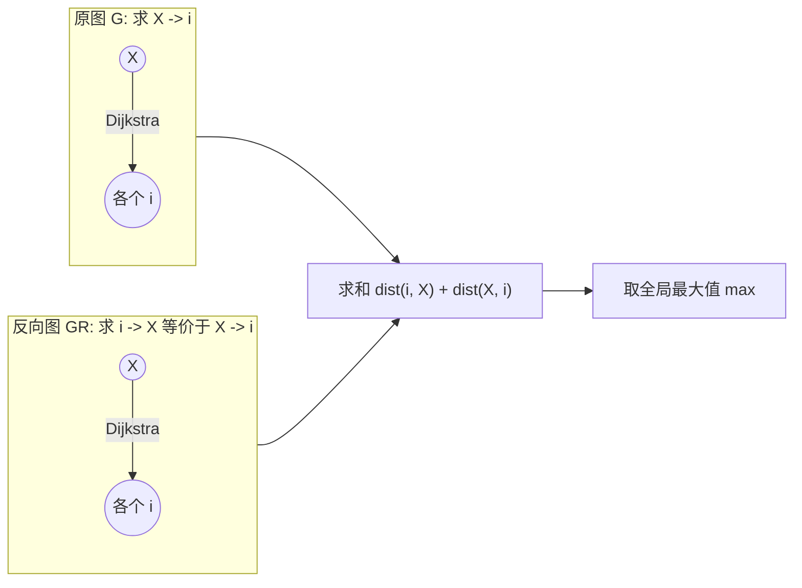

[[TOC]]

## 形式化题目

给定一个包含 $N$ 个顶点和 $M$ 条有向带权边的有向图 $G = (V, E)$，边权均为正整数，以及一个指定的目标顶点 $X$。

定义两点 $u, v$ 之间的最短路长度为 $\operatorname{dist}(u, v)$。对于每个顶点 $i \in \{1, 2, \dots, N\}$，其“往返最短路径长度”为：
$$
\operatorname{round\_trip}(i) = \operatorname{dist}(i, X) + \operatorname{dist}(X, i)
$$
求所有顶点中往返最短路径长度的最大值，即：
$$
\max_{1 \leqslant i \leqslant N} \operatorname{round\_trip}(i)
$$

## 正解

### 思路

计算每个顶点的往返最短路可分为两个独立的部分：
1. **回程部分**：从目标顶点 $X$ 出发到达每个顶点 $i$ 的最短路 $\operatorname{dist}(X, i)$；
2. **去程部分**：从每个顶点 $i$ 出发到达目标顶点 $X$ 的最短路 $\operatorname{dist}(i, X)$。

对于回程部分，这本质上是以 $X$ 为起点的单源最短路径（SSSP）问题。在原图 $G$ 上，以 $X$ 作为源点执行一次堆优化的 Dijkstra 算法，即可在 $O(M \log N)$ 时间内求出 $X$ 到所有顶点的最短距离 $\operatorname{dist}(X, i)$。

对于去程部分，如果对每个顶点 $i$ 都单独执行一次单源最短路算法，总共需要运行 $N$ 次 Dijkstra，时间复杂度高达 $O(N \cdot M \log N)$，在 $N = 1000, M = 100000$ 的数据规模下会严重超出时限。

这里可以借助**反向图（Reverse Graph）**的性质进行优化：
- 构造原图 $G = (V, E)$ 的反向图 $G^R = (V, E^R)$，其中反向边集合定义为 $E^R = \{(v, u, w) \mid (u, v, w) \in E\}$。
- 原图中任意一条由 $i$ 到 $X$ 且权重和为 $W$ 的有向路径：
  $$
  i = v_0 \xrightarrow{w_1} v_1 \xrightarrow{w_2} v_2 \cdots \xrightarrow{w_k} v_k = X
  $$
  在反向图 $G^R$ 中完全对应一条由 $X$ 到 $i$ 且权重和相同的路径：
  $$
  X = v_k \xrightarrow{w_k} v_{k-1} \cdots \xrightarrow{w_2} v_1 \xrightarrow{w_1} v_0 = i
  $$
- 因此，原图中 $i \to X$ 的最短路长度，严格等于反向图中 $X \to i$ 的最短路长度：
  $$
  \operatorname{dist}_G(i, X) = \operatorname{dist}_{G^R}(X, i)
  $$

于是，求所有顶点到 $X$ 的最短路，转化为在反向图 $G^R$ 上以 $X$ 为源点求解单源最短路。只需在 $G^R$ 上再运行一次堆优化 Dijkstra 即可得到所有的 $\operatorname{dist}(i, X)$。

算法全流程：
1. 读取输入时同时建立原图的邻接表 `adj` 与反向图的邻接表 `rev_adj`；
2. 在原图上以 $X$ 为起点跑一次 Dijkstra，记距离数组为 `dist_from_x`；
3. 在反向图上以 $X$ 为起点跑一次 Dijkstra，记距离数组为 `dist_to_x`；
4. 遍历 $i \in [1, N]$，取 `dist_to_x[i] + dist_from_x[i]` 的最大值输出。

### 代码

@include-code(./main.py, python)

### 复杂度

- **时间复杂度**：建图遍历 $M$ 条边需 $O(M)$ 时间；两次堆优化 Dijkstra 的时间复杂度均为 $O((N + M) \log N)$，最后遍历 $N$ 个顶点求最大值耗时 $O(N)$。整体时间复杂度为 $O((N + M) \log N)$，对于 $N \leqslant 1000, M \leqslant 100000$ 可以在数十毫秒内快速完成。
- **空间复杂度**：存储正向邻接表和反向邻接表各需要 $O(N + M)$ 空间，Dijkstra 堆与距离数组占用 $O(N + M)$ 空间。整体空间复杂度为 $O(N + M)$，远低于 128MB 的内存限制。

## 总结

多源单汇的最短路问题是图论中的经典模型。由于在有向图中“所有点到一个固定终点”等价于“在边全反向的图中从该点出发到所有点”，利用反向图可以将原本需要 $N$ 次的单源最短路规约为单次以目标点为起点的单源最短路，从而将时间复杂度从 $O(N \cdot M \log N)$ 大幅降低到 $O(M \log N)$。
