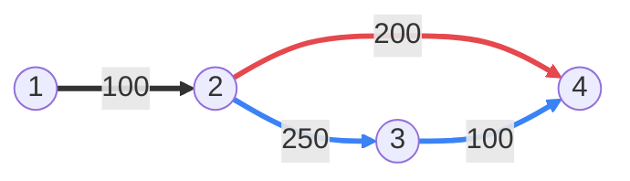

[[TOC]]

## 形式化题目

给定 $N$ 个结点、$R$ 条边的无向带权图 $G = (V, E)$，每条边权均为正整数；结点 $1$ 为起点，结点 $N$ 为终点。路径允许重复经过同一条边（考虑 walk，不要求简单）。

记 $S$ 为从 $1$ 到 $N$ 的所有路径中的最小长度，要求计算

$$
L = \min\{\, \operatorname{len}(P) \mid P \text{ 是 } 1 \to N \text{ 的路径，且 } \operatorname{len}(P) > S \,\}
$$

即长度**严格大于**最短路、又不大于其他一切非最短路径的第二小长度。第二短路与最短路可以共用任意多条边，同一条边也可以被重复走多次；若有多条路径并列最短，它们只算同一个长度值，都必须被跳过。

**样例**：$4$ 个结点、$4$ 条边，边权见下图；最短路 $1 \to 2 \to 4$ 长 $100 + 200 = 300$，第二短路 $1 \to 2 \to 3 \to 4$ 长 $100 + 250 + 100 = 450$。

红色的 $1 \to 2 \to 4$ 是最短路，蓝色的 $2 \to 3 \to 4$ 是第二短路绕开边 $(2, 4)$ 后的替代段，加粗的 $1 \to 2$ 则是两条路共用的开头。观察重点：第二短路并不是"完全不走最短路的边"，它只是把其中一段换成替代走法；任何绕圈的走法（如 $1 \to 2 \to 4 \to 2 \to 4$）都因边权为正而更长，不可能插到 $450$ 前面。

## 正解

### 思路

**朴素做法及其瓶颈。** 最直接的想法是 DFS 枚举所有路径再逐条比较长度，但路径条数是指数级，且允许重复走边后甚至无穷，$N = 5000$ 下完全不可行。另一个想法是先跑一次 Dijkstra 求出 $S$ 再想办法找"稍长一点"的路——瓶颈在于**普通 Dijkstra 每个结点只记一个距离标签**：当一条长度介于 $S$ 与次短之间的路到达时，它既不优于该标签，又正是我们要的答案，单标签只能把它丢掉。若改为对每个结点各跑一次单源最短路，复杂度 $O(N \cdot R \log R)$，在 $N = 5000,\ R = 10^5$ 下约 $5 \times 10^8 \times \log R \approx 10^{10}$ 次运算，也会超时。

**关键观察（双标签引理）。** 把每个结点的距离标签从一个扩成两个：`best[v][0]` 记最短、`best[v][1]` 记次短（严格递增，未发现为 $\infty$）。这样做的充分性来自一个引理：

> 设 $P^*$ 是到结点 $v$ 的第二短路，长度 $L^*$，去掉最后一条边 $(u, v, w)$ 得到前缀，长度 $p = L^* - w$。则 $p$ 一定是 $u$ 的最短或次短标签值。

反证：若 $p$ 大于 $u$ 的次短标签 $s_u$，则 $s_u + w$ 本身也是一条 $1 \to v$ 的真实路径，$s_u + w < p + w = L^*$。它不可能等于 $S$——否则 $u$ 的最短标签 $+ w \leqslant s_u + w = S$，而它作为一条 $1 \to v$ 的路径又有 $\geqslant S$，夹出 $u$ 的最短 = 次短，与严格递增矛盾。于是 $S < s_u + w < L^*$，与 $L^*$ 是第二短矛盾。同理可证最短路的前缀一定是 $u$ 的最短标签。**结论：只要展开每个结点的前两个标签，就不会漏掉任何最短/次短候选。**

**双标签 Dijkstra。** 于是算法水到渠成：小根堆按长度弹出 $(\text{length}, v)$，对每条出边 $(v, \text{nxt}, w)$ 计算候选 $\text{cand} = \text{length} + w$，按下表分三段处理：

| 条件 | 动作 | 含义 |
| --- | --- | --- |
| `cand < best[nxt][0]` | 原最短降级为次短，`cand` 成为新最短 | 找到更短的路，两个槽位整体下移 |
| `best[nxt][0] < cand < best[nxt][1]` | `cand` 登记为次短 | 严格落在开区间内，才是"第 2 小" |
| 其余 | 丢弃 | 等于最短不算（题面要求严格大于），超过已知次短也无意义 |

两条配套规则缺一不可：

- **不设 visited 封印**：题面允许重复走边；边权全为正，标签只会严格递减地刷新，且等于槽位值的候选被开区间拒绝，因此每个值只入堆一次，不会死循环；
- **过期项跳过**：弹出时若 `length > best[v][1]`，说明这条值入堆后已被更小的次短淘汰，直接丢弃，避免用陈旧长度污染邻居。

下表按堆的弹出顺序，展示样例上 `best[2]`、`best[3]`、`best[4]` 三个结点的槽位刷新过程（每格写成 `最短 / 次短`，`—` 表示尚未发现）：

| 弹出的堆项 | 触发的更新 | `best[2]` | `best[3]` | `best[4]` |
| --- | --- | --- | --- | --- |
| $(0, 1)$ | 2 登记最短 100 | 100 / — | — / — | — / — |
| $(100, 2)$ | 4 最短 300、3 最短 350，另给 1 登记次短 200 | 100 / — | 350 / — | 300 / — |
| $(200, 1)$ | 候选 300 卡进 $(100, \infty)$ 开区间，登记 2 的次短 | 100 / 300 | 350 / — | 300 / — |
| $(300, 2)$ | 500 登记 4 的次短（回 1 的 400、去 3 的 550 被拒） | 100 / 300 | 350 / — | 300 / 500 |
| $(300, 4)$ | 400 登记 3 的次短，500 被拒 | 100 / 300 | 350 / 400 | 300 / 500 |
| $(350, 3)$ | 候选 450 把 4 的次短从 500 刷新为 450 | 100 / 300 | 350 / 400 | 300 / 450 |
| $(400, 3)$、$(450, 4)$ | 无更新，候选全部落在槽位之外 | 100 / 300 | 350 / 400 | 300 / 450 |
| $(500, 4)$ | 过期项：$500 > 450$，直接跳过 | 100 / 300 | 350 / 400 | 300 / 450 |

观察两点：其一，$(200, 1)$ 这一步是"允许走回头路"的直接体现——标签 200 是 $1 \to 2 \to 1$ 绕一圈的产物，它让 2 得到次短 300；其二，次短槽位不是一次定型的：4 的次短先记 500，随后被更小的 450 迭代刷新，最终 `best[4] = 300 / 450`，次短 450 即答案。这也说明每个结点的两个槽位各自只会严格递减地更新，总更新次数有限。

### 代码

@include-code(./main.py, python)

### 复杂度

- **时间复杂度**：建图遍历 $2R$ 条有向边耗时 $O(N + R)$；主循环中每个结点的两个槽位各刷新入堆常数次，堆元素总数 $O(N + R)$，每次堆操作 $O(\log R)$，整体 $O((N + R) \log R)$，与普通堆优化 Dijkstra 同阶。$N = 5000,\ R = 10^5$ 时约为 $10^6$ 量级的堆操作，全部 11 组真实数据最慢 0.116s，远低于 OJ 的 1000ms 限制。作为对比，每点跑一次 Dijkstra 的 $O(N \cdot R \log R)$ 在同规模下约 $10^{10}$，不可接受。
- **空间复杂度**：双向邻接表 $2R$ 条元组、双标签数组 $2(N+1)$、小根堆 $O(N + R)$，整体 $O(N + R)$。实测峰值 60.9MB（大头是一次性读入的输入字节串），低于 128MB 的内存限制；`INF = 10**18` 远大于最长简单路 $< 5000 \times 5000 = 2.5 \times 10^7$，哨兵安全。

## 总结

第二短路问题的难点不是"多跑一遍最短路"，而是**单标签 Dijkstra 没有地方安放那些更长但仍可能夺冠的候选**。双标签引理证明只需保留每个结点的前两个长度标签即可不重不漏，于是普通 Dijkstra 平凡地推广为"三段式开区间松弛 + 过期项跳过"的双标签版本：复杂度只多一个常数，却把答案直接算了出来。同一框架继续扩展就是 k 短路问题（Yen 算法、Eppstein 算法）的起点。
