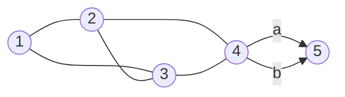

[[TOC]]

## 形式化题目

给定无向无权图 $G = (V, E)$，$V = \{1, 2, \dots, N\}$，$|E| = M$，**允许重边**（两条端点和方向都相同的边视为两条不同的边）。

对每个顶点 $i$，令 $\mathrm{dist}_i$ 为 1 到 $i$ 的最少边数，求有多少条长度为 $\mathrm{dist}_i$ 的路径，答案对 $100003$ 取模；若 $i$ 不可达则记 $0$。

下图是题面样例图（顶点 $1 \sim 5$，边 $1\text{-}2,\ 1\text{-}3,\ 2\text{-}3,\ 2\text{-}4,\ 3\text{-}4,\ 4\text{-}5 \times 2$），其中 $4 \to 5$ 之间的两条重边画成并列的两条：

注意 $(2,3)$ 是**同层横边**：$\mathrm{dist}_2 = \mathrm{dist}_3 = 1$，它不会构成任何最短路的一部分；而 $4 \to 5$ 的重边会让到 5 的答案正好翻倍。

## 正解

### 思路

朴素做法是"先求距离、再枚举路径"：对每个点搜出所有 1 到它的路径，挑最短的计数。
在分层图上用 DFS 枚举路径，路径条数本身就是答案，可以指数级增长，必然超时。
瓶颈不在于"求距离"（BFS 已经是最优），而在于把**路径计数当成了枚举路径**：
同一个前驱 $j$ 与到 $j$ 的所有最短路被重复走了很多遍。

注意到最短路有可加结构：一条以 $(j, i)$ 结尾的 1 到 $i$ 最短路，
去掉最后这条边后，剩下的是 1 到 $j$ 的最短路，且 $\mathrm{dist}_j + 1 = \mathrm{dist}_i$。
于是设 $cnt_i$ 为到 $i$ 的最短路条数，得到递推

$$cnt_1 = 1, \qquad cnt_i = \sum_{\substack{(j,i) \in E \\ \mathrm{dist}_j + 1 = \mathrm{dist}_i}} cnt_j$$

这是一条**只依赖上一层**的加法递推。而无权图的 BFS 按 $\mathrm{dist}$ 非降序访问顶点，
出队顺序天然就是转移所需的拓扑序，所以求距离和递推计数可以合并成一次 BFS，
不必显式建出最短路 DAG、也不必额外排序。

关键在于出队 $u$ 时它自己的 $cnt_u$ 是否已经收齐：$cnt_u$ 只被 $\mathrm{dist}_u - 1$ 层的点贡献，
而第 $\mathrm{dist}_u - 1$ 层的点全部先于第 $\mathrm{dist}_u$ 层的 $u$ 出队，
所以 $u$ 出队时 $cnt_u$ 一定完整，可以安全地传给下一层。

以样例为例，BFS 逐层推进的演算如下（$\mathrm{dist}$ 即队列的层号）：

| 出队 $u$ | $\mathrm{dist}_u$ / $cnt_u$ | 检查的邻居 $v$ | 命中分支 | 更新后 $cnt$ |
| --- | --- | --- | --- | --- |
| 1 | 0 / 1 | 2 | 未访问 | $cnt_2 = 1$ |
| 1 | 0 / 1 | 3 | 未访问 | $cnt_3 = 1$ |
| 2 | 1 / 1 | 1 | 更浅，忽略 | 不变 |
| 2 | 1 / 1 | 4 | 未访问 | $cnt_4 = 1$ |
| 2 | 1 / 1 | 3 | $\mathrm{dist}_3 = 1 = \mathrm{dist}_2$，同层，忽略 | 不变 |
| 3 | 1 / 1 | 1 | 更浅，忽略 | 不变 |
| 3 | 1 / 1 | 4 | 已访问且 $\mathrm{dist}_4 = 1 + 1$，累加 | $cnt_4 = 1 + 1 = 2$ |
| 3 | 1 / 1 | 2 | 同层（$\mathrm{dist}_2 = 1$），忽略 | 不变 |
| 4 | 2 / 2 | 2 | 更浅，忽略 | 不变 |
| 4 | 2 / 2 | 3 | 更浅，忽略 | 不变 |
| 4 | 2 / 2 | 5 | 未访问（重边第一条） | $cnt_5 = 2$ |
| 4 | 2 / 2 | 5 | 已访问且 $\mathrm{dist}_5 = 2 + 1$，累加（重边第二条） | $cnt_5 = 2 + 2 = 4$ |
| 5 | 3 / 4 | 4 | 更浅，忽略（两条重边各一次） | 不变 |

表格说明：每行是一次「出队 $u$ 后检查邻居 $v$」的完整记录，`dist_u / cnt_u` 是出队时 $u$ 的值。
按 BFS 顺序把这张表读下来，可以看到 $u$ 出队时它的 $cnt_u$ 从未再被改动过——这正是「上一层点先出队」带来的不变式。
可以看到 $cnt_4$ 由两个同层前驱 $2, 3$ 叠加得到，$cnt_5$ 则因为 $4$ 出队时遍历到两条重边而被累加两次，
正好解释了样例输出的 `1 1 1 2 4`。

实现上有两条分支，都写在遍历 `adj[u]` 的内层循环里：

- `dist[v] < 0`（尚未访问）：说明 $v$ 的最短距离刚被确定为 $\mathrm{dist}_u + 1$，
  此刻把 $cnt_v \leftarrow cnt_u$ 作为初值，并把 $v$ 入队。这里用 `-1` 兼任"未访问"标记，
  比额外开 `visited` 数组省一次空间和一次判断（顶点 1 的 $\mathrm{dist} = 0$，不会与 `-1` 混淆）。
- `dist[v] == dist[u] + 1`（已访问且正好在下一层）：$(u,v)$ 是递推求和里的一项，执行 $cnt_v \mathrel{+}= cnt_u$。

其余情形都不满足 $dist$ 关系，不参与最短路的构成，直接忽略：
$v$ 更浅（$dist_v < dist_u$）或与 $u$ 同层（$dist_v = dist_u$）都会被排除，在表格中一律记为 `忽略`。
在无权 BFS 中不会出现 $dist_v > dist_u + 1$，因为 $v$ 至多比 $u$ 晚一层被发现。
累加时立刻对 $100003$ 取模，避免答案位数膨胀。由于每条无向边在两个邻接表里各存一次，
重边会导致 $u$ 出队时对同一个 $v$ 执行分支两次，第二次恰好走"已访问 + 下一层"分支完成翻倍，
这也是样例中 $4 \to 5$ 两条重边被正确计成两条路径的原因。

### 代码

@include-code(./main.py, python)

### 复杂度

- 时间复杂度：$O(N + M)$。每个顶点入队、出队各一次，每个邻接表项被检查一次，检查是 $O(1)$。
- 空间复杂度：$O(N + M)$。邻接表存 $2M$ 个整数，`dist`、`cnt` 各 $O(N)$。

## 总结

- 带权最短路的计数要靠 Dijkstra/DAG 上的拓扑 DP；本题权值全为 1，BFS 的层序就是拓扑序，
  于是"求距离"和"计数递推"能合并进同一次 BFS。
- 递推式 $cnt_i = \sum_{\mathrm{dist}_j + 1 = \mathrm{dist}_i} cnt_j$ 的两个分支在代码中分别是
  "首次到达时赋值"和"同层前驱累加"，用 `dist[v] < 0` 与 `dist[v] == dist[u] + 1` 区分；
  同层横边（如样例的 $(2,3)$）和自环都会被这两条判断自动排除。
- 重边是这题的隐藏坑：按邻接表原样存两条边，第二次遍历会落到累加分支上，语义与"两条不同路径"一致。
- 计数必须边加边取模；不可达点 `cnt` 保持 0，输出自然为 0。
