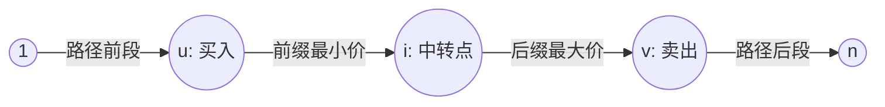

[[TOC]]

## 形式化题目

给定一个包含 $n$ 个顶点和 $m$ 条边的有向图（部分边为双向边），每个顶点 $u$ 有一个点权 $p_u$（表示该城市水晶球价格）。要求找到一条从顶点 $1$ 出发、最终到达顶点 $n$ 的可行路径，并在路径上选择两个顶点 $u, v$（$u$ 在路径中出现的位置不晚于 $v$），使得差价 $p_v - p_u$ 最大。若无法获利或最大差价为负，则可以不进行贸易，收益为 $0$。图中节点和边均可重复经过。

上图展示了最优贸易的路径拆分思想：任意一笔在 $u$ 买入、在 $v$ 卖出的合法交易，都可以通过中间经过的城市（例如交界点 $i$）拆分成“从 $1$ 到 $i$ 的最低进价”与“从 $i$ 到 $n$ 的最高售价”。

## 正解

### 思路

直接在任意有向图中寻找一条包含买卖两点的路径非常复杂，因为路径可以经过环且节点可重复访问。我们可以通过**枚举中转节点**将全局贸易问题分解为两个独立的极值可达性问题：

1. **状态分解**：
   假设阿龙在城市 $u$ 买入水晶球，在城市 $v$ 卖出水晶球，整条旅行路线为 $1 \leadsto u \leadsto v \leadsto n$。
   我们可以在 $u$ 和 $v$ 之间（甚至直接令 $i = v$）选取一个中转城市 $i$。
   这样，整个贸易的最大收益可以分解为两部分：
   - 在从 $1$ 到 $i$ 的可行路径中，所能遇到的**最低商品价格**，记为 $D_{\min}[i]$。
   - 在从 $i$ 到 $n$ 的可行路径中，所能遇到的**最高商品价格**，记为 $D_{\max}[i]$。
   如果在城市 $i$ 处决策，则通过城市 $i$ 的最大可能收益为 $D_{\max}[i] - D_{\min}[i]$。

2. **正向图松弛求解 $D_{\min}$**：
   - 设 $D_{\min}[x]$ 为从城市 $1$ 到城市 $x$ 的所有路径中经过的城市的最低商品价格。
   - 初始时 $D_{\min}[1] = p_1$，其余点设为 $+\infty$。
   - 考虑有向边 $u \to v$：若当前已经能在走到 $u$ 时买到价格为 $D_{\min}[u]$ 的商品，则沿该边走到 $v$ 时，能在途中买到的最低价格为 $\min(D_{\min}[u], p_v)$。
   - 若该值比已记录的 $D_{\min}[v]$ 更小，则更新 $D_{\min}[v]$，并将 $v$ 加入队列继续松弛。

3. **反向图松弛求解 $D_{\max}$**：
   - 设 $D_{\max}[x]$ 为从城市 $x$ 出发能够到达城市 $n$ 的所有路径中经过的城市的最高商品价格。
   - “从 $x$ 走向 $n$”等价于“在反向图上从 $n$ 走向 $x$”。
   - 初始时 $D_{\max}[n] = p_n$，其余点设为 $-1$。
   - 在反向图上，若当前沿反向边到达 $v$ 能卖出的最高价格 $\max(D_{\max}[u], p_v)$ 大于 $D_{\max}[v]$，则更新 $D_{\max}[v]$ 并将 $v$ 入队。

4. **合并求最优答案**：
   遍历所有城市 $i \in [1, n]$。若城市 $i$ 既可从 $1$ 到达（$D_{\min}[i] \leqslant 100$），又能到达 $n$（$D_{\max}[i] \geqslant 0$），则其对答案的贡献为 $D_{\max}[i] - D_{\min}[i]$。
   最终答案即为所有中转城市的收益最大值（若均小于等于 $0$ 则输出 $0$）。

### 代码

@include-code(./main.py, python)

### 复杂度

- **时间复杂度**：$\mathcal{O}(k(n + m))$。图中有 $n \leqslant 10^5$ 个城市，$m \leqslant 5 \times 10^5$ 条边。由于商品价格取值范围在 $[1, 100]$ 内，每个节点的价格只会被单调松弛常数次，队列松弛（SPFA 机制）能够极其迅速地收敛，实际运行时间在 0.1 秒内。
- **空间复杂度**：$\mathcal{O}(n + m)$。用于存储正向图与反向图的邻接表，以及正反向极值数组与辅助队列。

## 总结

本题的关键在于**拆分与中转点枚举**：
1. 将路径两点的关联最优化问题，转化为以中间点 $i$ 为枢纽的前后两段独立极值问题。
2. 逆向思维：将“从 $i$ 到 $n$ 的最大值”通过反向建图转化为“从 $n$ 出发到达各点的最大值”。
3. 状态转移虽然建立在可能有环的有向图上，但松弛操作具备严格单调性且值域极小，利用 SPFA / 队列松弛能高效求解。
