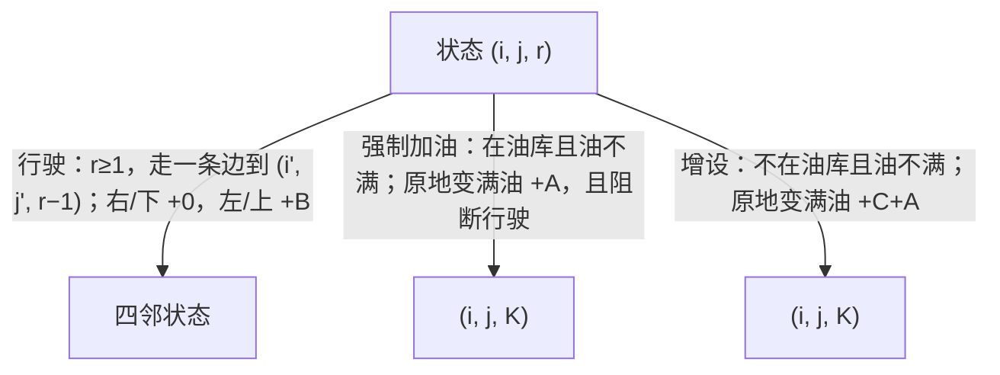

[[TOC]]

## 形式化题目

给定 $N \times N$ 网格，交叉点坐标 $(i, j)$（$1 \leqslant i, j \leqslant N$，$X$ 轴向右、$Y$ 轴向下），起点 $(1,1)$、终点 $(N, N)$，两处不设油库；部分交叉点设有油库。汽车沿网格边行驶，满油可走 $K$ 条边，出发时满油。费用规则：

1. 走一条网格边，若该边使 $X$ 或 $Y$ 坐标减小（向左/向上）付 $B$，否则免费；
2. 行驶途中**遇到油库必须加满油**并付 $A$；
3. 可在任意交叉点增设油库，付 $C$（题面注明**不含**加油费用 $A$）。

求从起点到终点的最小总费用，$N, K, A, B, C$ 均为正整数，$2 \leqslant N \leqslant 100$，$2 \leqslant K \leqslant 10$。

**样例**（$N=9, K=3, A=2, B=3, C=6$）存在一条只向右/下行驶的最优路线，全程费用全部来自 $6$ 次加油：

| 分段 | 路线（1 起） | 行驶费 | 段末油量 | 加油费 |
| --- | --- | --- | --- | --- |
| 1 | $(1,1) \to (2,1) \to (3,1)$ | 0（只向下） | 1，进油库加满 | 2 |
| 2 | $(3,1) \to (3,2) \to (3,3)$ | 0（只向右） | 1，进油库加满 | 2 |
| 3 | $(3,3) \to (3,4) \to (4,4) \to (5,4)$ | 0 | 0，进油库加满 | 2 |
| 4 | $(5,4) \to (5,5) \to (5,6) \to (5,7)$ | 0 | 0，进油库加满 | 2 |
| 5 | $(5,7) \to (5,8) \to (6,8)$ | 0 | 1，进油库加满 | 2 |
| 6 | $(6,8) \to (6,9) \to (7,9)$ | 0 | 1，进油库加满 | 2 |
| 7 | $(7,9) \to (8,9) \to (9,9)$ | 0 | 1，到达终点 | — |

观察：每段恰好用掉 $K=3$ 格油以内并在油库处补满（第 3、4 段耗尽到 0 才进站）；全程未向左/上，$B$ 一次未付，也未增设油库，总费用 $6 \times 2 = 12$，与样例输出一致。

## 正解

### 思路

**朴素做法及其瓶颈。** 想法一：把每个交叉点当图的点、四邻边连边跑最短路，把加油费当点权——**错在状态不完整**。同一个点，"油箱剩 3 格"和"油箱剩 0 格"是两个完全不同的处境：后者寸步难行，前者还能走很远；把它们混成一个点，可行性判断和费用都会算错。想法二：DFS 枚举所有行驶路线，模拟油量和费用取最小——路线可绕圈、可走回头路，分支数指数级，$N=100$ 下不可行。两个想法的瓶颈相同：**费用与可行性不仅取决于"在哪"，还取决于"油箱还剩多少"，而油量必须进状态**。

**关键观察：油量是小档位资源。** 每走一条边减 1 格油，满油 $K$ 格，所以油量只有 $0, 1, \dots, K$ 共 $K+1$ 种取值，而 $K \leqslant 10$。把状态定为 $(i, j, r)$——车在 $(i,j)$、还剩 $r$ 格油——状态总数只有 $N^2(K+1) \leqslant 100 \times 100 \times 11 = 1.1 \times 10^5$，完全可控。题面三条规则各自变成一类**非负权转移**：

三处细节决定模型是否成立：

- **强制加油阻断行驶**：题面说"遇油库则应加满油"——在油库且油不满时，付 $A$ 变满油是该状态的**唯一**后继，不能加满前离开（代码里 `must_refuel` 为真时不生成行驶后继）；油量为 0 时同理只能加油或增设，哪里都去不了。
- **增设就地付 $C+A$**：题面明说 $C$"不含加油费用 A"，所以增设并加满一次付清 $C+A$。增设是持久的（将来回该点加油只需 $A$），为什么不记录"已建集合"？靠一条删环引理：**任何最优路线都不会第二次经过同一个油库**——初访油库后油量必为 $K$（进站必加满），若回环再次回到该站，回程最后一次加油后至少走了 1 条边才回站，到站油量 $r \leqslant K-1 < K$，又触发强制加油；把整段回环删掉，状态仍是 $(X, K)$ 而费用更低，与最优矛盾。于是自建油库最多被用一次，就地付 $C+A$ 与持久记录**完全等价**，状态数保持 $O(N^2 K)$ 而不必带 $2^{N^2}$ 的位集维（另用 300 组 $N \leqslant 4$ 随机数据对拍两种模型，答案全部一致）。
- **弹出终点即答案**：终点不设油库、之后没有行驶需求，任何到终点后再加油/绕路都只会更贵；所有转移非负，Dijkstra 第一次弹出 $(N,N,r)$ 就是全局最小，直接输出。

**算法水到渠成**：以 $(1,1,K)$ 费用 0 起步，堆优化 Dijkstra 跑上述转移。所有边权 $\geqslant 0$，弹出即定稿；不设 visited 封印（费用更小就重新入堆，非负权保证每状态入堆次数有限），弹出时用 `cost != dist.get(...)` 跳过过期堆项。

### 代码

@include-code(./main.py, python)

### 复杂度

- **时间复杂度**：状态数 $V = N^2(K+1)$，每状态出度 $\leqslant 6$（4 行驶 + 加油 + 增设），边数 $E = O(V)$，堆优化 Dijkstra 整体 $O(V \log V) = O(N^2 K \log(N^2 K))$。实测 8 组真实数据最慢 0.148s（$N=100, K=10$ 满规格），OJ 限时 1000ms，余量充足。
- **空间复杂度**：`dist` 字典与堆各存 $O(V)$ 项，整体 $O(N^2 K)$。实测峰值 35.6MB（含解释器），内存限制 128MB。

## 总结

本题的钥匙是**状态补全**：只看"在哪"不够，"油箱剩几格"必须并入状态——好在 $K \leqslant 10$ 让档位只有 $K+1$ 种，指数枚举瞬间坍缩成 $O(N^2 K)$ 的普通最短路。三条题目规则（行驶计费、强制加油、增设油库）各对应一类非负权转移，其中"强制加油"用唯一后继表达、"增设"用删环引理证明可就地计费，都是把**规则语义**忠实编码成**图结构**的过程。同一框架可推广：油量档位换成其他有限资源（时间窗、载重、电量），就是典型的分层图/状态最短路题型。
