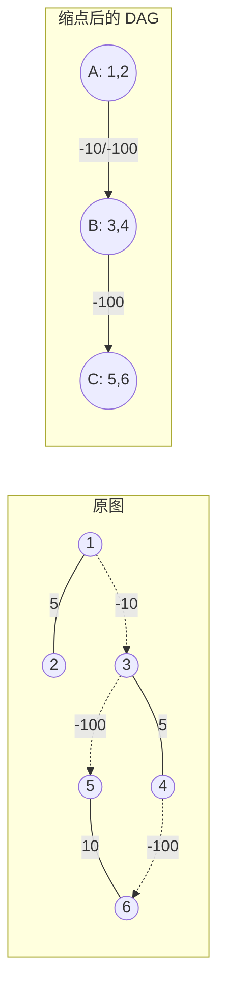

[[TOC]]

## 形式化题目

给定一张有 $T$ 个点的有向/无向混合图，边分两类：

- **道路**：无向边，边权 $0 \leqslant C_i \leqslant 10^4$；
- **航线**：有向边 $A_i \to B_i$，边权 $-10^4 \leqslant C_i \leqslant 10^4$。

额外保证：对任意航线 $A \to B$，不存在一条由道路与航线组成的、从 $B$ 回到 $A$ 的路径（即图中无环可归因于航线）。求起点 $S$ 到所有点的单源最短路；不可达的点报告不存在路径。

这一保证用「道路连通块」的语言可以改写为：把每个道路连通块收缩成一个超级点后，所有跨块航线构成的图是一张有向无环图。

## 暴力解法

### 思路

图中有负权边，最直接的单源最短路做法是 Bellman-Ford：

```text
dist[S] = 0，其余为 INF
重复 T-1 轮：
    对每条边 (a, b, c)：
        若 dist[a] + c < dist[b]，则更新 dist[b]
```

无负权环时它一定收敛到正确答案，并且能自然处理「不可达」——这类点的 `dist` 始终保持 `INF`，不会被任何松弛命中。

### 代码

<!-- 暴力层仅用于暴露瓶颈，与正解不是可切换的两个实现，故不单独给出代码文件。 -->

本解法不单独给出代码文件：它只是用来暴露瓶颈的接力层，正解在渐近复杂度上完全取代了它；
真正的可提交实现在正解的 `### 代码` 中（`main.py`）。

### 复杂度

每轮要扫过全部 $E = 2R + P$ 条边，共 $T - 1$ 轮：

$$
O\bigl(T(2R + P)\bigr)
$$

### 瓶颈

代入最大数据 $T = 2.5 \times 10^4$ 与 $R = P = 5 \times 10^4$：

$$
2.5 \times 10^4 \times (10^5 + 5 \times 10^4) \approx 3.75 \times 10^9
$$

即便单次操作再便宜，这个量级也远超时间限制。SPFA 的平均表现好得多，但最坏复杂度与 Bellman-Ford 同阶，本题作为最短路专题题，数据里显然有针对它的构造。

瓶颈的根源很清楚：**负权边让 Dijkstra 无法直接使用**，于是被迫退化成「反复扫描全图」。

## 正解

### 关键观察

题面那条看起来很奇怪的保证，正是为负权边量身定做的。把它翻译成「道路连通块」的语言：

1. 只走道路时，图被分成若干连通块，块内边权全部非负。
2. 把每个块收缩成一个超级点，航线成为超级点之间的有向边。上面的保证说明这张超级点图**没有环**，即它是一张 DAG。
3. 因此超级点存在**拓扑序**。

下面这张图展示了样例的三层结构：原图 → 按道路缩点 → 航线在超级点上构成 DAG。



实线是双向道路，虚线是单向航线。缩点后 $A \to B \to C$ 是一条链，三个超级点的入度分别是 $0, 1, 2$，拓扑序唯一（$A, B, C$）。可以看出所有负权边都被推到了超级点之间的边上，块内部只剩非负的道路。

### 思路

Dijkstra 的死穴是「负权边可能让已经出堆的点再次被更新」。拓扑序恰好给出了一个精确的时机：

> 按拓扑序处理块 $c$ 时，所有跨块航线 $x \to c$ 的起点块 $x$ 都已经处理完毕。所以块 $c$ 中每个点「从块外拿到」的距离值不可能再变小了。

换句话说，**跨块负权边不再构成障碍**——它们会在轮到目标块之前全部松弛完毕，形成确定的初值。而块内只剩下非负的道路边，可以直接跑 Dijkstra。

于是算法分成三步：

1. **缩点**：对每个未访问的城镇做一次只走道路的 BFS，得到一个连通块，记录 `comp[v]` 与块的成员表。
2. **拓扑排序**：在超级点层面加入所有航线边并统计入度，用 Kahn 算法求拓扑序。
3. **逐块 Dijkstra**：处理块 $c$ 时，把块内所有 `dist` 有限的点作为**多源起点**建堆，跑一次局部 Dijkstra。出堆点 $u$ 时，松弛它的道路边（入堆）和航线边（跨块的只更新 `dist`，不入本块的堆）。块 $c$ 结束后，把它指向的块入度减 $1$，归零者入队。

样例的处理过程如下表，可以逐列对照上面的算法步骤：

| 步骤 | 处理的块 | 压入堆的起点 | 结果 |
| --- | --- | --- | --- |
| 1 | $A = \{1,2\}$ | 块内 `dist` 全为 `INF`，$S=4$ 不在 $A$ → 堆空 | $A$ 内全部保持 `NO PATH` |
| 2 | $B = \{3,4\}$ | `dist[4] = 0`（起点） | 出堆 4：航线 $4 \to 6$ 写入 `dist[6] = -100`（跨块，不入堆）；道路 $4 - 3$ 松弛出 `dist[3] = 5` 入堆；出堆 3：航线 $3 \to 5$ 写入 `dist[5] = -95`（跨块，不入堆） |
| 3 | $C = \{5,6\}$ | 由 $B$ 的航线送来的初值：`(-100, 6)` 与 `(-95, 5)` | 块内道路 $5 - 6(10)$ 试松弛一次：$-95 + 10 = -85 > -100$，不更新 |

最终 `dist = [∞, ∞, 5, 0, -95, -100]`，与样例输出一致。

注意步骤 1：$A$ 虽然是拓扑序的第一个块，但 $S$ 不在其中，块内所有点的 `dist` 都是 `INF`，建堆时被 `dist[u] < INF` 过滤掉，堆空——松弛循环体一次也不会执行，因此不会向 $B$ 写入任何值，也不会污染结果。

再注意步骤 2 与 3 的分工：`4→6` 这条负权航线在块 $B$ 里被松弛时，**没有**把 6 压进 $B$ 的堆——6 属于块 $C$。它只是把 `dist[6]` 改成一个更小的值，等块 $C$ 被处理时作为初值参与堆。这正是「块内只有非负边，Dijkstra 安全」的保证所在。

### 代码

@include-code(./main.py, python)

### 复杂度

| 阶段 | 代价 |
| --- | --- |
| 缩点 BFS | 每条道路访问一次，$O(T + R)$ |
| 建 DAG、统计入度 | 每条航线一次，$O(T + P)$ |
| 拓扑排序 | $O(T + P)$ |
| 逐块 Dijkstra | 每条边最多参与一次堆操作，$O((R + P)\log T)$ |

总时间复杂度：

$$
O\bigl((T + R + P)\log T\bigr)
$$

比 Bellman-Ford 的 $O\bigl(T(R + P)\bigr)$ 少乘了一个 $T$。空间复杂度 $O(T + R + P)$。

## 总结

这道题的关键在于**看穿题面保证的图论含义**：那条「有航线 $A \to B$ 就回不到 $A$」的约束，等价于「道路连通块缩点后是 DAG」。一旦得到 DAG，就拿到了拓扑序；而拓扑序恰好提供了 Dijkstra 最需要的东西——一个「块外距离值已定」的时机。于是负权边被限制在块间、由拓扑序消化，块内退回非负图、由 Dijkstra 处理。

实现上有两个容易踩的坑：一是建堆时必须只遍历当前块的成员，若每个块都扫描全部 $T$ 个点会退化成 $O(T \times \text{块数})$，在块数接近 $T$ 的数据（如 24999 个孤立块）上直接超时；二是跨块航线松弛后**不能**入本块的堆，否则会把别的块的点提前当作已定值处理，破坏正确性。

本解法在全部 16 个官方测试点上通过，最慢 0.114 秒、峰值内存 63.6MB，Python 实现也在限制内（1000ms / 128MB）。
