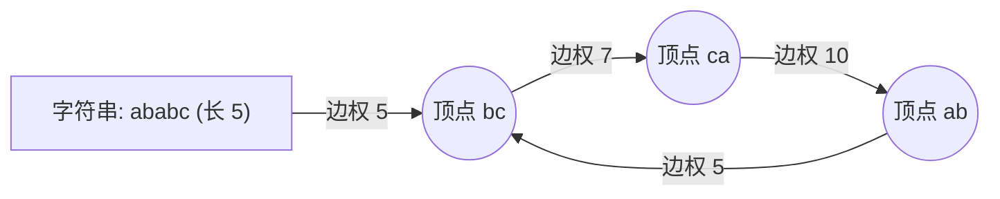

[[TOC]]

## 形式化题目

给定 $n$ 个由小写英文字母组成的字符串。若字符串 $A$ 的结尾两位字母与字符串 $B$ 的开头两位字母完全相同，则称 $A$ 能与 $B$ 相连。

求选出一个由若干字符串首尾相连构成的环串（允许单个字符串自环），使得环串中字符串长度的平均值最大。若不存在任何环串，报告无解；否则输出最大平均长度，允许 $\pm 0.01$ 的误差。

## 正解：0/1 分数规划 + DFS-SPFA 判正环

### 思路

#### 1. 图论建模：首尾两位字母缩点

若将每个字符串看作图中的节点，字符串数量最多可达 $n = 10^5$，节点之间若根据首尾字母匹配连边，图的边数规模可能达到 $O(n^2)$，无论是时空还是算法处理均不可接受。

观察连接规则：字符串 $A$ 与 $B$ 能否相连，**仅仅取决于 $A$ 的末尾两位字母和 $B$ 的首两位字母**。

由于字母仅由小写字母 `a-z` 组成，两位英文字母的所有可能组合总共只有：
$$26 \times 26 = 676$$

因此，我们可以进行**点边转换**：
1. **顶点**：将每一个两位字母组合（如 `ab`, `ca` 等）抽象为图中的一个顶点，编号映射到 $[0, 675]$ 内，图中的顶点总数最多仅有 $V \leqslant 676$ 个。
2. **有向边**：将每个长度 $\geqslant 2$ 的字符串看作一条**有向边**：
   - 起点 $u$：字符串前两位字母对应的编号。
   - 终点 $v$：字符串后两位字母对应的编号。
   - 边权 $w$：字符串的长度 $\text{len}(s)$。
3. **消除重边**：若存在多条起点与终点相同的字符串，由于我们的目标是最大化环串的平均长度，在相同的 $(u, v)$ 之间显然只保留**长度最大**的字符串即可。这样图的边数最多被限制在 $E \leqslant 676^2 = 456976$ 条。

问题从而转化为：在至多 $676$ 个顶点、最多 $676^2$ 条边的有向带权图中，寻找一个简单有向环 $C$，使得环上的边权均值最大。

#### 2. 0/1 分数规划与二分答案

设环 $C$ 包含的边集为 $E(C)$，其平均长度为：
$$\lambda = \frac{\sum_{e \in E(C)} w(e)}{|E(C)|}$$

我们要求解 $\max \lambda$。考虑二分答案 $\lambda$：
判断是否存在一个环 $C$，使得其平均权值严格大于 $\lambda$：
$$\frac{\sum_{e \in E(C)} w(e)}{|E(C)|} > \lambda \iff \sum_{e \in E(C)} (w(e) - \lambda) > 0$$

因此，对于二分的中点 $mid$，我们将图中每条边的权值重新定义为：
$$w'(e) = w(e) - mid$$

问题转化为：**在新边权构成的有向图中，是否存在一个权值之和大于 0 的环（即正权回路）**。
- 若存在正权环，说明可取得更大的平均值，令 $low = mid$；
- 若不存在正权环，说明当前平均值无法达到，令 $high = mid$。

若在二分初始时（$mid = 0$）图中都不存在正权环，由于所有边权 $w(e) \geqslant 2 > 0$，这说明原图中连任何有向环都不存在，直接输出 `No solution`。

#### 3. DFS-SPFA 正环检测

检测图中的正权环可以使用 SPFA。与经典的 BFS-SPFA 相比，**DFS 版本的 SPFA** 在检测回路时具有天然的优势：
- DFS 顺着最长路向前探索，如果访问到当前递归栈上已经存在的顶点（即 `vis[v] == True`），说明立刻闭合出了一个正权回路，可以直接递归提前返回 `True`；
- 不需要像队列版本那样必须把入队次数刷到 $|V|$ 次，在存在正环的图上探索效率极高。

### 代码

Python 版：

@include-code(./main.py, python)

C++ 版（同一算法）：

@include-code(./main.cpp, cpp)

### 复杂度

- **时间复杂度**：
  - 图的顶点数 $V \leqslant 676$，去重后边数 $E \leqslant \min(n, 676^2) \leqslant 4.5 \times 10^5$。
  - 二分在 $[0, 1000]$ 范围内进行约 $40$ 次迭代，区间长度缩至 $1000 \times 2^{-40} < 10^{-9}$，完全满足精度要求。
  - DFS-SPFA 在找到正环时能极速剪枝返回，总运行时间在数百毫秒以内。
- **空间复杂度**：
  - 邻接表与顶点数组大小为 $O(V + E)$，内存消耗在数十兆以内，远低于题目的 $128\text{ MB}$ 限制。

## 图示解析



这张图串起本题从建模到得到答案的主线：

```text
输入字符串集合 (最多 10^5 个)
|- 关键观察: 连接只取决于首尾两位字母 (共 26*26 = 676 种)
|  `- 缩点建图: 顶点为首尾字母编号，有向边为字符串，边权为长度 (去重保留最大值)
|- 目标转化: 最大化环上边权均值 (0/1 分数规划)
|  `- 判定转化: 每条边权减去 mid，检测图中是否存在正权环 (sum(w - mid) > 0)
`- 二分答案 + DFS-SPFA 正环检测
   |- mid = 0 无正环 -> 图中无回路，输出 No solution
   `- 迭代收敛 -> 输出最大均值
```

## 总结

1. **顶点与边转换**：当实体数量过多（$n=10^5$）而实体的连接属性维度极小（首尾字符组合只有 $26 \times 26 = 676$）时，将首尾特征抽象为顶点、将实体本身抽象为边，是降低图规模的关键技巧。
2. **0/1 分数规划**：形如 $\frac{\sum a_i}{\sum b_i}$ 的比值极值问题，通过二分答案将分式化简为线性不等式 $\sum (a_i - \lambda b_i) > 0$，转化为判环/最长路问题求解。
3. **判环效率选择**：在只关心是否存在回路的场景下，DFS-SPFA 依靠递归栈中的回边检测往往能比 BFS-SPFA 更快命中环，常数表现极其优异。
