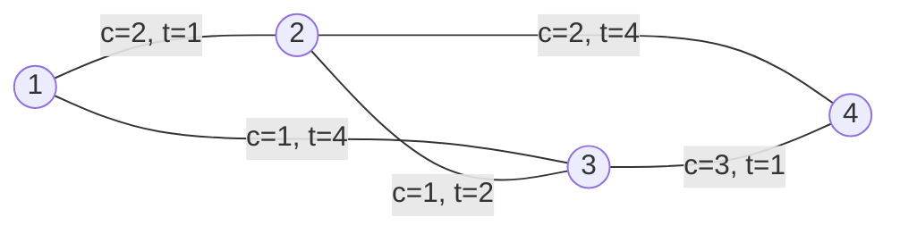

[[TOC]]

## 形式化题目

给定一个包含 $n$ 个节点、$m$ 条无向边的网络，起点为 $s$，终点为 $e$。每条边具有费用 $c$ 和时间 $t$ 两个非负属性。

对于从 $s$ 到 $e$ 的一条路径，其总费用 $C$ 为沿途各边费用之和，总时间 $T$ 为沿途各边时间之和。如果两条路径的 $(C, T)$ 相同，则视为同一种路径。

若一条路径 $A$ 满足 $C_A \le C_B$ 且 $T_A \le T_B$（且两者不同时相等），则称路径 $A$ 支配路径 $B$。不存在任何其他路径能支配的路径称为**最小路径**（即 Pareto 最优解）。

请求出从 $s$ 到 $e$ 互不相同的最小路径 $(C, T)$ 种数。

## 思路

这是一道典型的**双目标最短路（Bi-objective Shortest Path）**问题，要求统计 Pareto 前沿（非支配解集合）的大小。

### 1. 朴素方法与瓶颈

朴素思路是通过 DFS 搜索从起点 $s$ 到终点 $e$ 的所有简单路径，收集所有路径的 $(C, T)$ 点对，最后进行非支配排序与去重。
但在一张 $n \le 100, m \le 300$ 的无向图上，从 $s$ 到 $e$ 的简单路径数量在最坏情况下呈指数级爆炸，直接爆搜会严重超时。

### 2. 状态维度转化与上界估计

注意到两点关键性质：
1. **边的权值非负**：边费用 $c \in [0, 100]$，边时间 $t \in [0, 100]$。如果一条路径包含环路，走环只会让费用或时间增加或不变，绝不会比不走环更优。因此，所有的最小路径都可以规约为不含环的简单路径。
2. **费用有明确上界**：简单路径包含的边数最多为 $n - 1 \le 99$ 条。每条边费用最大为 $100$，因此任何有效简单路径的总费用必不超过：
   $$C_{\max} \le (n - 1) \times 100 \le 99 \times 100 = 9900 \le 10000$$

既然费用总和的上界较小，我们可以**将费用作为状态的一个维度**，将原问题转化为：
> 对于每个可能的总费用 $c \in [0, 10000]$，求从起点 $s$ 到各节点 $u$ 的**最小时间**。

设 `dist[u][c]` 表示到达节点 $u$ 且累计花费恰好为 $c$ 时的最短时间。

### 3. 拆点图上的 Dijkstra

由于每条边的时间 $t \ge 0$，我们可以将每个原图节点 $u$ 拆成 $(u, c)$ 状态。
对于原图中的一条无向边 $(u, v, c_e, t_e)$，状态转移为：
$$(u, c) \xrightarrow{+t_e} (v, c + c_e)$$

这等价于在一个有 $O(N \cdot C_{\max})$ 个状态的有向图上求单源最短路。我们使用优先队列（二叉堆）优化的 Dijkstra 算法进行状态扩展：
- 堆中元素为三元组 `(time, cost, u)`。
- 每次取出当前时间最小的状态进行松弛，更新 `dist[v][c + edge_c]` 并重新入堆。

### 4. 统计 Pareto 最优解

在 Dijkstra 结束后，我们获得了所有到达终点 $e$ 的状态 `dist[e][c]`（即费用为 $c$ 时的最小时间）。
如何筛选出真正的非支配解？
我们将费用 $c$ 从 $0$ 到 $10000$ 升序枚举：
- 随着费用 $c$ 逐渐增大，其对应的时间必须**严格小于**之前出现过的所有时间最小值（即 $dist[e][c] < \min_{0 \le k < c} dist[e][k]$）。
- 否则，若 $dist[e][c] \ge \min_{0 \le k < c} dist[e][k]$，则说明之前已经存在一个费用更低（$\le c$）且时间更优或相等（$\le dist[e][c]$）的方案，当前状态被它支配，必须舍弃。

因此，只需维护一个变量 `min_time` 记录历史最小时间。每当遇到更小的时间，就找到了一组新的 Pareto 最优解，计数器加 1，并更新 `min_time`。

## 图示过程

以样例为例：$4$ 个节点，$5$ 条边，从 $1$ 到 $4$。

所有简单路径产生的 $(C, T)$ 组合如下：

| 路径 | 总费用 $C$ | 总时间 $T$ | 是否为最小路径 | 原因说明 |
| :--- | :--- | :--- | :--- | :--- |
| $1 \to 2 \to 4$ | $4$ | $5$ | **是** | 费用为 4 时时间最短 |
| $1 \to 3 \to 4$ | $4$ | $5$ | **是** | 与上一条费用和时间相同，算作同一种 |
| $1 \to 2 \to 3 \to 4$ | $6$ | $4$ | **是** | 费用虽高，但时间更快（$4 < 5$），互不支配 |
| $1 \to 3 \to 2 \to 4$ | $4$ | $10$ | 否 | 被 $(4, 5)$ 支配（费用相同但时间更长） |

按费用 $c$ 升序扫描：
1. $c = 4$ 时，时间为 $5$，$5 < \infty$，计入答案，当前 `min_time = 5`；
2. $c = 6$ 时，时间为 $4$，$4 < 5$，计入答案，当前 `min_time = 4`；
3. 最终不同种类的最小路径数为 $2$。

## 代码

@include-code(./main.py, python)

## 复杂度分析

- **时间复杂度**：状态总数为 $V' = N \times C_{\max} \le 100 \times 10000 = 10^6$。边数 $E' = M \times C_{\max} \le 300 \times 10000 = 3 \times 10^6$。使用二叉堆优化 Dijkstra 算法的时间复杂度为 $O(E' \log V')$。实际可达状态远少于理论上限，在 Python 下运行效率高。
- **空间复杂度**：存储距离数组 `dist` 的空间为 $O(N \times C_{\max})$，约需几兆字节内存，远低于评测系统 128 MB 的限制。

## 总结

面对双目标权值优化问题，当其中一个维度的取值范围较小（或受简单路径长度限制）时，将该维度化作状态维度进行拆点，并用 Dijkstra 算法求解另一个维度的最优值，是一种非常高效的标准解法。最后通过一次单调扫描即可去重并滤出所有 Pareto 最优解。
