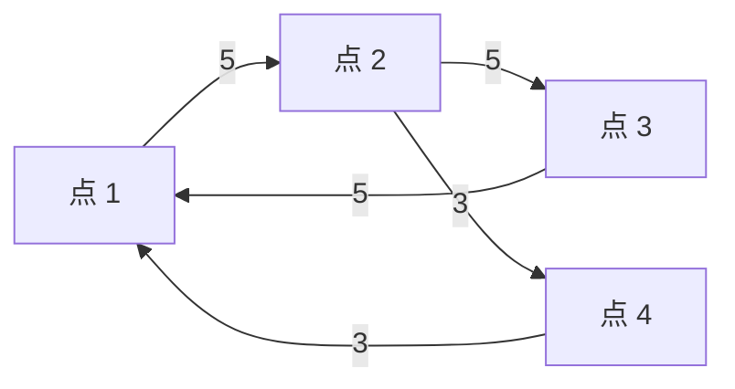

[[TOC]]

## 形式化题目

给定 $n$ 个顶点、$m$ 条有向边的带权图 $G=(V,E)$，边权 $w_{i,j}$ 为实数。$c=(c_1,c_2,\dots,c_k)$ 是一个**圈**，当且仅当 $c_i \to c_{i+1}$（$1 \leqslant i < k$）与 $c_k \to c_1$ 的边都存在，且 $c_1,\dots,c_k$ 互不相同。

圈 $c$ 的平均权定义为

$$\mu(c)=\frac{1}{k}\sum_{i=1}^{k} w_{c_i,c_{i+1}},$$

即圈上所有边权之和除以边数。求全图所有圈的平均权最小值 $\mu^*=\min_c \mu(c)$，输出保留 8 位小数。

**样例**：下图中只有两类圈（不计同一条圈的反向不存在，因为是有向图），展示它们的平均权：

| 圈 | 各边权 | 总权 | 平均权 $\mu(c)$ |
| :--- | :--- | :--- | :--- |
| $1 \to 2 \to 3 \to 1$ | $5, 5, 5$ | $15$ | $5$ |
| $1 \to 2 \to 4 \to 1$ | $5, 3, 3$ | $11$ | $11/3 \approx 3.66666667$ |

取较小者，输出 $3.66666667$。观察重点：平均权不是总权——长圈总权更大但平均权可以更小，因此不能只找"最短"的圈。

## 正解

### 思路

**朴素做法及其瓶颈。** 最直接的想法是枚举所有圈再算平均权，圈的数量是指数级的。退一步，按长度枚举圈：对每个起点 $s$、每个长度 $j$ 各做一次"恰好 $j$ 条边"的最短路 DP，取 $\min_{s,j} F_s[j][s]/j$，复杂度 $O(n^2 m) = 9\times 10^{10}$，不可接受。瓶颈很明确：**"从哪个点出发"这个维度把整张 DP 表复制了 $n$ 份**——需要一个不依赖固定起点的刻画。

**关键观察：只需考虑闭合行走。** 任何闭行走（起点终点相同）都能分解成若干个圈：总权等于各圈权之和、总长等于各圈长之和，因此闭行走的平均权是各圈平均权的加权平均，不可能小于其中最小者；反过来圈本身就是闭行走。所以

$$\mu^* = \min\{\text{闭行走的平均权}\}.$$

而 $\mu^*$ 一定由长度不超过 $n$ 的圈达到（圈上顶点互异），不必枚举任意长的行走。

**Karp 递推表。** 定义 $F[j][v]$ 为：**恰好 $j$ 条边、以 $v$ 结尾**的最小权行走的权值（起点任取）。它满足

$$F[0][v] = 0, \qquad F[j][v] = \min_{(u,v)\in E}\big(F[j-1][u] + w_{u,v}\big).$$

起点任取相当于把 $F[0]$ 全体置 0，"从哪出发"被折叠进同一个表里：固定长度 $j$ 扫一遍所有边即可推进一行，$n+1$ 行共 $O(nm)$ 次松弛。

**Karp 定理（min-max 见证分数公式）。** 

$$\mu^* = \min_{v \in V}\ \max_{0 \leqslant k \leqslant n-1} \frac{F[n][v] - F[k][v]}{n-k}.$$

直观理解：$F[n][v]$ 与 $F[k][v]$ 都是"终于 $v$"的最优行走，两者权值之差除以长度差，得到的是"多走 $n-k$ 条边"这段的平均权；对固定 $v$ 取 $\max_k$ 会剔除掉前缀异常便宜的干扰项，再对 $v$ 取 $\min$ 挑出最优终点。

正确性草证（下界方向）：设 $P$ 是终于 $v$ 的最优 $n$-行走。若 $P$ 在第 $k<n$ 步时也经过 $v$，则前缀本身是候选行走，$F[k][v]$ 不大于前缀权，于是 $\frac{F[n][v]-F[k][v]}{n-k}$ 不小于 $P$ 后缀（一条闭行走）的平均权 $\geqslant \mu^*$；否则 $P$ 的前 $n$ 个落点互异落在 $n-1$ 个点里，必有重复——$P$ 含圈，把圈对应的 $r$ 条边删去得 $k=n-r$ 的候选行走，同一分式不小于该圈平均权 $\geqslant \mu^*$。因此每个 $v$ 的 $\max$ 都 $\geqslant \mu^*$。上界方向是 Karp 定理的构造部分：把每条边权减去 $\mu^*$ 后全图圈权非负、最小平均圈权为 0；对它的最优到达行走反复绕圈可拼出任意长的最优行走，取其前 $n$ 条边的终点 $v$，该点的所有 $\frac{F[n][v]-F[k][v]}{n-k}$ 都不超过归一后的 $0$，两方向合起来即得等式。

**用样例走一遍这张表**（$n=4$，行是 $j$，列是 $v$，单元格为 $F[j][v]$，不可达处不会出现在本例）：

| $j$ \ $v$ | 点 1 | 点 2 | 点 3 | 点 4 |
| :--- | :--- | :--- | :--- | :--- |
| $0$ | $0$ | $0$ | $0$ | $0$ |
| $1$ | $3$ | $5$ | $5$ | $3$ |
| $2$ | $6$ | $8$ | $10$ | $8$ |
| $3$ | $11$ | $11$ | $13$ | $11$ |
| $4$ | $14$ | $16$ | $16$ | $14$ |

例如 $F[2][1]=6$ 来自行走 $2 \to 4 \to 1$（权 $3+3$），$F[4][4]=14$ 来自 $2 \to 4 \to 1 \to 2 \to 4$（$3+3+5+3$）。有了表之后按公式对每个终点算 $\max_k$：

| 终点 $v$ | $k=0$ | $k=1$ | $k=2$ | $k=3$ | $\max_k$ |
| :--- | :--- | :--- | :--- | :--- | :--- |
| 点 1 | $14/4=3.5$ | $11/3$ | $8/2=4$ | $3/1=3$ | $4$ |
| 点 2 | $16/4=4$ | $11/3$ | $8/2=4$ | $5/1=5$ | $5$ |
| 点 3 | $16/4=4$ | $11/3$ | $6/2=3$ | $3/1=3$ | $4$ |
| 点 4 | $14/4=3.5$ | $11/3$ | $6/2=3$ | $3/1=3$ | $11/3$ |

对四个 $\max$ 取 $\min$ 得 $11/3 \approx 3.66666667$，与样例一致；见证点是点 4、$k=1$，分子 $F[4][4]-F[1][4]=14-3=11$，分母 $n-k=3$。

**实现细节**：$F$ 表共 $(n+1)\times n$ 个整数，用 `array('q')` 紧凑存储（72 MB）；"不可达"用大哨兵 $10^{15}$，热循环里**不做哨兵剪枝**——哨兵加负权仍远大于任何真实路径权，永远不会冒充可达值；最后一步用整数分数四舍五入到 8 位小数（对齐 `printf` 的远离零取整），避免浮点误差在第 9 位上翻转答案。另一种同阶常见做法是二分平均值 + 判负环，需要约 50 轮全量松弛，常数约为本做法的 50 倍。

### 代码

@include-code(./main.py, python)

### 复杂度

- **时间复杂度**：$\mathcal{O}(nm + n^2)$。递推 $n+1$ 行、每行扫 $m$ 条边，共约 $3\times 10^{7}$ 次松弛；公式扫描 $(n+1)\times n \approx 9\times 10^{6}$ 次浮点比较（两个候选分数间隔至少 $1/(d_1 d_2) \geqslant 1.1\times 10^{-7}$，远大于浮点误差，比较不会误序）。与 C++ 正解同阶；实测最大规模组（$n=3000$、$m=10^4$）约 $2.1\,$s，本地限时 $20\,$s 内通过，OJ 时限 $1000\,$ms 下按约定允许 Python TLE。
- **空间复杂度**：$\mathcal{O}(n^2)$。$F$ 表 $(n+1)\times n$ 个 int64 共约 $72\,$MB，低于 $128\,$MB 限制。

## 总结

1. **平均权问题先换模型**：闭行走可分解为圈，故 $\mu^*$ 等于所有闭行走的最小平均权——这让"恰好 $j$ 条边"的 DP 能覆盖全部候选，不必固定起点。
2. **Karp 表 + min-max 公式**：$O(nm)$ 递推出 $F[j][v]$（起点任取），再按 $\min_v \max_k \frac{F[n][v]-F[k][v]}{n-k}$ 扫一遍即得精确的 $\mu^*$，比"二分答案 + 判负环"少掉对数轮松弛。
3. **工程细节决定精度**：哨兵带与真实值分离，热循环可以不加分支；答案是分母 $\leqslant n$ 的有理数，用整数四舍五入输出 8 位小数，天然免疫浮点误差。
