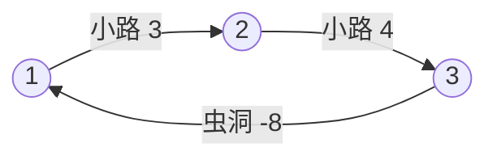

[[TOC]]

## 形式化题目

给定一张混合图：$n$ 个顶点、 $m$ 条无向正权边（小路，权为 $T$）、 $w$ 条有向负权边（虫洞，权为 $-T$）。判断是否存在一条从某点出发、最终回到同一点的行走，使总权为负（即回到出发时刻之前）。顶点和边都可以重复经过，出发点任选。

### 样例示意

下图是题面样例的第二个农场，展示小路正权边与虫洞负权边如何拼出一个负环：

农场 1 中含虫洞的闭环总权为 $2+1-3=0$ 与 $4-3=1$，不含虫洞的闭环总权为正，全部不小于 $0$，输出 `NO`；农场 2 的闭环 $1 \to 2 \to 3 \to 1$ 总权 $3+4-8=-1<0$，能回到出发时刻之前，输出 `YES`。读题时要抓住两点：小路无向且权为正，虫洞有向且权取负（"回到 8 秒前"就是 $-8$）。

## 正解

### 思路

**第一步，把故事翻译成负环判定。** 走一圈的总权 = 所有小路的 $+T$ 之和 + 所有虫洞的 $-T$ 之和，正好是时间变化量的相反数。所以"回到出发时刻之前" ⟺ 存在总权为负的闭环。又因为出发点任选、路径可重复经过：任何总权为负的闭环都必含一个总权为负的环（把其中总权非负的段删掉即可），而负环上任一点都可以当出发点。于是题目等价于一个问题——**图中有没有负环**。

**第二步，朴素做法为什么不行。** 最直接的思路是枚举所有闭环，但环的数量是指数级的；退一步，对每个点各跑一次最短路，可 Dijkstra 的"距离定型"贪心依赖边权非负，虫洞的负权会直接破坏它；再退一步用 Floyd 求全源最短路、看有没有点到自身距离变负，复杂度 $O(n^3)=1.25\times 10^8$，Python 下必然超时。三条路的瓶颈一致：**判定负环并不需要算出精确的最短路，只需要知道"距离还能不能继续变小"**。

**第三步，用 Bellman-Ford 的"松弛 $n$ 轮"回答这个问题。** 边数不超过 $k$ 的最短路最多 $k$ 轮松弛就能求出；没有负环时，每个点的最短路都可以取简单路径（边数 $\leqslant n-1$），$n-1$ 轮后距离全部定型。因此规则是：**做 $n$ 轮全量松弛，第 $n$ 轮还能松弛 ⟹ 存在负环**。配合两个细节：

- **超级源点**：所有点的 `dist` 初值设为 $0$，等价于加一个虚拟点向每个点连 $0$ 权边，一轮覆盖所有连通块。这样即使负环藏在与起点不连通的分量里也能检出（若写成 `dist[起点] = 0`、其余 $=+\infty$ 就会漏判）。
- **提前退出**：某一轮所有边都没能松弛，说明距离数组已经是不动点，之后永不再变，直接判 `NO`（代码里的 `relaxed` 标志就是这个开关）；只有跑满 $n$ 轮仍在松弛才判 `YES`。

下表是样例农场 2 的逐轮松弛轨迹（边序为 $1\!\to\!2,\ 2\!\to\!3,\ 2\!\to\!1,\ 3\!\to\!2,\ 3\!\to\!1$，同轮内就地更新）：

| 轮次 | `dist[1]` | `dist[2]` | `dist[3]` | 本轮是否松弛 |
| --- | --- | --- | --- | --- |
| 初始 | $0$ | $0$ | $0$ | —— |
| 第 1 轮 | $-8$ | $0$ | $0$ | 有：虫洞 $3\!\to\!1$ 把 `dist[1]` 压低 |
| 第 2 轮 | $-9$ | $-5$ | $-1$ | 有：负权沿小路 $1\!\to\!2$、$2\!\to\!3$ 传播 |
| 第 3 轮 | $-10$ | $-6$ | $-2$ | 有：第 $n=3$ 轮仍松弛 → 负环 |

读表时注意观察：负权每轮都能让三个点的值再下降一点，永不停歇——这正是负环"绕一圈就赚一次时间"的体现；反之农场 1 会在某一轮集体停止变化，提前退出判 `NO`。等价的替代做法是 SPFA：把被松弛的点入队，任一点入队次数超过 $n$ 就判负环；本题 $n$ 只有 500，全量扫描的 Bellman-Ford 常数更稳，不依赖数据。

**最后是建图**：小路 $(s,e,T)$ 拆成 $s\to e$ 与 $e\to s$ 两条权 $T$ 的有向边，虫洞 $(s,e,T)$ 只记一条权 $-T$ 的有向边；$F$ 个农场逐个判定即可。

### 代码

@include-code(./main.py, python)

### 复杂度

- **时间复杂度**：$\mathcal{O}(F \cdot n \cdot (2m + w))$。单农场上限 $500 \times 5200 = 2.6\times 10^{6}$ 次松弛，$F \leqslant 5$ 时总计 $\leqslant 1.3\times 10^{7}$；无负环的农场常在少数几轮内定型并提前退出。实测最大规模组（$n=500$、$m=2500$、5 个农场）约 $0.17\,$s，OJ 时限 $1000\,$ms 余量充足。
- **空间复杂度**：$\mathcal{O}(n + m + w)$。边表至多 $2m+w \leqslant 5200$ 个三元组，`dist` 长度 $n+1$，几十 KB 量级，远低于 $128\,$MB 限制。

## 总结

1. **把语义翻译成模型**："回到出发时刻之前" ⟺ 存在总权为负的闭环 ⟺ 图中存在负环，出发点任选使问题与起点无关。
2. **建图的两条不对称规则**：小路无向、双向各记一条正权边；虫洞有向、只记一条负权边。方向记反会漏判依赖回程的负环。
3. **负环判定的标准三件套**：超级源点初始化全 $0$（覆盖不连通分量）→ 最多 $n$ 轮全量松弛 → 某轮无松弛提前退出判 `NO`，第 $n$ 轮仍松弛判 `YES`。
4. 复杂度 $\mathcal{O}(n(2m+w))$ 与 C++ 正解同阶，规模只有 $500 \times 5200$，Python 实现也轻松通过。
