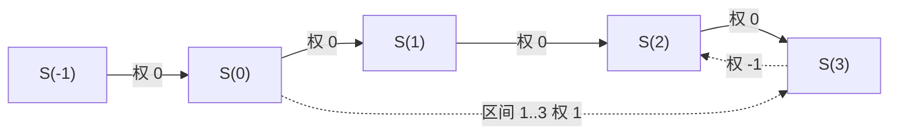

[[TOC]]

## 形式化题目

给定 $n$ 个闭区间 $[a_i, b_i]$（$i = 1, 2, \dots, n$）与对应的整数要求 $c_i$。
构造整数集合 $Z \subseteq [0, 5\times 10^4]$，使每个区间内至少包含 $c_i$ 个 $Z$ 中的整数，即

$$|\,Z \cap [a_i, b_i]\,| \geqslant c_i \quad (i = 1, 2, \dots, n),$$

求 $|Z|$ 的最小值。注意这是**最小化**问题：整个区间全选总是可行，难点在于统筹共享的整数，把总数压到最少。

### 样例示意

下表用题面样例检验候选集合 $Z = \{3, 6, 7, 8, 9, 10\}$ 是否满足每个区间，并统计每个区间里的落点个数：

| 区间 | 要求 | $Z$ 落在区间内的数 | 个数 |
| --- | --- | --- | --- |
| $[3,7]$ | $\geqslant 3$ | $3, 6, 7$ | $3$ ✓ |
| $[8,10]$ | $\geqslant 3$ | $8, 9, 10$ | $3$ ✓ |
| $[6,8]$ | $\geqslant 1$ | $6, 7, 8$ | $3$ ✓ |
| $[1,3]$ | $\geqslant 1$ | $3$ | $1$ ✓ |
| $[10,11]$ | $\geqslant 1$ | $10$ | $1$ ✓ |

$[3,7]$ 与 $[8,10]$ 互不相交，必须贡献两组各 3 个**不同**的整数，所以任何合法集合都至少有 $6$ 个数；上表给出恰好 $6$ 个数的方案，故答案为 $6$。读表时还要注意：$[6,8]$、$[1,3]$、$[10,11]$ 的要求被前两组落点"顺带"满足——一个整数同时属于多个区间，这正是逐区间各自补点难以统筹的原因。

## 正解

### 思路

**朴素做法为什么不行。** 最直接的思路是枚举点集：$0 \sim 5\times 10^4$ 每个整数选或不选，共 $2^{50001}$ 种方案，指数级爆炸。退一步"逐区间补点"——扫一遍区间，数已选落点，不够就往里填——也走不通：先处理的区间把点填在区间内哪个位置，会改变后面区间还差几个，局部补法不同结果不同，难以说明拿到的是全局最少。两个做法的共同瓶颈是**约束被拆散了**：一个整数同时属于多个区间，逐个区间决策无法统筹。出路是把所有约束装进同一个数学结构，一次性满足后再统一求最小。

**第一步：把"选点"翻译成前缀计数。** 定义

$$S(x) = |\,Z \cap [0, x]\,|, \qquad S(-1) = 0.$$

集合 $Z$ 与序列 $S$ 一一对应：$S$ 不减，且 $S(x) - S(x-1) \in \{0, 1\}$，取 $1$ 就表示整数 $x$ 被选中。于是题目的每个条件都改写成关于 $S$ 的不等式：

- 区间要求：$S(b_i) - S(a_i - 1) \geqslant c_i$，即 $S(b_i) \geqslant S(a_i - 1) + c_i$；
- 前缀不减：$S(x) \geqslant S(x - 1)$；
- 每个整数至多选一次：$S(x - 1) \geqslant S(x) - 1$（$0$ 边与 $-1$ 边夹逼出增量恰好 $\in \{0,1\}$）。

而 $|Z| = S(\max b_i)$：比最右端点更靠右的整数不落在任何区间里，选它们只会徒增个数，最小解根本不会包含它们。

**第二步：识别为差分约束系统。** 三类不等式**全部**形如 $S(v) \geqslant S(u) + w$，这正是差分约束系统的标准形——每条不等式对应一条有向边 $u \to v$ 权 $w$。下表列出三类事实到三条边的对应：

| 题目中的事实 | 关于前缀计数的不等式 | 图上的边 |
| --- | --- | --- |
| 区间 $[a_i,b_i]$ 至少 $c_i$ 个点 | $S(b_i) \geqslant S(a_i-1) + c_i$ | $a_i - 1 \to b_i$，权 $c_i$ |
| 前缀不减 | $S(x) \geqslant S(x-1)$ | $x - 1 \to x$，权 $0$ |
| 每个整数至多选一次 | $S(x-1) \geqslant S(x) - 1$ | $x \to x-1$，权 $-1$ |

读表时注意三条边各自的角色：链上一右一左两条边把每个位置的增量夹在 $\{0,1\}$ 之间，区间边则从 $a_i-1$ 跨到 $b_i$、跨越 $b_i - a_i + 1$ 段，这个跨度在第四步估计环权时会再次用到。

下图把样例的前缀链和两类边画出来（编号时整体 $+1$，让坐标 $-1$ 也有节点）：

链上每对相邻点之间都同时存在“向右权 $0$”和“向左权 $-1$”两条边（图中只画了一处反向边）；虚线是区间边，图中那条对应样例的 $[1,3]$ 要求 $c=1$，即 $S(0) \to S(3)$ 权 $1$。同理，样例的 $[3,7]$ 要求 $c=3$ 就是从 $S(2)$ 指向 $S(7)$、权为 $3$ 的边。点数只有 $\max b_i + 2 \leqslant 50002$，边数为 $n$ 条区间边加上每个相邻点对之间的两条链边，合计不超过 $1.5 \times 10^5$，规模完全可控。

**第三步：为什么"最小选点数"等于最长路。** 系统里全是 $\geqslant$ 形式的不等式，考虑以超级源点（到每个点连权 $0$ 边，实现上把 `dist` 全初始化为 $0$ 并全部入队）求**最长路** $L$：

1. **$L$ 可行**：最长路按定义满足每条边 $L(v) \geqslant L(u) + w$，三类不等式逐一成立；
2. **$L$ 逐分量最小**：任取可行解 $S$，对从超级源点出发的任意路径逐边累加 $S(v) \geqslant S(u) + w$（起点处 $S \geqslant 0$），可知 $S(v)$ 不小于所有路径的权和，取最大值得 $S(v) \geqslant L(v)$——$S$ 被最长路从下面托住。

即最长路是"被所有可行解压在下面、自己又满足全部约束"的解，它就是**分量最小的可行解**，其终点值 $L(\max b_i) - L(-1)$ 正是 $|Z|$ 的最小值。这就是差分约束的标准结论：$\leqslant$ 系统配最短路，$\geqslant$ 系统配最长路；求最大就跑最短路，求最小就跑最长路。

**第四步：为什么算得完（无正环）。** 最长路图里若有权为正的环，距离会无限抬升。本题不会：环必须向右走（区间边、$0$ 边都向右）再沿 $-1$ 边折返。设环上区间边总跨度为 $\sum (b_i - a_i + 1)$，$0$ 边数为 $t$，则折返的 $-1$ 边数恰好等于 $\text{总跨度} + t$，而题目保证 $c_i \leqslant b_i - a_i + 1$，于是

$$\text{环权} = \sum c_i - \bigl(\text{总跨度} + t\bigr) \leqslant \sum (b_i - a_i + 1) - \text{总跨度} - t = -t \leqslant 0.$$

以样例验证：$[3,7]$ 边去程 $+3$，沿链折返 $5$ 段共 $-5$，环权 $-2 < 0$。没有正环，SPFA 的队列必然收敛。

**实现上**只建点 $-1 \sim \max b_i$；编号 $=$ 坐标 $+1$ 免去 $a_i = 0$ 时坐标 $-1$ 的特判；松弛时在**弹出**队首的时刻读取 `du`，保证用的是该点的最新距离；被抬升且不在队中的点重新入队。

### 代码

@include-code(./main.py, python)

### 复杂度

- **时间复杂度**：建图 $\mathcal{O}(n + V)$，SPFA 理论最坏 $\mathcal{O}(V \cdot E)$，本题无正环且结构是"链 + 跨段边"，实践中每个点只需少数几轮抬升，接近 $\mathcal{O}(kE)$。规模 $V \leqslant 50002$、$E = n + 2V \leqslant 1.5 \times 10^5$，与 C++ 正解（差分约束 + SPFA/Bellman-Ford）同阶。实测 6 组真实数据各 $0.02\,$s；本地构造最大规模（$n = 5\times 10^4$、坐标 $0 \sim 50000$ 随机两组）$0.28\,$s / $0.25\,$s，OJ 时限 $1000\,$ms 下 Python 无 TLE 风险。
- **空间复杂度**：$\mathcal{O}(V + E)$，邻接表约 $1.5\times 10^5$ 个元组，`dist`、`in_queue` 各 $50002$ 项；实测峰值 $18.5\,$MB，远低于 $128\,$MB 限制。

## 总结

1. **构造问题改写成前缀计数**：$Z \leftrightarrow S(x) = |Z \cap [0,x]|$，选点的构造被完全吸收进 $S$ 的形状，"至少 $c_i$ 个"变成 $S(b_i) \geqslant S(a_i-1) + c_i$。
2. **三类事实 = 三类边**：区间要求是跨段权 $c_i$ 的边，前缀不减是向右权 $0$ 的边，"至多选一次"是向左权 $-1$ 的边；全是 $\geqslant$ 不等式 → 差分约束系统。
3. **最小选点数 = 最长路终点**：最长路既是可行解又逐分量最小，$|Z|_{\min} = L(\max b) - L(-1)$；实现上全 $0$ 初始化并全体入队，等价于超级源点。
4. **收敛性靠 $c_i$ 上界**：环权 $\leqslant -t \leqslant 0$，无正环，SPFA 必然终止——数据范围里的 $c_i \leqslant b_i - a_i + 1$ 不只是"保证有解"，也是算法不跑飞的前提。
5. **识别模式**：见到"一批 $\geqslant$/$\leqslant$ 约束 + 在所有可行解里求极值"，优先建差分约束图；求最大配最短路，求最小配最长路。
