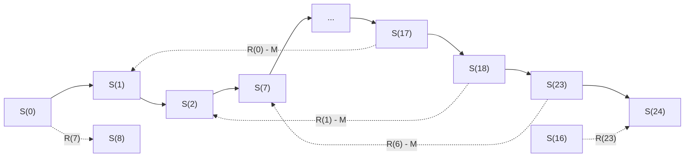

[[TOC]]

## 形式化题目

每天分 24 个小时段，第 $i$ 段（$i$ 时到 $i+1$ 时，$0 \le i \le 23$）至少需要 $R(i)$ 名出纳员在岗。

有 $N$ 名申请者，第 $j$ 人若被雇佣，将从 $t_j$ 时开始**恰好连续工作 8 小时**，即覆盖小时段

$$t_j,\ t_j+1,\ \dots,\ t_j+7 \pmod{24}.$$

注意时间是按 24 小时循环的：$t_j = 23$ 的人覆盖 $23, 0, 1, 2, 3, 4, 5, 6$。

记 $c_i$ 为满足 $t_j = i$ 的申请者人数。选择一组雇佣变量 $x_i$（从 $i$ 时开始且被雇佣的人数，
$0 \le x_i \le c_i$），使每个小时段的在岗人数不少于需求：

$$\sum_{k=0}^{7} x_{(i-k) \bmod 24} \ \ge\ R(i), \qquad i = 0,1,\dots,23,$$

在满足全部约束的前提下最小化总雇佣人数 $M = \sum_{i=0}^{23} x_i$。若不存在任何可行方案，输出
`No Solution`。

**样例覆盖关系**：下表中 `●` 表示该申请人覆盖了对应小时段，`R` 行是需求。

| 申请人 $t_j$ | 0 | 1 | 2 | 3 | 4 | 5 | 6 | 7 | … | 22 | 23 |
| --- | --- | --- | --- | --- | --- | --- | --- | --- | --- | --- | --- |
| 0 | ● | ● | ● | ● | ● | ● | ● | ● | | | |
| 1 | | ● | ● | ● | ● | ● | ● | ● | | | |
| 10 | | | | | | | | | | | |
| 22 | ● | ● | ● | ● | ● | ● | ● | | | ● | ● |
| 23 | ● | ● | ● | ● | ● | ● | ● | | | | ● |
| $R(i)$ | **1** | 0 | **1** | 0 | 0 | 0 | **1** | 0 | | 0 | **1** |

只雇佣 $t = 23$ 的这一个人，他覆盖 $23, 0, 1, \dots, 6$，恰好命中全部 4 个需求为 1 的小时段
（$0, 2, 6, 23$），其余小时段需求为 0，所以答案是 $1$。注意 $t = 22$ 的人覆盖不到小时段 6，
$t=0$ 的人覆盖不到小时段 23，都单独不够用。

## 正解

### 思路

**为什么不能贪心。** 一个人覆盖连续 8 小时，所以 $x_i$ 会同时出现在 8 条小时段约束里。
若从 0 时开始逐小时检查、不够就补人，"补在哪个时刻"会影响后面 8 小时，
补得早可能浪费、补得晚可能漏掉当前需求，局部选择无法保证全局最优。
枚举子集又是 $2^N$（$N \le 1000$），不可行。

**第一步：用前缀和把"区间求和"变成"两点之差"。**

令前缀和

$$S(i) = x_0 + x_1 + \dots + x_{i-1}, \qquad S(0) = 0, \qquad S(24) = M.$$

于是 $x_i = S(i+1) - S(i)$，而小时段约束里的"连续 8 项之和"正好可以写成两个 $S$ 相减：

$$\text{cover}(i) = \begin{cases} S(i+1) - S(i-7), & i \ge 7,\\[4pt] \bigl(S(24) - S(i+17)\bigr) + S(i+1), & i < 7. \end{cases}$$

**为什么 $i<7$ 时多了 $S(24)-S(i+17)$。** 覆盖小时段 $i$（$i<7$）的人，起始时刻是
$\{i-7, \dots, -1\} \cup \{0, \dots, i\}$，用模 24 写就是 $\{i+17, \dots, 23\} \cup \{0,\dots,i\}$。
前一段在**今天**的贡献是 $S(24) - S(i+17)$（从 $i+17$ 时到 24 时开始的人），后一段是 $S(i+1) - S(0)$。
两段相加即得上式。

**第二步：把目标 $M$ 变成约束。**

$M = S(24)$ 本来是要最小化的目标。但我们注意到它的取值范围很小：$M \in [0, N] \subseteq [0, 1000]$。
于是可以**枚举** $M$，用两条边把它钉死：

$$S(24) \ge S(0) + M, \qquad S(0) \ge S(24) - M.$$

这样"求最优"就变成了"判定某个 $M$ 是否可行"。

**第三步：可行性关于 $M$ 单调，所以二分。**

若 $M$ 有可行方案 $H$，且 $M < N$，则必有一个申请者 $j \notin H$；把他一并雇上，
所有小时段的人数只增不减，约束仍然满足，于是 $M+1$ 也可行。
所以存在分界点 $M^*$：$M < M^*$ 不可行、$M \ge M^*$ 可行。在 $[0,N]$ 上二分，只需 $O(\log N)$ 次判定。

**第四步：判定就是差分约束 + 最长路。**

把每条不等式 $S(v) \ge S(u) + w$ 建成有向边 $u \to v$、权 $w$，就得到一个差分约束系统：

| 含义 | 不等式 | 边 |
| --- | --- | --- |
| 前缀不减（$x_i \ge 0$） | $S(i+1) \ge S(i)$ | $i \to i+1$，权 $0$ |
| 人数上界（$x_i \le c_i$） | $S(i) \ge S(i+1) - c_i$ | $i+1 \to i$，权 $-c_i$ |
| 同一天需求（$i \ge 7$） | $S(i+1) \ge S(i-7) + R(i)$ | $i-7 \to i+1$，权 $R(i)$ |
| 跨午夜需求（$i < 7$） | $S(i+1) \ge S(i+17) + R(i) - M$ | $i+17 \to i+1$，权 $R(i) - M$ |
| 钉死总人数 | $S(24) \ge S(0) + M$、$S(0) \ge S(24) - M$ | $0 \to 24$ 权 $M$，$24 \to 0$ 权 $-M$ |

这类系统的**最长路**解 $d$ 是"逐分量最小的可行解"：任何可行解都必须处处不小于 $d$
（沿最长路归纳），而无正环时 $d$ 本身满足全部边。把 25 个距离初值全设为 0 并全部入队，
等价于加一个超级源点向每个点连 0 权边，一轮即可从所有点出发。

因此判定 $M$ 的方法就是：跑最长路，若出现**正环**说明约束自相矛盾，返回不可行；
否则检查 $d(24) \ge M$（配合钉死边，实际就是 $d(24) = M$）。

下面是样例对应的约束图：粗链是前缀不减的 $S(0) \to \dots \to S(24)$，
跨段弧是需求边（$i\ge7$ 向"后"取 $S(i-7)$，$i<7$ 向"前"取 $S(i+17)$）。

读图要点：**需求边不一定沿链的方向**。$i \ge 7$ 时它从 $S(i-7)$ 指向 $S(i+1)$（沿链向右，
例如 $S(0) \to S(8)$ 与 $S(16) \to S(24)$）；$i < 7$ 时它从 $S(i+17)$ 指向 $S(i+1)$
（**逆着链向左**，例如 $S(17) \to S(1)$、$S(23) \to S(7)$）——这正是跨午夜时段
必须借助 $M$ 才能表达的几何来源。链边保证 $S$ 单调，使最长路的解能还原出合法的 $x_i \ge 0$。

> 图中每条链边 $S(i) \to S(i+1)$ 权 $0$，反向的 $S(i+1) \to S(i)$ 权 $-c_i$ 为清晰起见省略。

### 代码

@include-code(./main.py, python)

### 复杂度

设 $V = 25$、$E \le 74$（$= 24 \times 2 + 24 + 2$）。

- 单次判定：SPFA 最长路，无正环时每点最多被松弛 $O(V)$ 次，每次扫其出边，故 $O(VE)$，
  且 $V, E$ 都是与 $N$ 无关的常数。
- 二分：$O(\log N)$ 次判定，$N \le 1000$ 时至多 10 次。
- 单组总时间 $O(N + \log N \cdot VE)$，空间 $O(N + V + E)$。

与 C++ 正解（差分约束 + 二分答案）**同阶**，只差常数因子。由于 $V = 25$，
Python 侧实测 24 组数据合计 0.024s、峰值内存约 15MB，不存在 TLE/MLE 风险。

## 总结

本题的关键是把"连续 8 小时的区间计数"翻译成**前缀和的差**，从而让每条小时段约束都变成
一对变量之间的不等式；再用"枚举总数 $M$ 并钉死 $S(24)=M$"把最优化降级为判定，
用 $M$ 的单调性把枚举换成二分，最后交给差分约束的最长路。

三个容易写错的地方：

1. **跨午夜的需求边权必须减 $M$**，即 $S(i+1) \ge S(i+17) + R(i) - M$，漏掉 $-M$ 会让
   样例直接判成 `No Solution`；
2. **钉死 $S(24) = M$ 需要两条方向相反的边**，只加一条会让判定对过大的 $M$ 误判为可行；
3. **正环检测**用"某点被成功松弛超过 $V$ 次"来判定，不要在 SPFA 里漏掉这个出口，
   否则矛盾输入会死循环。

## 图示解析

跨午夜是本题唯一的几何障碍。下表列出"覆盖小时段 $i$ 的起始时刻集合"在午夜处被切成两段的情形，
它正是要求 $i<7$ 时边权减去 $M$ 的原因。

| 小时段 $i$ | 覆盖它的起始时刻 $\{i-7,\dots,i\} \bmod 24$ | 被午夜切成的两段 | 覆盖人数 |
| --- | --- | --- | --- |
| $i \ge 7$（如 $i=23$） | $16,17,\dots,23$ | 不切分，就是一段 | $S(24)-S(16)$ |
| $i = 6$ | $23,0,1,2,3,4,5,6$ | $[23,23]$ 与 $[0,6]$ | $(S(24)-S(23)) + S(7)$ |
| $i = 0$ | $17,18,\dots,23,0$ | $[17,23]$ 与 $[0,0]$ | $(S(24)-S(17)) + S(1)$ |

观察重点：

- 判断一个起始时刻是否覆盖小时段 $i$，等价于判断 $t \in \{i-7, \dots, i\} \pmod{24}$；
  当 $i < 7$ 时这个集合被午夜切成两段，所以覆盖人数是**两个前缀差之和**，其中靠前的那段含 $S(24)$。
- 因为 $S(24) = M$ 正是要枚举的量，这条边的权里就必然出现 $M$；
  这也是"每个候选 $M$ 都要重新建图"的原因。
- 对比 $i=23$ 与 $i=6$：前者起点是一段连续下标，后者被拆成 $23$ 和 $0..6$ 两个片段——
  这种"跨过午夜回绕"正是循环时间带来的唯一麻烦，也是前缀和下标要用 $i+17$ 而不是 $i-7$ 的原因。

验证情况：3 个真实数据文件共 24 组全部通过；与指数级暴力在 1005 组随机小数据上逐行一致，
0 处不符；并实测确认可行性关于 $M$ 严格单调（24 组真实数据上 0 处违反），二分成立。
