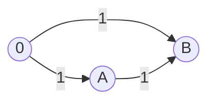

[[TOC]]

## 形式化题目

给定 $N$ 个正整数变量 $x_1, x_2, \dots, x_N$（满足 $x_i \geqslant 1$）以及 $K$ 个形如 $x_A = x_B$、$x_A < x_B$、$x_A \geqslant x_B$、$x_A > x_B$ 或 $x_A \leqslant x_B$ 的不等式约束。

求满足所有条件的 $\sum_{i=1}^N x_i$ 的最小值；若无解则输出 $-1$。

## 正解

### 思路

本题要求求出一组未知数满足若干大小关系，且使总和最小。因为每个未知数都要取到满足条件的**最小值（下界）**，我们可以将其建模为**差分约束系统**。

在差分约束系统中：
- 如果要计算每个变量的最小值，需将所有约束统一变形为形如 $x_v \geqslant x_u + w$ 的下界形式。
- 该不等式等价于从顶点 $u$ 向顶点 $v$ 引一条权值为 $w$ 的有向边，在图上求**单源最长路**。
- 若图中存在正权回路，则意味着某些变量必须严格大于自身，存在自相矛盾，系统无解（输出 $-1$）。

#### 1. 约束条件建图

根据题目给出的 5 类条件进行转化：
1. $X=1$：$x_A = x_B \iff x_A \geqslant x_B + 0$ 且 $x_B \geqslant x_A + 0$，故连双向边 $A \xrightarrow{0} B$ 与 $B \xrightarrow{0} A$。
2. $X=2$：$x_A < x_B \iff x_B \geqslant x_A + 1$。特别地，若 $A = B$，自相矛盾直接无解；否则连边 $A \xrightarrow{1} B$。
3. $X=3$：$x_A \geqslant x_B \iff x_A \geqslant x_B + 0$，连边 $B \xrightarrow{0} A$。
4. $X=4$：$x_A > x_B \iff x_A \geqslant x_B + 1$。特别地，若 $A = B$，直接无解；否则连边 $B \xrightarrow{1} A$。
5. $X=5$：$x_A \leqslant x_B \iff x_B \geqslant x_A + 0$，连边 $A \xrightarrow{0} B$。

此外，每个小朋友都必须分到糖果，即 $x_i \geqslant 1$。我们设立超级源点 $0$（初值设为 $0$），向所有点连边：
$$x_i \geqslant x_0 + 1 \quad (0 \xrightarrow{1} i, \; 1 \leqslant i \leqslant N)$$

#### 2. 最长路与正环检测

从超级源点 $0$ 出发运行 SPFA 最长路算法：
- 松弛条件：若 $dist[v] < dist[u] + w$，则更新 $dist[v] = dist[u] + w$。
- 正环检测：记录每个点在最长路路径上的入队或更新次数 $cnt[v]$。总点数为 $N+1$，若 $cnt[v] > N$，说明路径上包含了重复顶点，存在正权环，无解输出 $-1$。
- 实现细节：差分约束判环时，使用后进先出栈（LIFO）代替普通先进先出队列，可以在有环时迅速深入环中反复松弛，极大加快正环的检测速度。

### 代码

Python 版：

@include-code(./main.py, python)

C++ 版（同一算法）：

@include-code(./main.cpp, cpp)

### 复杂度

- 时间复杂度：$O(N + K)$ 至最坏 $O(N \cdot K)$。采用栈优化的 SPFA 实际运行速度极快。
- 空间复杂度：$O(N + K)$，用于存储邻接表、距离数组以及入队标记。

## 总结

本题是差分约束系统的标准应用题。核心要点在于：
1. 求变量的极小值总和，需将约束条件统一转化为 $x_v \geqslant x_u + w$ 的形式，在图上求解最长路。
2. 建立虚拟超级源点统一所有变量的绝对下界（每个小朋友至少分配 $1$ 颗糖果）。
3. 严格注意严格不等式中 $A=B$ 的非法特判，以及利用栈结构优化 SPFA 的正环检测效率。
